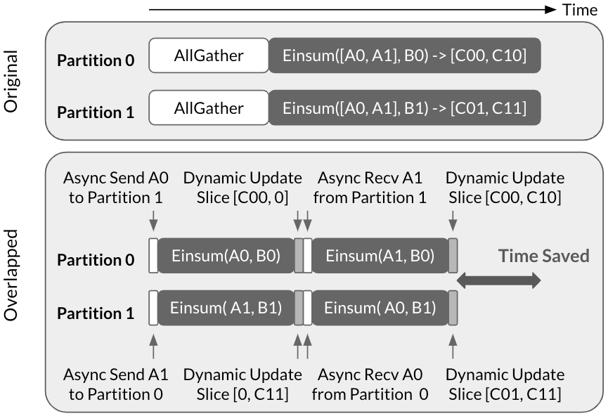

# Communication Overlap via Decomposition

**Source**: Wang et al. (Google), ASPLOS 2023. DOI: 10.1145/3567955.3567959. A technique to overlap communication with dependent computation by decomposing collectives into finer-grained operations for intra-layer model parallelism.

## Key Points

- **Problem**: Intra-layer model parallelism (TP) generates significant communication overhead — collectives like AllReduce/AllGather can dominate execution time
- **Key insight**: Communication is often **dependent** on computation (e.g., AllReduce must wait for all shards to be computed), preventing naive overlap
- **Solution**: Decompose the original communication collective AND the dependent computation into a sequence of finer-grained operations, creating overlapping opportunities
- **Mechanism**: Break a large AllReduce into smaller chunks; as each chunk finishes computation, immediately begin communication — interleaving compute and comm at fine granularity
- Results: **1.14–1.38× throughput improvement** across models from 10B to 1T parameters
- Peak: **72% FLOPs utilization** on 1024 TPU chips with a 500B parameter LLM
- General technique applicable to TPU, GPU, and various model architectures

## The Problem

### Intra-Layer Model Parallelism and Its Cost

When a model layer is partitioned across devices (tensor parallelism):
1. Each device computes its shard independently
2. Results must be aggregated via collective communication (AllReduce, AllGather)
3. Communication cannot start until ALL devices finish computation — **dependent communication**



This dependency creates idle time: devices that finish early must wait for stragglers, and communication latency is fully exposed.

### Why Naive Overlap Fails

Standard overlap techniques (e.g., async collectives) don't work here because:
- The communication is **semantically dependent** on the computation result
- You cannot start the AllReduce until every device has its partial result
- The dependency chain is: compute → collective → next compute

## The Decomposition Technique

### Core Idea

Instead of:
```
[All devices compute full shard] → [AllReduce full result]
```

Decompose into fine-grained chunks:
```
[Device 0: compute chunk 1] → [start AllReduce chunk 1]
  [Device 0: compute chunk 2] → [start AllReduce chunk 2]
    while AllReduce chunk 1 runs in background
      ...
```

Each device exposes partial results as soon as they're available, allowing communication to begin before the full computation finishes.

### How It Works

1. **Identify** the collective operation and its dependent computation
2. **Decompose** both the computation and the collective into a sequence of smaller operations along a splittable dimension (e.g., the hidden dimension in TP)
3. **Pipeline** the finer-grained compute and communication operations so they execute in parallel

The key enabler: many tensor operations (matmul, layer norm) can be decomposed along the reduction dimension without changing the mathematical result.

### Applicability

Works for:
- **Tensor parallelism** (shard along hidden/FFN dimension)
- **AllReduce** and **ReduceScatter** collectives
- Any computation that can be decomposed along the reduction axis
- Both GPU and TPU (evaluated on TPU v4)

Does NOT work when:
- The computation has no splittable dimension
- The communication pattern cannot be chunked (e.g., AllToAll with complex routing)

## Results

| Model | Parameters | Devices | Throughput Gain |
|-------|-----------|---------|----------------|
| Dense LLM | 500B | 1024 TPU v4 | 1.38× |
| Various models | 10B–1T | Up to 1024 TPU v4 | 1.14–1.38× |

Peak FLOPs utilization: **72%** on 1024 TPU chips with 500B LLM.

The technique is integrated into Google's production training infrastructure (GSPMD/XLA compiler stack).

## Connections

- [GSPMD](gspmd.md) — Google's SPMD partitioning system; this decomposition technique composes with GSPMD's sharding annotations
- [PartIR](partir.md) — PartIR's collectives (AllReduce, AllGather) can benefit from this decomposition strategy
- [TOAST](toast.md) — TOAST could integrate this as a post-partitioning optimization in its cost model
- [Megatron-Core MoE](megatron-core-moe.md) — Megatron's communication overlap techniques (EP overlap, CUDA graphs) for a different parallelism dimension (expert parallelism)
- [Comet](comet-moe-overlap.md) — fine-grained EP communication overlap, similar decomposition philosophy applied to MoE dispatch/combine
- [NCCL Demystifying](nccl-demystifying.md) — NCCL's ring/tree algorithms; this technique reduces the amount NCCL needs to communicate
- [GPU Communication Landscape](gpu-communication-landscape.md) — communication-computation overlap as a general design pattern
- [Distributed Networking](aspe-distributed-networking-tuning.md) — GPUDirect, SHARP as complementary communication optimizations
