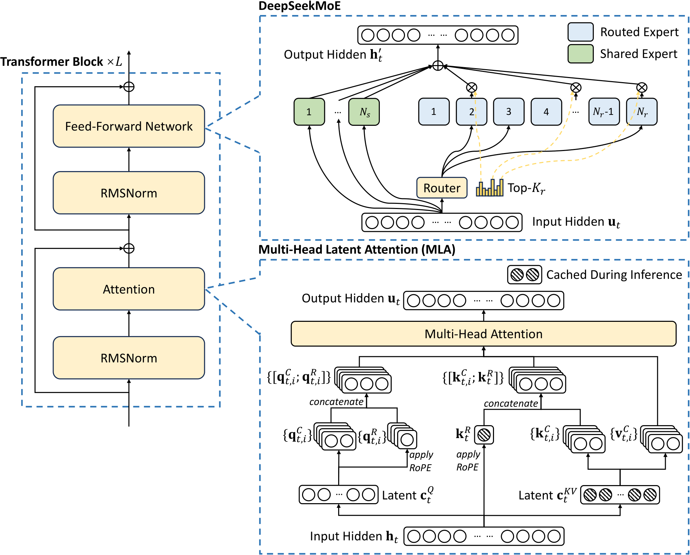

# Insights into DeepSeek-V3

**Source**: DeepSeek-AI, ISCA 2025 (Industry Track). 15 pages. Trained on 2,048 NVIDIA H800 GPUs.

**Authors**: Chenggang Zhao, Chengqi Deng, Chong Ruan, Damai Dai, Huazuo Gao, Jiashi Li, Liyue Zhang, Panpan Huang, et al.

## Key Points

- Hardware-aware co-design paper: how DeepSeek-V3 achieved state-of-the-art performance on cost-constrained H800 hardware
- **MLA** reduces KV cache to 70KB/token (vs 516KB for LLaMA-3.1 405B, 327KB for Qwen-2.5 72B)
- **FP8 mixed-precision training**: First open-source large model to use FP8 training, with fine-grained tile/block-wise quantization
- **Avoided Tensor Parallelism** due to H800's reduced NVLink bandwidth (400 GB/s vs 900 GB/s on H100)
- **Multi-Plane Fat-Tree Network**: Novel topology to maximize all-to-all communication bandwidth for EP
- **Hardware wishlist**: Integrated scale-up/scale-out, in-network computation for EP, native FP8 communication

## Architecture Overview

DeepSeek-V3 builds on DeepSeek-V2's MLA and DeepSeekMoE, adding:
- Multi-Token Prediction (MTP) modules for denser training signal
- FP8 mixed-precision training (first open-source large model)
- Auxiliary-loss-free load balancing

*Figure 1: Basic architecture of DeepSeek-V3 — MLA, DeepSeekMoE, MTP, and FP8 mixed precision. Colored annotations show precision used in each component. [src](raw/insights-into-deepseek-v3.pdf)*

**Hardware context**: H800 GPUs with reduced NVLink (400 GB/s, down from 900 GB/s on H100) and reduced FP64 performance. This shaped key architectural decisions.

## MLA: Multi-head Latent Attention

MLA is DeepSeek's core memory efficiency innovation. Standard Multi-Head Attention stores full Key and Value vectors per token per head. MLA compresses them via low-rank factorization:

- Keys and Values are projected into a shared **latent space** c_KV (much smaller than the full KV dimension)
- During inference, only the compressed latent vector is cached
- For attention computation, the latent is up-projected to full Keys and Values on-the-fly

**KV cache comparison (BF16)**:

| Model | KV Cache Per Token | Multiplier vs MLA |
|-------|-------------------|-------------------|
| DeepSeek-V3 (MLA) | 70.272 KB | 1$\times$ |
| Qwen-2.5 72B (GQA) | 327.680 KB | 4.66$\times$ |
| LLaMA-3.1 405B (GQA) | 516.096 KB | 7.28$\times$ |

MLA achieves 7.28$\times$ smaller KV cache than LLaMA-3.1 405B — critical for long-context inference and multi-turn conversations.

See: [Multi-Head Latent Attention](multi-head-latent-attention.md)

## FP8 Mixed-Precision Training

DeepSeek-V3 was the **first open-source large model** to successfully use FP8 training at scale. Key techniques:

- **Fine-grained quantization**: Tile-wise 1$\times$ 128 quantization for activations, block-wise 128$\times$ 128 for weights
- **High-precision accumulation**: FP32 accumulation to maintain numerical stability
- **Selective precision**: Sensitive components (embeddings, output head, RMSNorm) remain in BF16/FP32

**Validation**: FP8 training ablation on 16B and 230B models showed <0.25% relative accuracy loss vs BF16.

**Limitations noted**:
- FP8 accumulation precision is currently restricted on H800
- GEMM kernel requires padding to 128-divisible dimensions
- FP8 quantization/dequantization overhead in all-to-all communication can be 50-100%

**Open-sourced**: Fine-grained FP8 GEMM implementation in [DeepGEMM](https://github.com/deepseek-ai/DeepGEMM).

## LogFMT: Experimental Precision Format

An experimental logarithmic floating-point format explored for MoE all-to-all communication. Offers higher precision than FP8 at the same bit width. However, encode/decode overhead was 50-100% when fused with all-to-all, so it was not deployed.

**Future suggestion**: Hardware-native support for compression/decompression units tailored to FP8 or custom formats.

## Hardware-Aware Parallelism Strategy

DeepSeek-V3's parallelism was directly shaped by H800's reduced NVLink:

| Decision | Reason |
|----------|--------|
| **Avoid TP during training** | H800 NVLink at 400 GB/s makes TP communication too expensive |
| **Use DualPipe (PP)** | Zero-bubble pipeline to compensate for no TP |
| **EP for MoE layers** | Distribute experts across GPUs with all-to-all |
| **ZeRO-1** | Optimizer state sharding only (not ZeRO-3) |

**Inference**: TP can be selectively used to improve TTFT and TPOT since inference is less communication-bound.

## Inference Speed Analysis

Theoretical TPOT (Time Per Output Token) analysis for MoE inference on CX7 400Gbps IB:

- EP all-to-all: dispatch (FP8, 1 byte) + combine (BF16, 2 bytes)
- 32 tokens per device, 9 transfers per token (8 routed experts + 1 shared), ~7K hidden size
- Communication time per layer: ~121μs (each direction)
- Total per layer: ~242μs
- 61 layers → **14.76ms TPOT → 67 tokens/sec theoretical upper bound**

**Dual micro-batch overlap** maximizes throughput by overlapping compute of one batch with communication of another.

**Prefill/Decode Disaggregation**: Separate EP group sizes for prefill (large batch) and decode (latency-sensitive) to maximize system throughput.

## Multi-Plane Fat-Tree Network

A novel network topology designed for EP all-to-all communication:

- Each node: 8 GPUs + 8 IB NICs, each GPU-NIC pair on a distinct network plane
- 64-port 400G IB switches, two-layer fat-tree
- Theoretically supports up to 16,384 GPUs in a two-layer topology

**Performance**: MPFT matches single-plane multi-rail fat-tree for all-to-all bandwidth while being more cost-effective. For EP communication with 64 GPUs: multi-plane shows 35-50% improvement in algorithm bandwidth over single-plane.

**Key insight**: All-to-all communication bandwidth determines MoE inference speed. The network topology directly shapes model architecture choices.

## All-to-All Communication Overhead

All-to-all communication currently consumes SM (Streaming Multiprocessor) resources for:
- Forwarding data between IB and NVLink domains
- Data transport between RDMA buffers and compute buffers
- Reduce operations for EP combine
- Memory layout management
- Data type casting

**Recommendation**: Offload these to dedicated communication co-processors in future hardware.

## Hardware Recommendations

The paper makes concrete suggestions for future chip/interconnect design:

1. **Unified scale-up/scale-out**: Integrate NVLink and IB into a single logical fabric with dedicated co-processors
2. **Native FP8 in communication**: Hardware FP8 compression/decompression to reduce all-to-all volume
3. **NIC in I/O die**: Connect NICs directly via NVLink instead of PCIe to reduce latency
4. **CPU-GPU over NVLink**: Replace PCIe for CPU-GPU transfers (offloading, KV cache)
5. **In-network computation**: Hardware-level multicast for EP dispatch, in-network reduction for EP combine
6. **Improved RoCE**: Specialized low-latency Ethernet switches, adaptive routing to match IB performance
7. **Advanced error detection**: Beyond ECC — checksum validation, hardware-accelerated redundancy
8. **Memory-semantic ordering**: Hardware-enforced acquire/release semantics for RDMA

## Training Cost Context

DeepSeek-V3 was trained on just **2,048 H800 GPUs** (a fraction of what competitors use), demonstrating that hardware-aware co-design can dramatically reduce cost. The Fire-Flyer AI-HPC philosophy: "harness existing hardware to its fullest potential."

The paper explicitly contrasts with Meta, Google, xAI clusters using tens/hundreds of thousands of GPUs, arguing that effective software-hardware co-design levels the playing field for smaller teams.

## Connections

- [Multi-Head Latent Attention](multi-head-latent-attention.md) — MLA architecture deep-dive
- [DeepSeek-V4 Architecture](deepseek-v4.md) — V4's CSA/HCA attention builds on MLA's KV compression philosophy
- [Megatron-Core MoE](megatron-core-moe.md) — NVIDIA's approach to the same challenges on unrestricted hardware
- [Scaling Techniques Overview](usp-scaling-techniques-overview.md) — TP, PP, EP, ZeRO fundamentals
- [Ultra-Scale Playbook](usp-ultra-scale-playbook.md) — educational foundation for the parallelism strategies discussed
