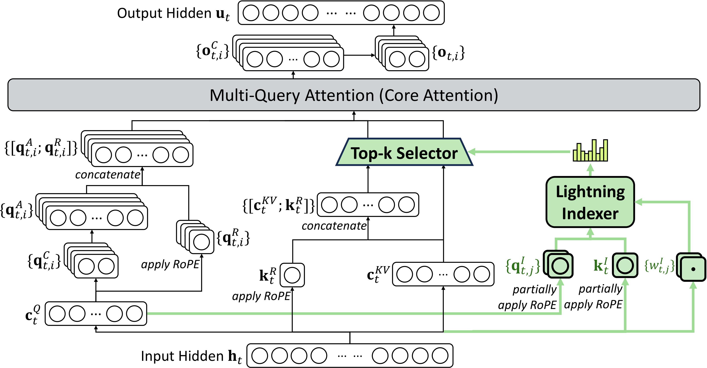

# DeepSeek-V3.2

**Source**: DeepSeek-AI, December 2025. 23 pages. Continued training from V3.1-Terminus.

## Key Points

- **DeepSeek Sparse Attention (DSA)**: Lightning indexer + fine-grained token selection — substantial compute reduction while preserving long-context performance
- **Scalable RL framework**: Post-training compute exceeding **10% of pre-training cost** — unlocks advanced capabilities
- **V3.2-Speciale**: High-compute variant surpasses GPT-5, achieves **IMO and IOI gold medals** in 2025
- **Agentic task synthesis pipeline**: Systematic generation of tool-use training data for scalable agent post-training
- Identifies three gaps keeping open-source behind closed: attention inefficiency, insufficient post-training compute, weak agent generalization

## The Problem: Why Open-Source Was Falling Behind

The paper argues the gap between open and closed models was **widening** (not converging) due to three deficiencies:

1. **Architectural**: Vanilla attention limits long-sequence efficiency → constrains both deployment and post-training
2. **Resource allocation**: Insufficient post-training compute investment on hard tasks
3. **Agent capability**: Weak generalization and instruction-following in interactive tool-use scenarios

## Architecture: DeepSeek Sparse Attention (DSA)

The only architectural change from V3.1-Terminus. DSA selects a sparse subset of KV entries per query token, reducing attention FLOPs while maintaining quality.



*Figure 2: DSA architecture under MLA. The green part shows how the Lightning Indexer selects top-k key-value entries for sparse attention. [src](raw/DeepSeek-V3.2.pdf)*

### Lightning Indexer

A compact, efficient scoring mechanism that computes relevance between each query token and all preceding KV entries:

```
I_{t,s} = Σ_j (wI_{t,j} · ReLU(qI_{t,j} · kI_s))
```

Where:
- `qI` and `wI` are derived from the query token `h_t`
- `kI` is derived from the preceding token `h_s`
- ReLU activation for throughput
- Small number of indexer heads, implemented in FP8 → very efficient

### Fine-Grained Token Selection

For each query token, select only the **top-k** preceding KV entries (k=2048 for V3.2) based on indexer scores. Core attention operates only on these sparse entries.

### Instantiated Under MLA

DSA is implemented on top of MLA's MQA mode: each latent KV vector is shared across all query heads. The lightning indexer and sparse selection operate on the compressed latent representations.

### Training: Two Stages of Continued Pre-training

**Stage 1: Dense Warm-up** (1,000 steps, 2.1B tokens)
- Freeze all parameters except the lightning indexer
- Train indexer with KL-divergence loss against the main attention distribution
- Learning rate: 10⁻³

**Stage 2: Sparse Training** (15,000 steps, 943.7B tokens)
- Introduce fine-grained token selection
- Optimize all model parameters to adapt to sparse attention pattern
- Indexer continues alignment training; main model optimized via language modeling loss
- Learning rate: 7.3 × 10⁻⁶, k=2048

**Key design**: Indexer input is detached from the computation graph — the indexer is optimized separately from the main model, preventing gradient interference.

## Scalable RL Framework

The second key breakthrough: a stable RL protocol enabling massive post-training compute:

- Post-training compute **exceeds 10% of pre-training cost**
- This is significantly more than typical open-source post-training budgets
- Enables the model to develop advanced reasoning patterns without SFT limitations
- Stable at scale — the paper emphasizes the framework's reliability

## Agentic Task Synthesis Pipeline

To integrate reasoning with tool use:

1. **Systematic data generation**: Novel synthesis pipeline produces training data at scale
2. **Cold-start phase**: Use V3 methodology to unify reasoning and agent behaviors
3. **Scalable agent post-training**: The synthetic data enables generalization across diverse tool-use scenarios

Results: Substantial improvements in agent benchmarks (Terminal Bench 2.0, SWE Verified, Toolathlon).

## V3.2-Speciale: The High-Compute Variant

V3.2-Speciale represents the extreme end of RL compute scaling:

- **Surpasses GPT-5** on reasoning benchmarks
- **Reasoning proficiency on par with Gemini-3.0-Pro**
- **IMO 2025 Gold Medal**: Perfect or near-perfect scores on International Mathematical Olympiad
- **IOI 2025 Gold Medal**: International Olympiad in Informatics

This is the first open model to achieve these competitive programming/math milestones.

## Results

| Benchmark | V3.2-Speciale | V3.2-Thinking | GPT-5-High | Gemini-3.0-Pro |
|-----------|--------------|---------------|------------|----------------|
| AIME 2025 (Pass@1) | **96.0** | 93.1 | 94.6 | 87.0 |
| HMMT 2025 Feb (Pass@1) | **99.2** | 90.2 | 88.3 | 95.0 |
| HLE (Pass@1) | 37.7 | 30.6 | 26.3 | 25.1 |
| Codeforces (Rating) | **2708** | 2378 | 2701 | 2537 |
| SWE Verified (Resolved) | 77.2 | 73.1 | 74.9 | 76.2 |
| Terminal Bench 2.0 (Acc) | **54.2** | 35.2 | 46.4 | 42.8 |
| 2Bench (Pass@1) | **85.4** | 80.3 | 80.2 | 84.7 |
| Toolathlon (Pass@1) | **38.6** | 29.0 | 36.4 | 35.2 |

V3.2-Speciale **leads or matches GPT-5** on reasoning, code, and agent benchmarks. The Thinking variant provides strong performance at lower compute.

## Comparison to V4

V3.2's DSA is the direct predecessor to V4's CSA (Compressed Sparse Attention):

| Feature | V3.2 (DSA) | V4 (CSA) |
|---------|-----------|----------|
| Compression | None (sparse selection only) | Compress m→1 KV entries, then sparse |
| Indexer | Lightning indexer (FP8, ReLU) | Lightning indexer (similar design) |
| Scope | Token-level sparse selection | Block-level compression + sparse |
| KV cache | Full (no compression) | 1/m compressed |
| Context | 128K | 1M |

V4 took DSA's sparse attention concept and added **KV compression** before sparsity — the key to V4's 10$\times$ KV cache reduction.

## Connections

- [DeepSeek-V3](deepseek-v3.md) — the base architecture V3.2 extends
- [DeepSeek-V4 Architecture](deepseek-v4.md) — CSA/HCA is the evolution of DSA
- [DeepSeek-R1](deepseek-r1.md) — R1's GRPO framework is the foundation for V3.2's scalable RL
- [DeepSeek-V4 Post-Training](deepseek-v4.md) — V4's OPD is the next evolution of post-training
- [LLM Architecture Comparison](llm-architecture-comparison.md) — how DSA fits in the broader attention variant landscape (MHA, GQA, MLA, SWA)
