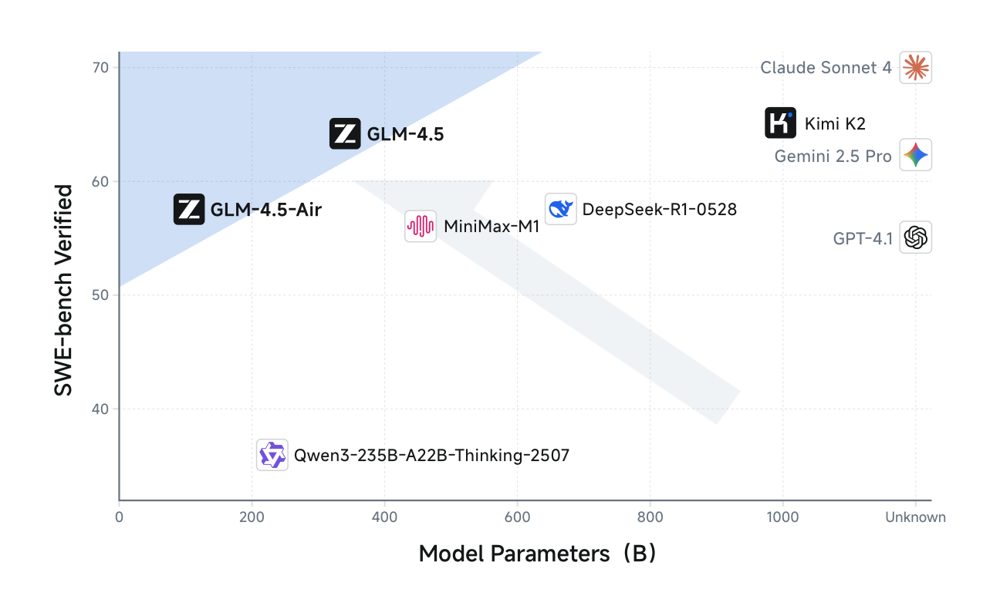

# GLM-4.5: ARC Foundation Models

**Source**: GLM-4.5 Team (Zhipu AI & Tsinghua University), Aug 2025. arXiv:2508.06471. 26 pages. [src](../raw/glm-4.5.pdf)

## Key Points

- **355B total / 32B activated MoE**, trained on 23T tokens; also GLM-4.5-Air (106B/12B)
- **Deep-over-wide design**: fewer experts, more layers — deeper models showed better reasoning capacity
- **96 attention heads** (2.5× typical): no training-loss gain, but consistent reasoning-benchmark gains (MMLU, BBH)
- **Post-training = two-stage expert iteration**: 3 domain experts (Reasoning, Agent, General) → self-distillation into one hybrid-reasoning generalist
- **RL = GRPO without KL loss**, split into Reasoning / Agentic / General RL with task-specific techniques
- **Reasoning RL findings**: single-stage 64K RL beats progressive-length staging; two-stage difficulty curriculum; token-weighted mean loss; dynamic temperature with quality control
- **Agentic RL**: web-search + SWE data with verifiable rewards; iterative self-distillation before resuming RL; process format penalty; test-time compute scales accuracy
- **General RL**: multi-source feedback (rule + RLHF + RLAIF); instruction-following taxonomy (7 major/151 minor constraints); strict exact-match function calling rewards; end-to-end multi-turn function calling RL
- **XML-like function call template** avoids JSON escaping burden for code-in-parameters
- **slime RL infra**: dual sync/async modes; BF16 training + online block-wise FP8 quantized inference; Docker-based agent sandboxes; HTTP endpoint + centralized data pool
- **Results**: 70.1% TAU-Bench, 91.0% AIME, 64.2% SWE-bench Verified; ranked 3rd overall, 2nd on agentic benchmarks

## Architecture

### Deep-over-Wide MoE

Unlike DeepSeek-V3 and Kimi K2, GLM-4.5 reduces width (hidden dim, routed experts) and increases height (layers) — deeper models exhibited better reasoning capacity:

| Model | Total | Active | Dense | MoE Layers | Hidden | Heads | KV Heads | Experts |
|-------|-------|--------|-------|-----------|--------|-------|----------|---------|
| GLM-4.5 | 355B | 32B | 3 | 89 | 5120 | 96 | 8 | 160 (8 active + 1 shared) |
| GLM-4.5-Air | 106B | 12B | 1 | 45 | 4096 | 96 | 8 | 128 (8 active + 1 shared) |

- Loss-free balance routing + sigmoid gates
- QK-Norm stabilizes attention logit range
- MTP (Multi-Token Prediction) MoE layer for speculative decoding at inference

### Attention Head Scaling

2.5× attention heads (96 for 5120 hidden) does **not** improve training loss but **consistently improves reasoning benchmarks**. Partial RoPE + GQA (8 KV heads) keeps KV small.

### Data Processing

- Quality-bucketed web corpus (Nemotron-CC-inspired): up-sample top buckets (>3.2 epochs), discard lowest
- **SemDedup** beyond MinHash: removes template-generated near-duplicates (MinHash misses them)
- Multilingual: crawls + Fineweb-2

## Post-Training: Expert Model Iteration + Self-Distillation

### Stage 1: Three Domain Experts

- Cold-start SFT with extended CoT → domain-specific RL (Reasoning, Agent, General chat)

### Stage 2: Unified Hybrid-Reasoning Generalist

- **Overall SFT**: millions of samples distilled from experts (reasoning, chat, agentic, long-context) at 128K context
- Model learns to apply the right-length CoT per task; **deliberately balanced** full-reasoning vs no-thinking data → hybrid reflective/immediate response modes
- SFT data filtering: remove repetitive/short/truncated samples, verify objective answers, reward-model filter for subjective, tool-protocol checks
- **Challenging-prompt filtering + response scaling**: removing bottom-50% by response length gives 2-4 pt math/science gains with half the data; 4 responses per prompt adds another 1-2 pt

### Agentic SFT data (4 steps)

1. Collect agentic frameworks, real tool APIs/MCP servers + LLM-constructed simulated tools
2. Auto-synthesize agentic tasks (single-step and multi-step tool calling)
3. Generate tool-call trajectories; LLM user-simulator converts multi-step tasks into multi-round dialogues
4. Multiple judge agents evaluate completion; only successful trajectories retained

## Reinforcement Learning (GRPO without KL)

Three RL categories with distinct recipes:

### Reasoning RL

- **Single-stage at 64K beats progressive staging**: multi-stage with increasing max length causes irreversible "unlearning" of long-context generation (output length shrinks, hard to recover)
- **Two-stage difficulty curriculum**: stage 2 switches to extremely hard problems (pass@8=0, pass@512>0) — static data mismatches evolving model skill; all-same rewards give no gradient signal. Stage-2 problems strictly from verified-correct pools
- **Dynamic temperature**: when average reward stabilizes (convergence), raise temperature for diversity; quality control via held-out validation — pick max temperature with <1 pt performance drop
- **Token-weighted mean loss > sequence-mean loss** for code RL: finer, stabler gradient; faster convergence; alleviates length bias
- **GPQA-Diamond finding**: exclusively expert-verified MCQ data beats mixed-quality data even for simple formats

### Agentic RL (web-search + SWE agents)

- Verifiable actions → dense, reliable rewards
- Web-search data: multi-hop knowledge-graph reasoning pipeline + human-in-the-loop extraction with obfuscation
- SWE data: GitHub PRs/issues with executable unit tests, evaluated in hardened sandbox (horizontal scaling + isolation)
- Group-wise policy optimization; **only model-generated tokens get loss** (environment feedback excluded from loss)
- Reward: final-answer accuracy (web search); test-passing (SWE); **process format penalty** (0 reward if tool format invalid, trace halted)
- **Iterative self-distillation**: RL on cold-start → distill responses into improved SFT model → RL again with increasing difficulty
- **Test-time compute scaling**: accuracy scales smoothly with browsing effort (vs reasoning models that scale output tokens)

### General RL

- **Multi-source feedback**: rule-based + human (RLHF reward model on preferences: instruction following, safety, factual correctness) + model-based (RLAIF scoring rubrics, ground-truth-aware)
- **Instruction Following RL**: 7 major / 151 minor constraint taxonomy; deterministic rules + reward model + critique model; up to ~1000 steps no reward hacking observed (SysBench-ISR tracks reward)
- **Function Calling RL**:
  - *Step-wise rule-based*: strict reward — $r_t = 1$ iff $a_t$ matches ground truth exactly (name, params, every field); enforces format
  - *End-to-end multi-turn*: full trajectory reward on task completion (single-turn multi-step via MCP/Agentgym; multi-turn multi-step with LLM user-simulator)
- **Pathology RL**: targeted dataset of prompts triggering language mixing/repetition/format errors (rare, <1%, so sample-inefficient to penalize generally)

## Function Call Template (XML-style)

JSON parameters containing code require heavy escaping — a learning burden for agentic models. XML-like tags keep code native:

```
<tool_call>
  <arg_key>city</arg_key> <arg_value>Beijing</arg_value>
</tool_call>
```

No function-call performance loss while substantially reducing escaping.

## RL Infrastructure (slime)

- **Dual mode**: synchronous colocated (general/reasoning RL — training+inference same worker, dynamic sampling) and disaggregated asynchronous (agentic RL — rollout engines decoupled from training engines, Ray-scheduled)
- **BF16 training + online block-wise FP8-quantized inference** for rollout acceleration (params re-quantized each update)
- **Agent runtime**: high-concurrency Docker-based isolated environments per task
- **Unified HTTP endpoint + centralized message-format data pool**: decouples task-specific rollout logic (heterogeneous agent frameworks) from RL training; supports custom filtering + dynamic sampling

## Evaluation

Base model: stable across English/Code/Math/Chinese (SimpleQA 30.0, MMLU 86.1, MATH 61.0, C-Eval 86.9 — pre-training only, no instruction data).

Full model (12 ARC benchmarks — MMLU-Pro, AIME, MATH-500, SciCode, GPQA, HLE, LCB, SWE-bench Verified, Terminal-Bench, TAU-Bench, BFCL V3, BrowseComp):

| Benchmark | GLM-4.5 | Context |
|-----------|---------|---------|
| TAU-Retail | 79.7 | > Gemini 2.5 Pro, close to Claude Sonnet 4 |
| TAU-Airline | 60.4 | optimized user simulator |
| BFCL V3 | 77.8 | best overall among baselines |
| BrowseComp | 26.4 | close to 2nd-best (o4-mini), > Claude Opus 4 |
| AIME | 91.0 | — |
| SWE-bench Verified | 64.2 | — |

Ranked 3rd overall, 2nd on agentic benchmarks among evaluated open + closed models.



## Connections

- [GLM-5](glm-5.md) — successor: DSA attention, 744B, async RL for agentic engineering
- [DeepSeek-V3](deepseek-v3.md) — both use loss-free balance routing; deep-over-wide vs wide-over-deep contrast
- [Kimi K2](kimi-k2.md) — compared in architecture; both do agentic data synthesis + joint RL
- [DeepSeek-R1](deepseek-r1.md) — GRPO lineage (GLM-4.5 drops the KL term); R1 = pure RL, GLM-4.5 = expert iteration
- [Stabilizing RL with LLMs](stabilizing-rl-llms.md) — token-level objectives; GLM-4.5's token-weighted loss finding
- [TITO: Agentic RL](tito-agentic-rl.md) — only model-generated tokens in loss = TITO invariant in agentic loops
- [Async RL Training Landscape](async-rl-training-landscape.md) — survey context; note: the survey's "SLIME" is Mozilla's library, distinct from Zhipu's `slime` framework described here
- [Single-Rollout Async Optimization](single-rollout-async-agentic-rl.md) — SAO deployed in GLM-5.2; GLM-4.5's async agentic infra is the precursor
- [Muon Optimizer](muon-optimizer.md) — GLM uses conventional training; Muon is the K2-side alternative
- [LLM Architecture Comparison](llm-architecture-comparison.md) — position among 23 open-weight models
- [LLM Scaling Laws](llm-scaling-laws.md) — 23T token budget context
