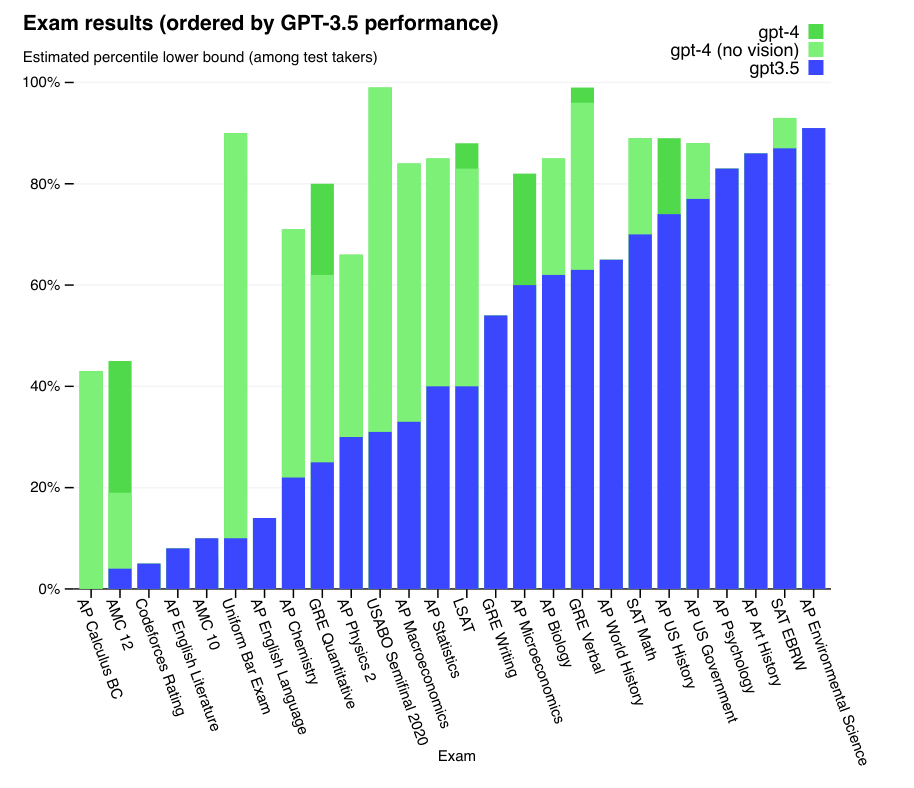
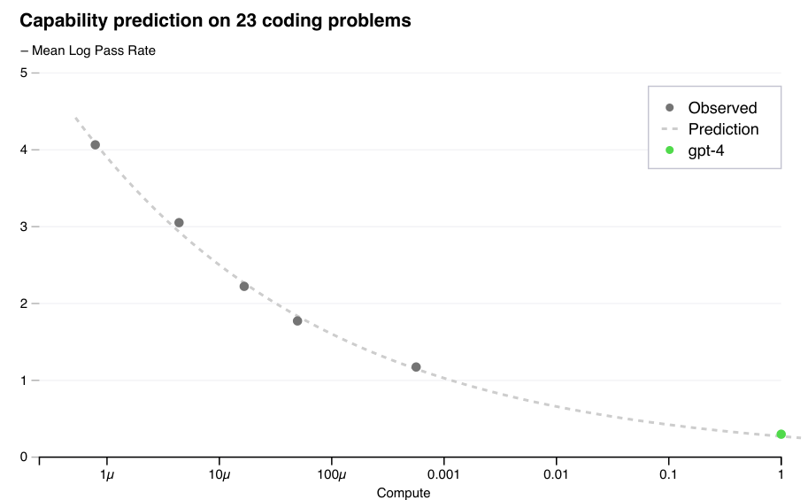

# GPT-4

**Source**: OpenAI, 2023. arXiv:2303.08774. The technical report for GPT-4, a large multimodal model that accepts image and text inputs and produces text outputs, achieving human-level performance on many professional and academic benchmarks.

## Key Points

- **Multimodal**: accepts text and images as input, produces text output
- Achieves **human-level performance** on many benchmarks: top 10% on simulated bar exam (vs GPT-3.5's bottom 10%), top percentiles on SAT, GRE, AP exams
- Report deliberately omits **architecture details, model size, hardware, and training methodology** — citing competitive landscape and safety concerns
- Trained with **predictable scaling**: developed infrastructure and optimization methods that accurately predicted final performance from small-scale runs
- **RLHF post-training** (InstructGPT-style) for alignment, safety, and steerability
- Introduces **system messages** to control model behavior, tone, and role
- OpenAI Evals framework for benchmarking and safety evaluation
- Significant improvement on **multilingual** benchmarks vs GPT-3.5
- Supports 8K and 32K context windows



## What We Know (from the report and external sources)

| Aspect | Details |
|--------|---------|
| Modality | Text + image → text |
| Architecture | Transformer-based (details undisclosed) |
| Parameters | Undisclosed (rumored ~1.8T, MoE with 8 experts, ~220B active) |
| Context | 8K tokens (base), 32K (extended) |
| Training | Predictable scaling + RLHF |
| Compute | Undisclosed |

## Predictable Scaling

A key innovation: OpenAI developed infrastructure to predict GPT-4's final performance from models trained with 1,000× to 10,000× less compute:

- Built a **small-scale proxy** that accurately forecasted final loss and downstream task performance
- This reduced expensive large-scale trial-and-error
- Prior to GPT-4, such predictions were often off by large margins
- Implications: the ability to predict scaling behavior is itself a competitive advantage



## System Messages & Steerability

GPT-4 introduced system messages as a core mechanism for controlling behavior:

```
System: You are a tutor that always responds in Socratic style.
User: How do I solve quadratic equations?
```

This enables role-playing, tone control, constraint enforcement, and custom behaviors without fine-tuning — a capability that has become standard in all modern chat models.

## Safety & Alignment

- **RLHF training** following the InstructGPT methodology
- **Rule-based reward models** (RBRMs): additional classifiers to detect harmful outputs, providing reward signals during RL
- Evaluated against adversarial prompts, jailbreak attempts, and disallowed content categories
- External red-teaming before release
- **OpenAI Evals**: open-source framework for systematic safety and capability evaluation

## Benchmarks

GPT-4 achieves SOTA or near-SOTA across diverse benchmarks:
- **MMLU**: 86.4% (5-shot) — near human expert level
- **HellaSwag**: 95.3% — significantly above prior models
- **ARC-Challenge**: 96.3%
- **HumanEval** (code): 67.0% pass@1 (vs 48.1% for GPT-3.5)
- **Multilingual MMLU**: strong performance across 23+ languages

## Limitations

- Still **hallucinates** and makes reasoning errors
- Does not learn from experience (no online learning)
- Sensitive to prompt phrasing and format
- Biases in training data may emerge in outputs
- **No details on architecture or training** — a departure from the transparency of GPT-1/2/3

## Connections

- [GPT-3](gpt-3.md) — predecessor (175B, text-only)
- [InstructGPT](instruct-gpt.md) — the RLHF methodology used for GPT-4's alignment
- [LLM Scaling Laws](llm-scaling-laws.md) — the predictable scaling infrastructure builds on scaling law theory
- [DeepSeek-V4](deepseek-v4.md) — a modern open competitor with disclosed architecture
- [LLM Architecture Comparison](llm-architecture-comparison.md) — where GPT-4 fits in the architecture landscape
