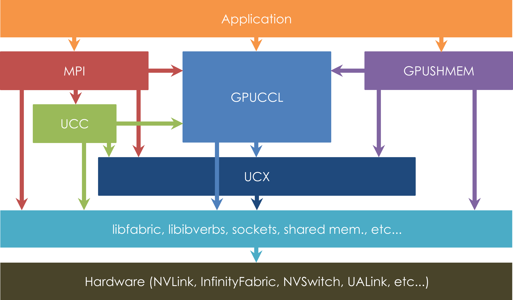
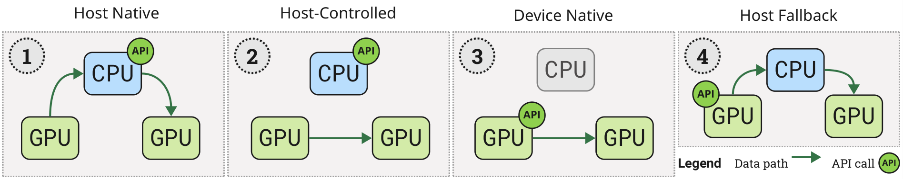
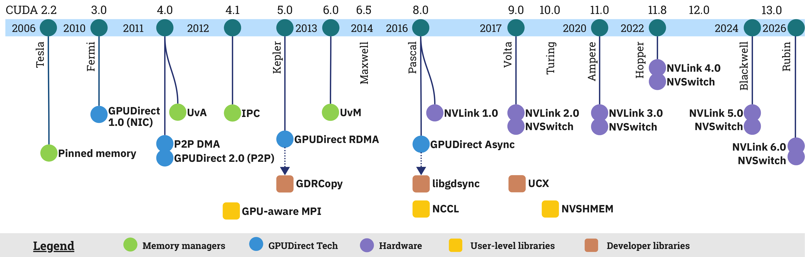

# GPU-Centric Communication Landscape

**Source**: Unat et al., 2024 (revised 2026). Survey. arXiv:2409.09874.

## Key Points

- GPU communication has shifted from **CPU-managed** to **GPU-centric**: GPUs increasingly control their own communication, reducing CPU involvement
- Covers vendor mechanisms and user-level libraries across the full stack
- Defines terminology and categorizes approaches within and across nodes

## Communication Stack

*Figure: Software stack for GPU-centric communication — hardware, vendor APIs, collective libraries, and application-level frameworks. [src](../raw/gpu-communication-landscape.pdf)*

*Figure 1: Multi-node GPU communication system with NVLink intra-node and InfiniBand inter-node. [src](../raw/gpu-communication-landscape.pdf)*

*Figure: Timeline of GPU communication technology evolution — from early PCIe to NVLink 5 and NVSHMEM. [src](../raw/gpu-communication-landscape.pdf)*

| Layer | Mechanism | Example |
|-------|-----------|---------|
| **Hardware** | Interconnects | NVLink, NVSwitch, InfiniBand, PCIe |
| **Vendor APIs** | Direct communication primitives | GPUDirect RDMA, GPUDirect P2P, NVSHMEM |
| **Collective Libraries** | Multi-GPU collectives | NCCL, RCCL, MPI |
| **Application** | Framework integration | PyTorch DDP/FSDP, JAX pmap |

## GPU-Centric Communication Paradigms

**CPU-Managed (Traditional)**: CPU orchestrates all communication — launches kernels, manages buffers, initiates transfers. GPU is a passive compute device. Creates CPU bottlenecks for fine-grained operations.

**GPU-Centric (Modern)**: GPU initiates and manages communication:
- **GPU-initiated RDMA**: GPU kernels trigger network transfers directly (NCCL GIN, NVSHMEM)
- **GPU-controlled collectives**: NCCL Device API lets GPU kernels invoke collectives
- **In-network computing**: SHARP, NVLS offload reductions to switch fabric
- **Direct GPU-GPU**: NVLink P2P, GPUDirect RDMA bypass CPU entirely

## Key Communication Libraries

| Library | Focus | Key Feature |
|---------|-------|-------------|
| **NCCL** | Multi-GPU collectives | Ring, tree, PAT algorithms; topology-aware; in-network reduction |
| **NVSHMEM** | One-sided PGAS | GPU-initiated put/get/atomic from device code |
| **RCCL** | AMD GPU collectives | NCCL-equivalent for ROCm |
| **MPI (CUDA-aware)** | Multi-node | GPU-aware send/recv, GPUDirect RDMA integration |
| **UCX** | Transport abstraction | Unified communication across InfiniBand, RoCE, TCP |
| **Gloo** | CPU collectives | Fallback for CPU-only or heterogeneous clusters |

## Memory Management

- **Unified Memory**: Single address space across CPU and GPU — simplifies programming but adds page fault overhead
- **Pinned/Mapped Memory**: CPU memory directly accessible by GPU DMA — lower latency than unified memory
- **Peer-to-Peer Access**: GPU directly accesses another GPU's memory over NVLink/PCIe
- **NVLink-C2C**: Cache-coherent CPU-GPU memory (Grace Hopper)

## Future Directions

- Converged scale-up (NVLink) and scale-out (IB/RoCE) fabrics
- In-network computation beyond reduction (multicast, compression)
- Fault-tolerant collective communication with automatic recovery
- Communication scheduling to overlap with computation at finer granularity

## Connections

- **[NCCL Demystifying](nccl-demystifying.md)** — Ring, tree, and PAT algorithms for NCCL collectives
- **[NCCL Device API / GIN](nccl-device-api-gin.md)** — GPU-initiated communication
- **[NCCL EP](nccl-ep.md)** — MoE communication built on NCCL
- **[Distributed Networking Tuning](aspe-distributed-networking-tuning.md)** — Magnum IO, NVSHMEM, GPUDirect
- **[Scaling Techniques Overview](usp-scaling-techniques-overview.md)** — Where collectives are used (ZeRO/FSDP)
- **[Every Microsecond Matters](every-microsecond-matters.md)** — Barrier-free low-latency GPU collectives; LL/sentinel/LL128 atomic algorithms; within 7% of hardware SoL
