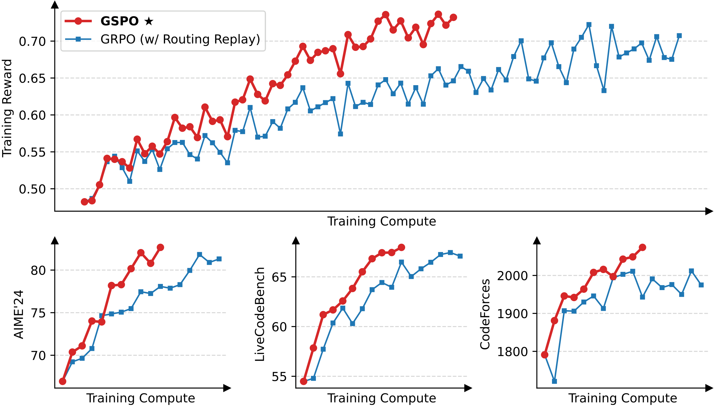
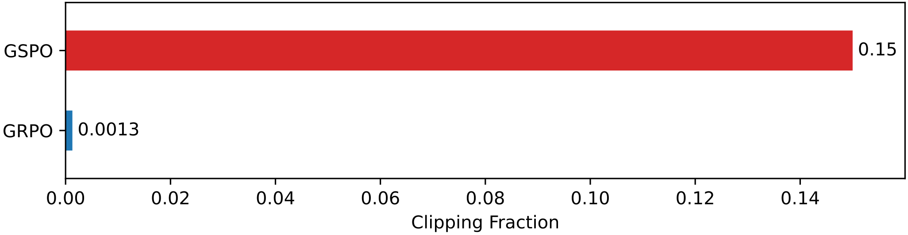

# GSPO: Group Sequence Policy Optimization

**Source**: Zheng, Liu, Li, Chen, Yu, et al. (Qwen Team, Alibaba), July 2025. 7 pages. arXiv:2507.18071. Used in Qwen3.

## Key Points

- **Sequence-level importance sampling** replaces GRPO's problematic token-level IS
- GRPO's instability stems from a fundamental mismatch: token-level IS weights are invalid when the reward is sequence-level
- GSPO uses **per-sequence importance ratios** with geometric averaging: $s_i = (\pi_\theta(y) / \pi_{\theta_{\text{old}}}(y))^{1/|y|}$
- More stable than GRPO, especially for **MoE models**
- Used in Qwen3 — contributed to its significant RL improvements

## The Problem with GRPO's Token-Level IS

GRPO uses token-level importance sampling weights:

$$
w_{i,t}(\theta) = \frac{\pi_\theta(y_{i,t} \mid x, y_{i,1:t-1})}{\pi_{\theta_{\text{old}}}(y_{i,t} \mid x, y_{i,1:t-1})}
$$

**The core problem**: The reward $r(x, y_i)$ is granted to the **entire sequence**, but the IS correction is applied at the **token level**. This mismatch causes:

1. **High-variance gradients**: Token-level IS weights accumulate over long sequences, and the clipping mechanism amplifies the instability
2. **Irreversible model collapse**: Once collapse occurs, even reverting to a previous checkpoint and tuning hyperparameters cannot recover training
3. **Fundamental invalidation**: The IS weight at token $t$ cannot correctly correct the off-policy distribution for the full sequence reward

The paper argues: **the unit of optimization objective should match the unit of reward.** Sequence-level reward → sequence-level IS.

## GSPO: Sequence-Level Optimization

*Figure: GSPO vs GRPO and DAPO — superior training efficiency and more stable convergence, especially for MoE models. [src](../raw/gspo.pdf)*

GSPO uses **sequence-level importance ratios** with group-based advantage (same as GRPO):

$$
\mathcal{J}_{\text{GSPO}}(\theta) = \mathbb{E}_{x, \{y_i\}_{i=1}^G \sim \pi_{\theta_{\text{old}}}} \left[ \frac{1}{G} \sum_{i=1}^G \min\left( s_i(\theta) \hat{A}_i, \; \text{clip}(s_i(\theta), 1-\varepsilon, 1+\varepsilon) \hat{A}_i \right) \right]
$$

Where the **sequence importance ratio** $s_i(\theta)$ is the geometric mean of token-level ratios:

$$
s_i(\theta) = \left( \frac{\pi_\theta(y_i \mid x)}{\pi_{\theta_{\text{old}}}(y_i \mid x)} \right)^{\frac{1}{\lvert y_i \rvert}} = \exp\left( \frac{1}{\lvert y_i \rvert} \sum_{t=1}^{\lvert y_i \rvert} \log \frac{\pi_\theta(y_{i,t} \mid x, y_{i,1:t-1})}{\pi_{\theta_{\text{old}}}(y_{i,t} \mid x, y_{i,1:t-1})} \right)
$$

And advantage is group-based (same as GRPO):

$$
\hat{A}_i = \frac{r(x, y_i) - \text{mean}(\{r(x, y_i)\}_{i=1}^G)}{\text{std}(\{r(x, y_i)\}_{i=1}^G)}
$$

### Why the Geometric Mean?

The sequence likelihood ratio $\pi_\theta(y|x) / \pi_{\theta_{\text{old}}}(y|x)$ varies dramatically with sequence length — longer sequences naturally have smaller product likelihoods. The geometric mean (power of $1/|y|$) normalizes for sequence length, making $s_i(\theta)$ comparable across responses of different lengths.

### Sequence-Level Clipping

The clipping in GSPO operates at the **sequence level**: it clips $s_i(\theta)$ directly, rather than $w_{i,t}(\theta)$ at each token. This means:

*Figure: Comparison of clipping mechanisms — GSPO clips at the sequence level (one decision per response), GRPO clips at the token level (accumulating errors). [src](../raw/gspo.pdf)*

- A single clip decision per response, not per token
- Prevents the accumulation of per-token clipping errors
- Aligns the clipping scope with the reward scope

## GSPO vs GRPO vs PPO

| Component | PPO | GRPO | GSPO |
|-----------|-----|------|------|
| **Importance ratio** | Token-level, per-token advantage | Token-level, group advantage | **Sequence-level (geometric mean)**, group advantage |
| **Clipping** | Per-token | Per-token | **Per-sequence** |
| **Value model** | Required | Not needed | Not needed |
| **Optimization granularity** | Token | Token | **Sequence** |
| **MoE stability** | — | Unstable | **Stable** |
| **Used in** | GPT-4, Claude | DeepSeek-R1/V3 | **Qwen3** |

## MoE Stability

GSPO notably stabilizes MoE RL training — a key advantage the paper emphasizes. GRPO's token-level IS interacts poorly with MoE's dynamic routing, where the router changes between generation and training, creating additional training-inference discrepancy. GSPO's sequence-level approach reduces sensitivity to this discrepancy.

This complements the [Stabilizing RL with LLMs](stabilizing-rl-llms.md) paper's finding that Routing Replay is essential for MoE stability under off-policy updates — GSPO provides stability at the algorithmic level, while Routing Replay provides stability at the systems level.

## Connections

- [GRPO](grpo.md) — The algorithm GSPO improves upon
- [PPO](ppo.md) — The foundation both build on
- [ScaleRL](scalerl.md) — Found GSPO achieves high asymptotic performance but was unstable on large models; GSPO addresses this
- [Stabilizing RL with LLMs](stabilizing-rl-llms.md) — Token-level RL as first-order approximation; GSPO takes the logical next step to sequence-level
- [DeepSeek-R1](deepseek-r1.md) — Uses GRPO (the algorithm GSPO improves)
- [RL Foundations](rl-foundations.md) — Sequence-level importance sampling theory underlying GSPO's design
