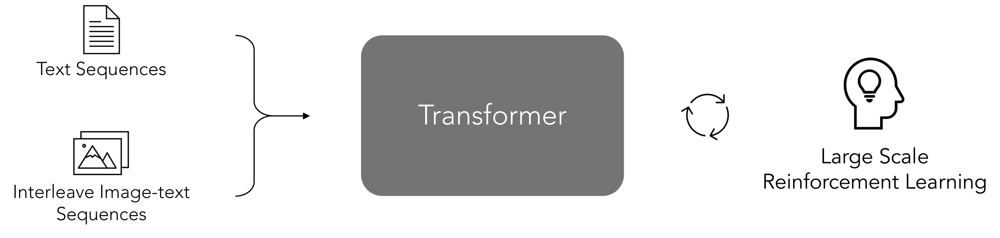
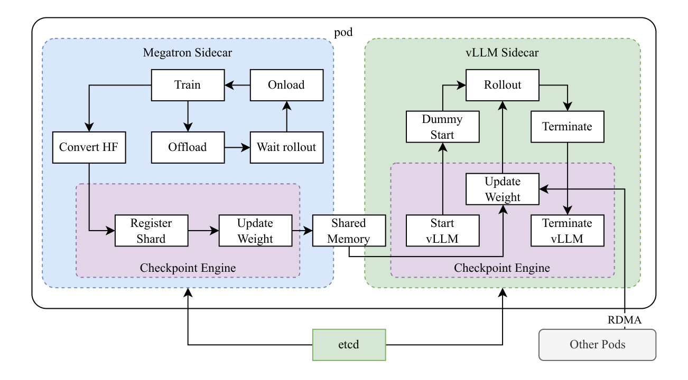
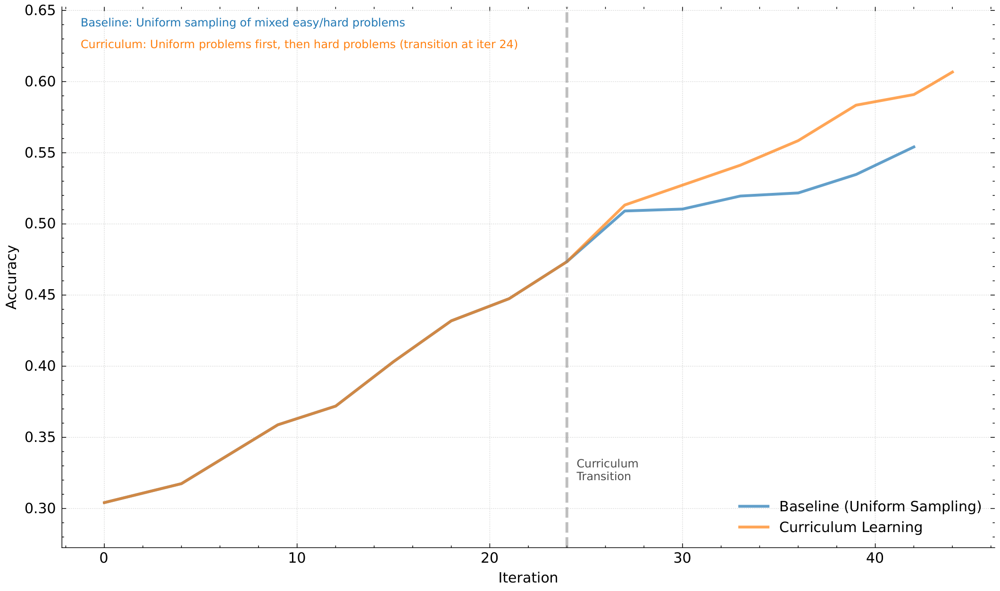

# Kimi k1.5: Scaling RL with LLMs

**Source**: Kimi Team (Moonshot AI), Jan 2025. arXiv:2501.12599. 25 pages. [src](../raw/kimi-k1.5.pdf)

## Key Points

- **Long-context RL scaling**: context window scaled to **128K** — context length as a key dimension of continued RL scaling; learned CoTs exhibit planning, reflection, correction
- **Partial rollouts**: fixed output token budget; unfinished trajectories saved to replay buffer, continued next iteration — no single trajectory monopolizes resources
- **Simplistic framework**: no MCTS, no value functions, no process reward models — long context + online mirror descent + data recipe
- **Online mirror descent (OMD)** with KL regularization against current policy — closed-form optimum gives off-policy-compatible surrogate loss
- **RL prompt set curation**: diverse coverage, balanced difficulty (model-based pass-rate difficulty), accurate evaluability (anti-reward-hacking filtering)
- **Length penalty** with warmup: promote shorter correct, penalize longer wrong; overthinking control
- **Curriculum + prioritized sampling** ($\propto 1 - s_i$)
- **Chain-of-Thought RM (98.5% accuracy) vs classic RM (84.4%)** for math reward modeling
- **long2short**: transfer long-CoT priors to short-CoT models (model merging, shortest rejection sampling, DPO, long2short RL)
- **Results (long-CoT)**: 77.5 AIME, 96.2 MATH-500, 94th pct Codeforces, 74.9 MathVista — matches o1
- **Results (short-CoT)**: 60.8 AIME, 94.6 MATH-500, 47.3 LiveCodeBench — beats GPT-4o / Claude 3.5 Sonnet by up to +550%

## RL Prompt Set Curation

Three properties: **diverse coverage** (STEM/coding/general reasoning, text+image), **balanced difficulty**, **accurate evaluability**.

- **Model-based difficulty**: SFT model answers each prompt 10× at high temperature; pass rate = difficulty proxy (aligned with model's intrinsic capability)
- **Anti-reward-hacking**: exclude multiple-choice, true/false, proof questions (guessable answers → false-positive verification); "guess test" — if a model can guess the answer without CoT within N=8 attempts, drop the prompt

## Long-CoT SFT Warm-up

Small high-quality warm-up dataset of verified long-CoT reasoning paths (planning, evaluation, reflection, exploration) — rejection-sampling-like but built with prompt engineering; light SFT primes the model to internalize reasoning strategies.

## Policy Optimization: Online Mirror Descent (OMD)

At iteration i, use current model $\pi_{\theta_i}$ as reference:

$$\max_\theta \mathbb{E}_{(x,y^*) \sim D}\left[\mathbb{E}_{(y,z)\sim\pi_\theta}[r(x,y,y^*)] - \tau \operatorname{KL}(\pi_\theta(x) \| \pi_{\theta_i}(x))\right]$$

Closed-form solution: $\pi^*(y,z|x) = \pi_{\theta_i}(y,z|x) \exp(r(x,y,y^*)/\tau) / Z$ — enables the surrogate loss:

$$L(\theta) = \mathbb{E}\left[\left(r(x,y,y^*) - \tau \log Z - \tau \log \frac{\pi_\theta(y,z|x)}{\pi_{\theta_i}(y,z|x)}\right)^2\right]$$

Gradient (with $\tau \log Z$ approximated via sampled rewards, empirical mean $\bar{r}$ as baseline):

$$\frac{1}{k}\sum_{j=1}^k \left[\nabla_\theta \log \pi_\theta(y_j,z_j|x)(r(x,y_j,y^*) - \bar{r}) - \frac{\tau}{2}\nabla_\theta \left(\log \frac{\pi_\theta(y_j,z_j|x)}{\pi_{\theta_i}(y_j,z_j|x)}\right)^2\right]$$

Like policy gradient with mean-reward baseline; the KL term regulates the update. Key design point: **reward only from final answer correctness** — exploration of "wrong" branches is encouraged because trial-and-error patterns in long CoT carry learning signal (recovering to the right answer is valuable).

## Length Penalty

Overthinking: response length grows during RL. Length reward:

$$\text{len\_reward}(i) = \begin{cases} \lambda & \text{if } r = 1 \\ \min(0, \lambda) & \text{if } r = 0 \end{cases}, \quad \lambda = 0.5 - \frac{\text{len}(i) - \min\_len}{\max\_len - \min\_len}$$

- Promotes shorter correct responses, penalizes longer ones (among correct)
- Explicitly penalizes long wrong responses
- **Warmup**: standard optimization first, then constant length penalty (avoids early-training slowdown)

## Sampling Strategies

- **Curriculum sampling**: easier tasks first (data has grade/difficulty labels)
- **Prioritized sampling**: sample $\propto 1 - s_i$ (success rate per problem) — focus on weak areas

## Reward Design Details

### Test Case Generation for Coding

- Base k1.5 generates test cases from problem statements + CYaRon library usage
- 50 candidate test cases × 10 ground-truth submissions; valid if ≥7/10 match; problem kept if ≥9/10 pass
- From 1,000 contest problems: 614 no-special-judge; 463 generators produced ≥40 valid cases; **323 problems in training set**

### Chain-of-Thought Reward Model for Math

- **Classic RM**: value-head RM on ~800K points — 84.4% accuracy in spot checks
- **CoT RM**: generates step-by-step reasoning before JSON correctness judgment, ~800K examples — **98.5% accuracy**; adopted in training
- Rationale: same answer can be written differently ($a^2 - 4$ vs $(a+2)(a-2)$)

### Vision RL Data

1. **Real-world**: science questions with graphics, location guessing, chart analysis
2. **Synthetic visual reasoning**: procedurally generated scenes (spatial, geometric, object interaction)
3. **Text-rendered**: text/code/structured data converted to images — modality consistency for text-heavy images

## long2short (Context Compression for Short-CoT)

Transfer thinking priors from long-CoT to short-CoT models:

1. **Model merging**: average weights of long-CoT + short-CoT models (no training)
2. **Shortest rejection sampling**: sample n=8, pick shortest correct response → SFT
3. **DPO**: shortest correct = positive; longer responses (wrong, or correct but ≥1.5× longer) = negatives
4. **Long2short RL**: second RL phase with length penalty + drastically reduced max rollout length

## SFT + Pretraining Details

- Pretraining 3 stages: vision-language pretraining (strong language base, gradual multimodal integration) → cooldown (curated/synthetic reasoning data) → long-context activation (131,072 tokens)
- Vanilla SFT: ~1M text examples (500K QA, 200K coding, 200K math/science, 5K creative writing, 20K long-context) + 1M text-vision examples
- Training: 1 epoch @32K (lr $2\times10^{-5} \to 2\times10^{-6}$), then 1 epoch @128K (re-warmup to $1\times10^{-5}$, decay to $1\times10^{-6}$); sequence packing

## RL Infrastructure

### System (iterative synchronous)

Central master coordinates rollout workers, trainer workers, reward models, code execution service; replay buffer breaks temporal correlation.

### Partial Rollouts

- Fixed output token budget caps each trajectory
- Overshoot → unfinished portion saved to replay buffer, **continued next iteration** (segments across iter n-m to n)
- Only current iteration needs on-policy computation; previous segments reused — no re-rolling
- Async rollout workers: long-trajectory workers don't block short-task workers
- Segments can be excluded from loss
- **Repeat detection**: early termination of repeated sequences + penalties

### Hybrid Deployment (Megatron + vLLM sidecars)

- Megatron sidecar (train) + vLLM sidecar (rollout) on shared pod; checkpoint engine for weight transfer; train onload/offload cycles; vLLM start/terminate/update cycles

## Results

| Benchmark | k1.5 long-CoT | o1 |
|-----------|--------------|-----|
| AIME 2024 | 77.5 | 74.4 |
| MATH-500 | 96.2 | 94.8 |
| Codeforces | 94 pct | 94 pct |
| MathVista | 74.9 | 71 |
| MMMU | 70.0 | 77.3 |

Short-CoT: AIME 60.8, MATH-500 94.6, LiveCodeBench 47.3 — beats GPT-4o and Claude Sonnet 3.5 by large margins (up to +550% relative).

## Connections

- [DeepSeek-R1](deepseek-r1.md) — same-era RL reasoning; k1.5 uses long context + partial rollouts + OMD instead of GRPO scaling
- [GRPO](grpo.md) — k1.5 deliberately avoids group-relative advantage; OMD with mean-reward baseline
- [LLM Scaling Laws](llm-scaling-laws.md) — RL as a new scaling axis beyond pretraining data limits
- [PPO](ppo.md) — policy optimization lineage; OMD as trust-region-style alternative
- [Batch Size-Invariance](batch-size-invariance.md) — reference policy (proximal) + behavior data reuse in OMD surrogate
- [Stabilizing RL with LLMs](stabilizing-rl-llms.md) — token-level objectives; off-policy data via KL-regularized surrogate
- [Async RL Training Landscape](async-rl-training-landscape.md) — replay buffer + partial rollout patterns; async workers
- [Kimi K2](kimi-k2.md) — successor; colocated RL architecture inherits k1.5 design; MuonClip
- [RL Foundations](rl-foundations.md) — mirror descent, policy gradient math
- [TITO: Agentic RL](tito-agentic-rl.md) — partial rollouts segment tokens across iterations; token fidelity matters

## Key Figures

