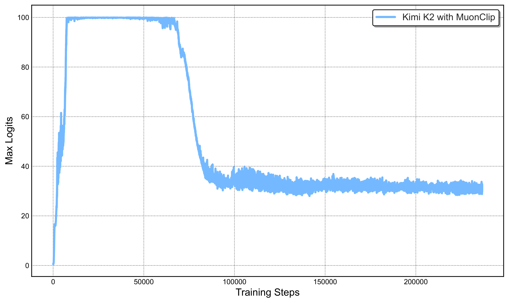
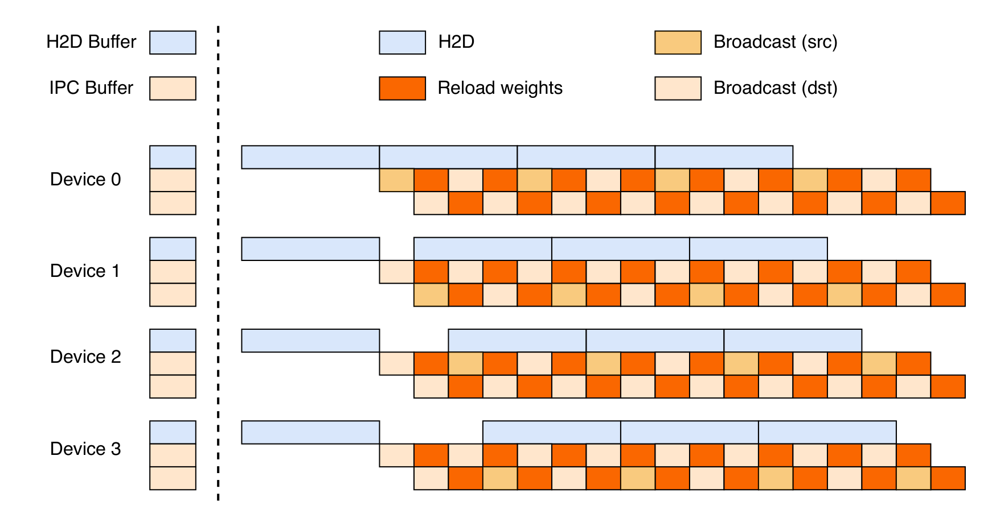
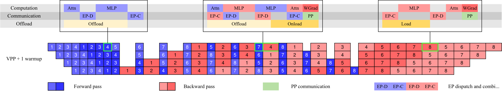

# Kimi K2: Open Agentic Intelligence

**Source**: Kimi Team (Moonshot AI), Jul 2025 (v2 Feb 2026). arXiv:2507.20534. 32 pages. [src](../raw/kimi-k2.pdf)

## Key Points

- **1.04T total / 32.6B activated MoE** (often rounded to "32B"), 61 layers, MLA attention, 15.5T tokens, **zero loss spike**
- **MuonClip optimizer**: Muon (token-efficient) + **QK-Clip** weight rescaling — fixes exploding attention logits that plain Muon hits (max logits > 1000 at 9B-active scale)
- **QK-Clip**: post-update rescaling of query/key projection weights when max logit exceeds threshold $t$; head-specific components scaled by $\sqrt{g}$, rotary by $g$ — works where logit soft-cap (too late) and QK-Norm (inapplicable to MLA, keys not materialized) fail
- **384 experts vs DeepSeek-V3's 256** (scaling-law-driven sparsity); **64 attention heads vs 128** — 83% inference-FLOP reduction at 128K context for only 0.5-1.2% validation-loss gain
- **Large-scale agentic data synthesis**: 3000+ real MCP tools + 20,000+ evolved synthetic tools; thousands of agents; rubric-based tasks; simulated tool executor + real sandboxes
- **Joint RL**: RLVR (verifiable rewards gym) + **Self-Critique Rubric Reward** (model judges its own outputs)
- **Auxiliary PTX loss** on curated high-quality data prevents overfitting to RL task set
- **Temperature decay** schedule: exploration → exploitation
- **Flexible parallelism**: 16-way PP (virtual stages) + 16-way EP + ZeRO-1 DP; trainable on any node count multiple of 32; ~30GB/GPU for all states
- **Distributed checkpoint engine**: full parameter update < 30s for 1T model; robust to single-point failure
- **Results (non-thinking)**: 66.1 Tau2-Bench, 76.5 ACEBench (En), 65.8 SWE-bench Verified, 47.3 SWE-bench Multilingual, 53.7 LiveCodeBench v6, 27.1 OJBench, 49.5 AIME 2025, 75.1 GPQA-Diamond; #1 open on LMSYS Arena (5th overall, 3000+ votes)

## MuonClip Optimizer

### The Problem: Muon + Exploding Attention Logits

Muon (matrix orthogonalization) substantially outperforms AdamW at fixed compute/data (Moonlight finding). But scaling Muon training explodes attention logits — max logits exceed 1000 even at 9B-active scale, causing loss spikes/divergence.

Existing mitigations fail:
- **Logit soft-cap**: clips logits but dot products still grow excessively before capping
- **QK-Norm**: not applicable to MLA — key matrices not fully materialized during inference

### QK-Clip

Rescale query/key projection weights post-update when max logit exceeds threshold $t$:

$$S^{\text{max}}_h = \frac{1}{\sqrt{d}} \max_{X \in B} \max_{i,j} Q^h_i {K^h_j}^\top$$

If $S^{\text{max}}_h > t$: scale factor $g = t / S^{\text{max}}_h$, then:
- Head-specific components $q_C, k_C$: × $\sqrt{g}$
- Head-specific rotary $q_R$: × $g$
- Shared rotary $k_R$: untouched (avoid cross-head effects)

### MuonClip Algorithm

Per step: (1) Muon update (momentum $M_t = mM_{t-1} + G_t$; Newton-Schulz orthogonalization $O_t = \text{NS}(M_t) \cdot \sqrt{\max(n,m)} \cdot 0.2$ to match Adam RMS; weight decay $l$), then (2) QK-Clip per attention head using $S^{\text{max}}$ computed during forward.

## Pre-training

- 4,096-token context, WSD schedule: 10T tokens @ constant lr 2e-4 (500-step warmup), then 5.5T tokens cosine decay 2e-4 → 2e-5; weight decay 0.1; global batch 67M tokens
- Annealing: 400B tokens @4K seq (lr 2e-5 → 7e-6) + 60B tokens @32K seq; **YaRN** extends context to 128K

### Data Rephrasing (token efficiency)

- **Chunk-wise rephrasing** for long inputs (sequential rewrite + fidelity check) — proven vs multi-epoch repetition: SimpleQA 23.76 (raw ×10 epochs) → 27.39 (rephrased once ×10) → **28.94** (rephrased 10×, 1 pass)
- Math data rewritten to "learning-note" style (SwallowMath-inspired) + multilingual translation
- 15.5T tokens across Web Text, Code, Math, Knowledge

## Architecture (vs DeepSeek-V3)

| | DeepSeek-V3 | Kimi K2 |
|--|------------|---------|
| Total params | 671B | 1.04T (+54%) |
| Activated | 37B | 32.6B (-13%) |
| Experts | 256 | 384 (+50%) |
| Active/token | 8 | 8 |
| Shared experts | 1 | 1 |
| Attention heads | 128 | 64 |
| Hidden dim | 7168 | 7168 |

- **Why 384 experts**: scaling-law analysis shows continued sparsity gains
- **Why 64 heads**: doubling heads (64→128) at 128K context = **83% inference-FLOP increase** for only 0.5-1.2% validation-loss gain (iso-token). Agentic apps need efficient long context.

## Training Infrastructure

### Cluster + Parallelism

- H800 cluster; 8×400 Gbps RoCE inter-node; NVLink/NVSwitch intra-node
- **16-way PP with virtual stages + 16-way EP + ZeRO-1 DP** — flexible: any node count multiple of 32; ~30GB/GPU for params/gradients/optimizer states (BF16 params + FP32 grad accumulation ≈ 6TB over 256-GPU model-parallel group)
- **No DualPipe** (needs 2× memory for params/gradients → more parallelism → more bubbles/EP overhead); instead: warm-up micro-batches overlap EP all-to-all with compute under interleaved 1F1B; weight-gradient computation decoupled from backward, overlapped with PP communication
- **EP=16 chosen small**: K2's reduced attention time (64 heads) needs minimal EP latency; smaller EP also relaxes expert-balance constraints

### Activation Reduction

- Selective recomputation (LayerNorm, SwiGLU, MLA up-projections, MoE down-projections)
- **FP8-E4M3 storage** for insensitive activations (MoE up-projection/SwiGLU inputs, 1×128 tiles, FP32 scales) — no measurable loss increase; FP8 NOT used in computation (performance risk)
- **CPU offload**: copy engine streams offload/onload overlapped with compute+comm; EP traffic unaffected despite PCIe congestion

## Agentic Data Synthesis Pipeline

Three stages:

1. **Tool spec generation**: 3000+ real MCP tools (GitHub) + hierarchical domain evolution (financial trading → robot control...) → **20,000+ synthetic tools** with clear interfaces/semantics (t-SNE: complementary tool-space coverage)
2. **Agent and task generation**: thousands of agents (synthesized system prompts × tool combos); rubric-based tasks (success criteria, expected tool-use patterns, checkpoints)
3. **Trajectory generation**: LLM user personas × tool-execution simulator (world-model-like, stateful, controlled stochasticity — successes/partial failures/edge cases); LLM judge filters by rubric; **hybrid real sandboxes** (Kubernetes, 10,000+ concurrent instances) for coding/SWE authenticity

= large-scale rejection sampling for tool-use capability.

## Reinforcement Learning

### Verifiable Rewards Gym (RLVR)

- **Math/STEM/logical**: diverse coverage + moderate difficulty (SFT pass@k selects problems with signal)
- **Complex instruction following**: hybrid rule verification (code interpreters + LLM-judge + **hack-check layer** for deceptive compliance claims); multi-source generation (expert-crafted, AutoIF-inspired augmentation, failure-mode probing model)
- **Faithfulness**: sentence-level faithfulness judge model (FACTS Grounding-inspired) as reward model
- **Coding/SWE**: competition problems + judges; GitHub PRs/issues → sandboxed environment with executable unit tests (Kubernetes, 10K+ concurrent sandboxes)
- **Safety**: seed prompts + automated attack/target/judge evolution pipeline for jailbreak simulation

### Self-Critique Rubric Reward (beyond verification)

- Actor generates; **K2 critic ranks via pairwise evaluation** against rubrics (core values + anti-reward-hacking prescriptive rubrics + human-annotated)
- Critic bootstrapped in SFT with open-source + in-house preference data
- **Closed-loop refinement**: critic continuously updated using on-policy rollouts from verifiable-reward prompts — grounds subjective judgment in verifiable signals (transfer from RLVR)

### RL Algorithm

- K1.5's policy optimization as foundation (sampled from previous policy, group objective)
- **Auxiliary PTX loss** on hand-curated high-quality data — mitigates overfitting to RL task set, improves generalization
- **Temperature decay**: high temperature early (exploration) → low late (stable outputs)

## RL Infrastructure

- **Colocated hybrid architecture** (as k1.5): training + inference on same workers, releasing/offloading GPU resources to the active engine; centralized controller orchestrates
- **Distributed checkpoint engine**: checkpoint workers co-located on training nodes; broadcast full params across checkpoint workers (simpler than transfer-what-you-need; better bandwidth utilization); inference engine pulls only its shard; pipelined parameter-by-parameter for 1T; **full update < 30s**; robust to single-point failure; also used for startup (collective disk read once)
- **Agentic rollout**: heavy environments as scalable dedicated services; many concurrent rollouts amortize expensive-interaction latency; **partial rollout** (from k1.5) for long-tail trajectories

## Results (non-thinking)

| Benchmark | K2 | vs baselines |
|-----------|----|--------------|
| Tau2-Bench | 66.1 | closes gap with Claude 4 Opus/Sonnet |
| ACEBench (En) | 76.5 | — |
| SWE-bench Verified | 65.8 | — |
| SWE-bench Multilingual | 47.3 | — |
| LiveCodeBench v6 | 53.7 | — |
| OJBench | 27.1 | — |
| AIME 2025 | 49.5 | — |
| GPQA-Diamond | 75.1 | — |
| LMSYS Arena | #1 open | 5th overall, 3000+ votes |

## Connections

- [Muon Optimizer](muon-optimizer.md) — MuonClip = Muon + QK-Clip; Moonlight evidence
- [Kimi k1.5](kimi-k1.5.md) — predecessor: colocated RL infra, partial rollouts, policy optimization algorithm
- [DeepSeek-V3](deepseek-v3.md) — architecture base (MLA, MoE); contrast: 384 vs 256 experts, 64 vs 128 heads, no DualPipe
- [GLM-5](glm-5.md) — Muon Split (per-head orthogonalization) vs MuonClip: two solutions to Muon instability under MLA
- [GLM-4.5](glm-4.5.md) — deep-over-wide vs K2's wide-over-deep contrast
- [DeepSeek-V3.2](deepseek-v3.2.md) — router consistency concerns; K2's expert balance
- [ScaleRL](scalerl.md) — RL scaling; pass@k difficulty filtering
- [Stabilizing RL with LLMs](stabilizing-rl-llms.md) — PTX auxiliary loss; temperature decay
- [LLM Architecture Comparison](llm-architecture-comparison.md) — K2's MLA config among 23 models
- [Single-Rollout Async Optimization](single-rollout-async-agentic-rl.md) — value-model/critic training strategies contrast
- [LLM Scaling Laws](llm-scaling-laws.md) — 15.5T tokens; sparsity scaling analysis

## Key Figures

