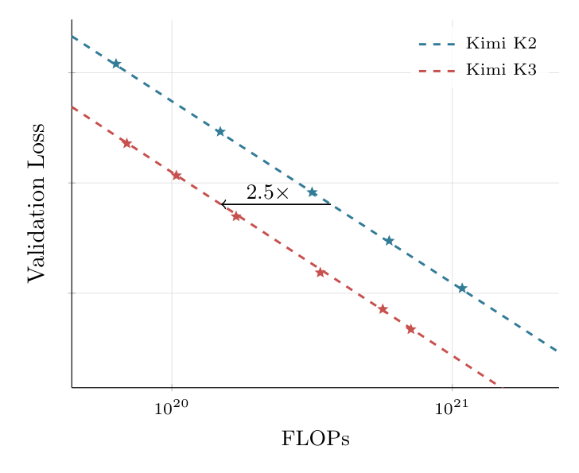
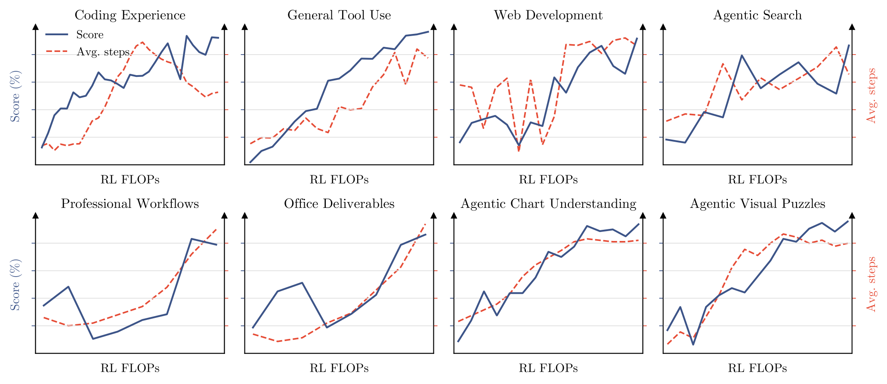
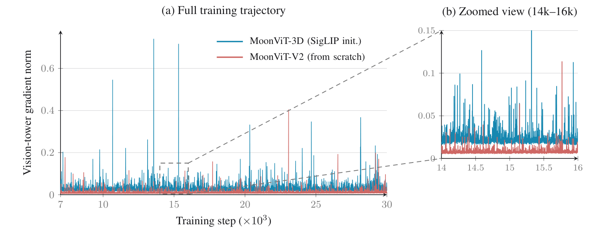

# Kimi K3: Open Frontier Intelligence

**Source**: Kimi Team (Moonshot AI), Jul 2026. arXiv:2607.24653. 47 pages. [src](../raw/kimi-k3.pdf)

## Key Points

- **2.78T total / 104.2B activated MoE**, 93 layers (vs K2's 61), native vision, **1M-token context**
- **~2.5× scaling efficiency** over Kimi K2 (fitted scaling-law curves, OOD validation)
- **Hybrid attention**: 3× KDA (Kimi Delta Attention) + 1× Gated MLA per block (3:1 ratio), final layer always Gated MLA
- **KDA**: delta-rule recurrence + channel-wise forget gate — fixed-size state $S_t \in \mathbb{R}^{d_k \times d_v}$; bounded log-decay (scaled sigmoid, $g_{\min}=-5$) enables dense Tensor-Core chunkwise computation
- **Attention Residuals (AttnRes)**: learned pseudo-query attention over all preceding layer outputs — selective depth information flow (full + block variants)
- **Stable LatentMoE**: 896 routed experts / 16 active (sparsity 56) in compact latent width ($\ell$ = 0.5×); RMSNorm before up-projection + **SiTU-GLU** (bounded activation) + **Quantile Balancing (QB)** for load balancing
- **Quantile Balancing**: bias from the $(1-k/n)$-quantile of router-score margins via Top-(k+1) cutoffs; histogram-based (few hundred bins/expert all-reduce) at scale
- **NoPE**: no positional encoding — KDA's recurrent gating encodes position; extrapolates to 1M without RoPE rescaling/YaRN
- **Per-Head Muon**: per-head Newton-Schulz orthogonalization (equalizes update scale across heads; cheaper)
- **Progressive context extension**: 8K→64K pre-training, 256K→1M cooldown
- **MOPD (Multi-Teacher On-Policy Distillation)**: 3 domains × 3 reasoning efforts (low/high/max) = 9 experts distilled into one model
- **MXFP4 QAT deployment-aware post-training**: MoE experts MXFP4 / MXFP8 activations, non-experts higher precision; train-inference quantization parity
- **EAGLE-3 draft from MTP layer** with $L_{LK}$ acceptance-rate objective (not KL)
- Trails only Claude Fable 5 and GPT-5.6 Sol; beats GPT-5.5, Opus 4.8, GLM-5.2; full weights released

## Architecture

Information flow along 3 dimensions: sequence (hybrid attention), depth (AttnRes), width (Stable LatentMoE).

### Kimi Delta Attention (KDA)

Delta-rule recurrence with channel-wise forget gate:

$$S_t = (I - \beta_t k_t k_t^\top)\operatorname{Diag}(\alpha_t) S_{t-1} + \beta_t k_t v_t^\top, \quad \tilde{o}_t = S_t^\top q_t$$

- $\alpha_t \in (0,1)^{d_k}$: channel-wise retention factor (forget)
- $\beta_t$: delta-rule write strength
- **Bounded log-decay** (vs Kimi Linear's negative-Softplus, unbounded): $g_t = g_{\min}\operatorname{Sigmoid}(e^{A_h} z_t) \in (g_{\min}, 0)$, $g_{\min}=-5$ fixed → retention $\alpha > e^{-5} \approx 6.7\times10^{-3}$; 16-token tile cumulative decay in $(-80, 0)$ → reciprocal rescaling < $e^{80}$ within BF16 range → **all causal tiles use dense Tensor-Core GEMMs** (no position-pair diagonal path)
- **Full-rank output gate**: $y_t = W_o[\operatorname{Sigmoid}(W_g x_t) \odot \operatorname{RMSNorm}(\tilde{o}_t)]$
- Flash-attention FP32 output accumulation (biased rounding fix); kernel redesign overlaps output tile with KV staging buffers

### Gated MLA

- NoPE on all MLA layers — KDA provides position/recency, MLA provides unrestricted global content mixing
- Full-rank input-dependent output gate: $y_t = W_o[\operatorname{Sigmoid}(W_g x_t) \odot \tilde{o}_t]$

### Attention Residuals (AttnRes)

Depth as attention: each layer retrieves from all preceding layers with data-dependent weights:

$$\alpha_{i\to l} = \frac{\phi(q_l, k_i)}{\sum_{j=0}^{l-1}\phi(q_l, k_j)}, \quad h_l = \sum_{i=0}^{l-1}\alpha_{i\to l} \cdot v_i$$

- Layer-specific pseudo-query $q_l = w_l$; keys/values = embeddings + layer outputs
- RMSNorm on keys prevents large-magnitude layers dominating weights
- **Block variant**: L layers → N blocks of S = L/N layers (reduces O(Ld) memory + cross-stage PP communication)
- O(L²d) full arithmetic affordable since L < 100

### Stable LatentMoE

LatentMoE separates full width from routed-expert width ($\ell$ = 3584, 0.5× hidden):

$$y = \sum_{j=1}^{N_s} E^{\text{shared}}_j(x) + W_\uparrow \operatorname{RMSNorm}(u), \quad u = \sum_{i \in T_k(x)} p_i E^{\text{routed}}_i(W_\downarrow x)$$

- 896 routed experts, 16 active/token, sparsity 56; 2 full-width shared experts
- Extreme sparsity failure modes: (1) exploding activations from the ill-conditioned $W_\downarrow$-MLP-$W_\uparrow$ chain → fixed by RMSNorm + SiTU-GLU; (2) load balancing beyond auxiliary-loss-free regime → fixed by QB

**SiTU-GLU**: $f(x) = \beta_1\tanh(x/\beta_1)\cdot\sigma(x/\beta_2)$ — matches SwiGLU near origin, bounded $|f(x)| \le \beta_1\beta_2$ (SwiGLU unbounded → activation outliers, low-precision overflow risk).

**Quantile Balancing**: expert bias from router-score quantile matching target load $q := mk/n$:
- Top-(k+1) routing: k-th entries routed, (k+1)-th entry = cutoff $\alpha_i^{(t)}$ per token
- Bias update: $-b_j^{(t+1)}$ = $(1-k/n)$-quantile of margins $s_{:,j} - \alpha^{(t)}$ (single forward pass, no separate quantile)
- Causal: takes effect next step; frozen at inference
- **Histogram estimation** at scale: per-rank bin counts all-reduced (few hundred bins/expert); additive counts = pooled global batch quantile

### Native Vision

- MoonViT-V2: 27-layer ViT (~0.4B), RMSNorm, no biases; trained **entirely from scratch** (not from SigLIP); fully shared image/video params; factorized intra-frame spatial + inter-frame temporal attention; temporal pooling; pixel-shuffle 2×2 downsampling → 4× token reduction; up to 3584×3584 pixels affordable in 1M context
- No post-hoc modality alignment — text/vision jointly optimized from the start (interleaved next-token prediction)

### Per-Head Muon

- Partition momentum matrices along head dimension; orthogonalize each head's block separately
- Fixes: full-matrix orthogonalization couples heads — larger-gradient heads dominate the shared update; per-head equalizes update scale
- Cheaper Newton-Schulz on tall per-head blocks; improves stability at 2.8T scale
- Same mechanism as [GLM-5](glm-5.md)'s Muon Split — but at 2.8T per-head orthogonalization alone was insufficient; K3 still combines it with QK-Clip-style weight clipping

## Pre-Training

- 4 domains (Web Text, Code, Math, Knowledge) + large vision corpus (captions, interleaved, OCR, perception, video, visual coding)
- Rephrasing recipe from K2 (chunk-wise, fidelity-verified); coordinate supervision absolute + normalized [0,1]
- **Programmatic multimodal data scaled up**: code + rendered visuals (SVG, 3D assets, Webpage, Game, CAD)
- **Cosine decay beats WSD under fair comparison** (independent scaling-law search per schedule; shared hyperparameters unfairly favor one)
- Per-Head Muon + QK-Clip-style weight clipping + QB; cosine lr with 1% warmup; weight decay 0.1
- Context: 8K → 64K pre-training; **256K → 1M in cooldown** (economical: long-seq cost concentrated in small fraction of budget)

### Long-Context Extension

- NoPE → direct 1M extrapolation (no positional-encoding modification)
- Long-context data cleaning: exact + fuzzy dedup, perceptual hashing (video), quality filtering, structural validation; long documents upsampled
- **Synthetic long-context data**: permuting/concatenating multimodal documents so tasks require attending across full 1M context (prevents degeneration into local patterns)

## Post-Training

Three-stage: SFT → domain-expert RL (3 domains × 3 reasoning efforts = 9 experts) → **MOPD** consolidation.

### RL

- Domains: (i) general (experience, vision, reasoning, faithfulness, search, knowledge work), (ii) general agents (long-horizon assistant, deep research, paragraph writing), (iii) coding agents (SWE, kernel tasks, web dev)
- RL FLOPs scaling: tool-call steps scale up with comprehensive capability gains
- **Partial rollout with λ-early-stop**: generation pauses when fraction λ of N×K trajectories completes; paused rollouts enqueued for next iteration; per-token regularization tolerates extreme off-policy staleness
- **Reasoning Effort RL**: per-problem token budget $b_0(x)$ from cold-start; reward = -1 if $T(y) > \tau \cdot b_0(x)$ (thinking tokens for general, cumulative output for agentic); stage-wise curriculum annealing $\tau$; human-in-the-loop per-domain
- **Agentic GRM**: tournament-style binary comparisons + mandatory judge protocol (read output → generate rubric → score → scorepad); verbosity control (lose comparison if length > $\sigma \cdot \ell_0$)

### MOPD (Multi-Teacher On-Policy Distillation)

Per-token OPD reward between teacher $\pi^{(d,e)}_{\text{teacher}}$ and student:

$$r^d_{\text{opd}}(y_t | e, x, y_{<t}) = \operatorname{clip}\left(\operatorname{sg}\left(\log \frac{\pi^{(d,e)}_{\text{teacher}}(y_t | x, y_{<t})}{\pi_\theta(y_t | e, x, y_{<t})}\right), -R_{\max}, R_{\max}\right)$$

- Dense reward integrates with RL framework; partial-rollout compatible
- Top-k distillation variants: no advantage in convergence or final performance

### Deployment-Aware Post-Training

- **MXFP4 QAT**: MoE expert weights MXFP4, activations MXFP8; non-experts (attention projections, latent MoE projections, shared experts, routers) higher precision; QAT through SFT + RL; **rollout and training share quantization** — no train-inference mismatch
- **EAGLE-3 draft**: MTP layer fine-tuned into EAGLE-3-style draft (frozen target; draft layer + feature-fusion projection updated); 7-step unrolled training; input fuses features from 1st, 4th, final AttnRes blocks, projected by $W_{E3}$ initialized $[0\;0\;I]$; **$L_{LK}$ objective** = negative log acceptance rate $\sum_{x\in V}\min(p(x), q(x))$ (KL surrogate doesn't maximize acceptance rate for capacity-limited drafts)

## RL Task Environments

- **Unified white-box RL environment**: agent harness = configurable modules (tool interfaces, system prompts, context management, skills, memories, subagents) — instantiates Kimi Code, Claude Code, Codex, OpenClaw, Hermes; diverse harness configs during training prevents overfitting to one harness
- **Knowledge-graph-guided task synthesis**: self-evolving hierarchical DAG (agent-driven web exploration); edges coarser→finer; keyword-set material retrieval → task synthesis (knowledge/coding/vision types)
- **Verifiable agentic problems**: multi-step search, professional workflows (investment banking, data analysis, legal) in sandboxes, multi-step visual reasoning with Python interpreter (crop/zoom/transform, verify intermediate results)
- **Kernel optimization tasks**: single-op to fused mega-kernels (Flash Linear Attention repos), CUDA/Triton/CuTe/Gluon/ThunderKittens/TileLang, BF16/FP8/FP4; correctness threshold (0 reward), performance vs expert (0.5) → roofline (1.0); **hacking-detection system** penalizing CUDA graph replay, input caching, precision reduction
- **Personal assistant tasks**: mock Gmail/Notion/Slack/Canvas preserving semantics for reproducible large-scale interaction

## Infrastructure (co-design)

- **KDA kernels**: chunkwise FlashKDA (CUTLASS, token-parallel stages + head-parallel recurrence, overlaps intra-chunk compute with cross-chunk state propagation; auto-dispatched flash-linear-attention backend) for training/prefill; **intra-device context parallelism** (automatic SM-level CP planner partitions sequence across SMs of a single rank — state transition of each segment evaluated independently of incoming state, composed exactly after)
- **Perfectly balanced EP training** (QB) with efficient memory management
- **Million-token agentic RL**: hierarchical state management + resumable sandbox execution (persistent rollout across iterations)
- Deployment: state-aware KDA prefix caching, specialized inference kernels, cache- and budget-aware scheduling

## Evaluation

Configuration: reasoning effort max, temperature 1.0; top-p 0.95 (reasoning/knowledge) or 1.0 (agentic); harnesses Kimi Code / Claude Code / Codex.

Benchmark suite: reasoning (GPQA Diamond, CritPt, AA-LCR, HLE-Full ± tools), coding (DeepSWE 73.0, ProgramBench 76.9, Terminal-Bench 2.1, FrontierSWE, SWE-Marathon 42.0, PostTrainBench, MLS-Bench-Lite, SciCode), agentic (BrowseComp 90.4% at 1M no-context-management, DeepSearchQA, AutomationBench 30.8, JobBench, GDPval-AA v2 Elo 1686, OSWorld-Verified/2.0, τ³-Banking, Finance Agent v2, Legal Research Bench...), vision (WorldVQA, OmniDocBench, Video-MME, MMVU, MMMU-Pro, CharXiv, Math-Vision, ZeroBench-main ± Python tool).

Position: **trails only Claude Fable 5 and GPT-5.6 Sol; beats all other open + proprietary models evaluated** (GPT-5.5, Opus 4.8, GLM-5.2). Notable: Fable 5 hits fallbacks on 35% of SWE-Marathon tasks; GPT-5.6 Sol results include potential cyberguards.

## Connections

- [Kimi K2](kimi-k2.md) — predecessor; 2.5× scaling efficiency; architecture delta table (93 vs 61 layers, 896 vs 384 experts)
- [Kimi K2.5](kimi-k2.5.md) — MoonViT lineage → MoonViT-V2 (from-scratch); Agentic GRM lineage; Toggle → reasoning-effort budget control
- [Kimi k1.5](kimi-k1.5.md) — partial rollout origin; OPD → MOPD
- [GLM-5](glm-5.md) — GLM-5.2 compared; DSA vs KDA long-context approaches
- [Multi-Head Latent Attention](multi-head-latent-attention.md) — Gated MLA retention; KDA recurrent extension
- [DeepSeek-V3.2](deepseek-v3.2.md) — DSA sparse attention; context of efficient attention evolution
- [DeepSeek-V4](deepseek-v4.md) — CSA+HCA hybrid attention; OPD; 1M context — direct architectural sibling
- [Muon Optimizer](muon-optimizer.md) — Per-Head Muon refinement
- [GLM-5](glm-5.md) — Muon Split is the same per-head orthogonalization mechanism; K3 shows it scales but still needed clipping at 2.8T
- [LLM Scaling Laws](llm-scaling-laws.md) — 2.5× scaling efficiency claim; cosine vs WSD
- [Maestro](maestro.md) — scheduling context
- [LLM Architecture Comparison](llm-architecture-comparison.md) — frontier attention architectures
- [Tensor Core Evolution](tensor-core-evolution.md) — MXFP4 QAT, low-precision training

## Key Figures

