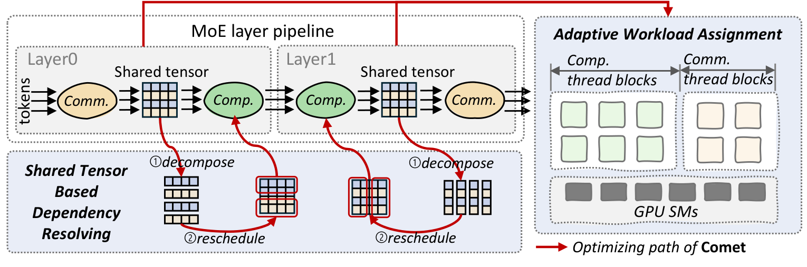
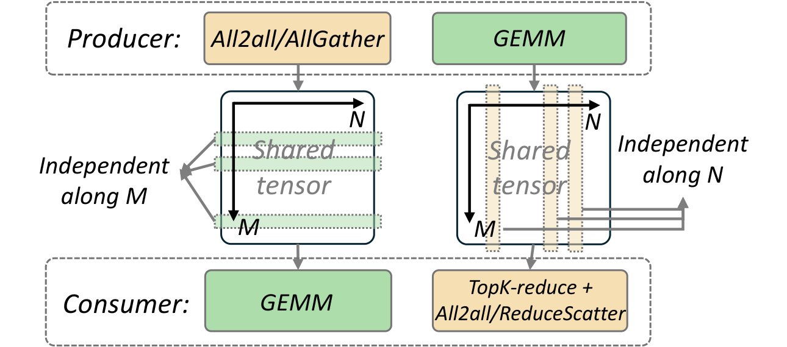
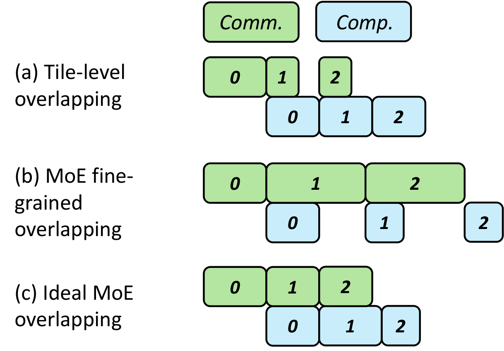
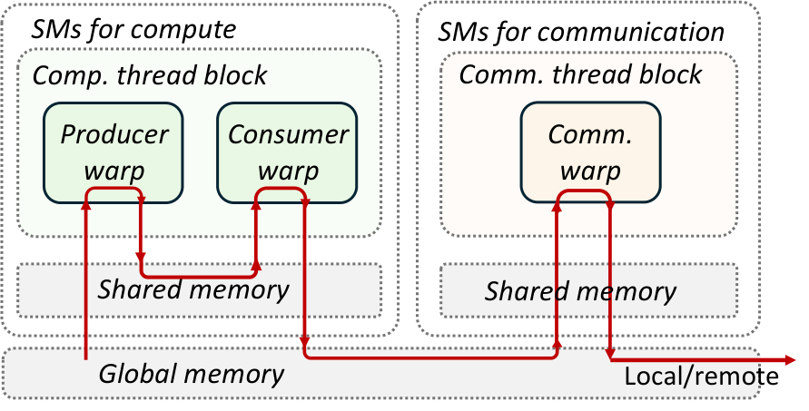

# Comet: Fine-Grained MoE Communication Overlap

**Source**: Zhang et al. (ByteDance Seed / SJTU), Feb 2025. 14 pages. arXiv:2502.19811. Deployed in 10K+ GPU production clusters.

## Key Points

- MoE inter-device communication can occupy **47%** of total model execution time
- Existing coarse-grained overlapping impairs compute efficiency and leaves latency unconcealed
- **Comet**: Fine-grained overlap via data dependency analysis and task rescheduling
- **Thread block specialization**: Dynamically allocates GPU thread blocks to comm vs compute within fused kernels
- 1.96× single MoE layer speedup, 1.71× end-to-end speedup on average
- Integrated into Megatron-LM; deployed in production clusters saving millions of GPU hours

## The Problem

Coarse-grained overlap (existing approaches) pipelines communication and computation at the **layer level**:
- Dispatch tokens for layer N+1 while computing layer N's experts
- Problem: granularity mismatch — communication operations are too large to be fully hidden behind compute
- Compute efficiency drops because GPU resources are underutilized during communication phases

Comet addresses this with **fine-grained overlap**: decomposing communication and computation into smaller pieces that interleave more tightly.

## Key Techniques

*Figure: Comet overview — decomposes shared tensors for fine-grained overlap, then uses thread block specialization for adaptive workload balance. [src](raw/comet-moe-overlap.pdf)*

### 1. Data Dependency Analysis

Comet analyzes **shared tensors** — buffers accessed by both communication and computation operations:

*Figure: By decomposing shared tensors along specific dimensions, Comet eliminates the granularity mismatch between communication and computation. [src](raw/comet-moe-overlap.pdf)*

- Decompose shared tensors along specific dimensions (e.g., token axis, hidden dimension)
- Reorganize tensor data layout to eliminate granularity mismatches
- Reschedule intra-operator execution order to enable tighter interleaving

This transforms "communicate all tokens → compute all experts" into "communicate a chunk of tokens → compute those tokens' experts → communicate next chunk → ..."

*Figure: Coarse-grained (left) vs fine-grained (right) overlap. Comet decomposes operations into smaller pieces that can be interleaved more tightly. [src](raw/comet-moe-overlap.pdf)*

### 2. Adaptive Workload Assignment

Communication and computation are fused into a **single GPU kernel**:

*Figure: Thread block (CTA) division — dedicated groups for communication and computation within a fused kernel, with adaptive workload balancing. [src](raw/comet-moe-overlap.pdf)*

- **Thread block specialization**: Dedicate some thread blocks to communication (NCCL collectives, RDMA) and others to computation (GEMM, routing)
- **Dynamic allocation**: Adjust the number of thread blocks assigned to each workload based on real-time load
- **Balance communication and computation latencies**: Reduce idle bubbles where either comm or compute waits for the other

Isolating communication and computation into separate thread blocks prevents interference — communication kernels don't starve compute cores, and vice versa.

### 3. Integration with Megatron-LM

Comet is integrated into Megatron-LM's MoE training pipeline:
- Works with various parallel strategies (TP, EP, DP, PP)
- Compatible with MoE dispatch/combine operations
- Evaluated on H800 and L20 GPU clusters

## Performance

| Scenario | Speedup |
|----------|---------|
| Single MoE layer | **1.96×** |
| End-to-end (Mixtral-8×7B) | ~**1.71×** |
| End-to-end (Qwen2-MoE) | ~**1.71×** |
| End-to-end (Phi3.5-MoE) | ~**1.71×** |

Average end-to-end speedup of 1.71× across Mixtral-8×7B, Qwen2-MoE, and Phi3.5-MoE on H800 and L20 clusters.

## Comparison to Other MoE Communication Approaches

| Approach | Granularity | Overlap Mechanism | Compute Impact |
|----------|------------|-------------------|----------------|
| **Vanilla EP** | None | Sequential dispatch → compute → combine | Best compute efficiency |
| **Layer-level overlap** | Coarse (whole layer) | Pipeline Layer N compute / Layer N+1 dispatch | Impaired compute efficiency |
| **DeepEP** | Fine (kernel-level) | Device-initiated all-to-all | Good, but kernel-level only |
| **Comet** | **Fine (sub-kernel)** | Thread block specialization + fused kernel | **Balanced** via adaptive workload assignment |

Comet's key differentiator: it **fuses communication and computation into a single kernel** with adaptive thread block assignment, rather than running them as separate operations.

## Connections

- **[Communication Wall](megatron-core-moe.md)** — EP comm overlap in Megatron-Core (layer-level 1F1B overlap that Comet improves upon)
- **[NCCL EP](nccl-ep.md)** — MoE communication library with LL/HT modes
- **[Megatron-Core MoE](megatron-core-moe.md)** — Training stack Comet integrates with
- **[NCCL Device API / GIN](nccl-device-api-gin.md)** — GPU-initiated networking (Comet's thread block specialization builds on this)
- **[DeepSeek-V4 Infrastructure](deepseek-v4.md)** — DeepEP and EP overlap in V4
