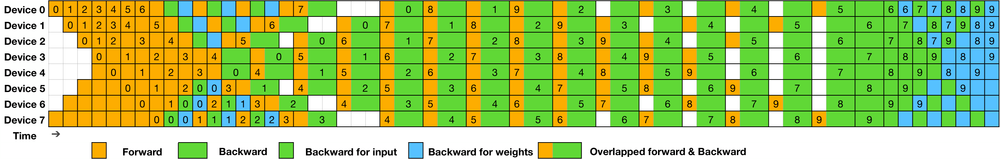
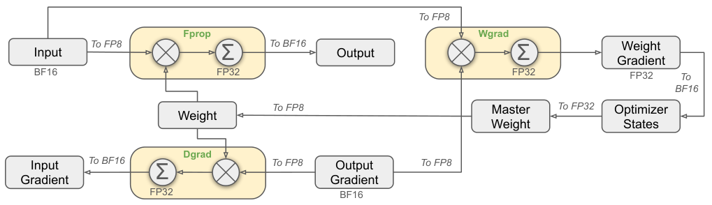

# DeepSeek-V3

**Source**: DeepSeek-AI, December 2024 (revised February 2025). 53 pages. 671B MoE (37B active), 14.8T tokens, 2.788M H800 GPU hours.

## Key Points

- First open-source large model to successfully use **FP8 mixed precision training** at scale
- **Auxiliary-loss-free load balancing** — eliminates the performance penalty of traditional auxiliary losses
- **Multi-Token Prediction (MTP)** — predicts multiple future tokens at each position, densifying the supervision signal
- **DualPipe** — zero-bubble pipeline parallelism with bidirectional scheduling
- **2.788M H800 GPU hours** total training cost — remarkably economical for a 671B model
- **Zero irrecoverable loss spikes or rollbacks** throughout the entire training process
- Beats all open-source models, comparable to GPT-4o and Claude 3.5 Sonnet

## Architecture

DeepSeek-V3 retains the architecture validated in DeepSeek-V2:

*Figure 1: Basic architecture — MLA, DeepSeekMoE with auxiliary-loss-free load balancing, Multi-Token Prediction, FP8 mixed precision. [src](raw/DeepSeek-V3.pdf)*

| Component | Description |
|-----------|-------------|
| **MLA** (Multi-Head Latent Attention) | Low-rank KV cache compression — see [MLA page](multi-head-latent-attention.md) |
| **DeepSeekMoE** | Fine-grained routed experts + shared experts |
| **Auxiliary-loss-free load balancing** | Dynamic expert bias adjustment instead of auxiliary loss penalties |
| **Multi-Token Prediction (MTP)** | Predict next 1-3 tokens at each position (depth=1 for main training) |

### Auxiliary-Loss-Free Load Balancing

Traditional MoE uses auxiliary losses to encourage balanced expert utilization, but these losses introduce a performance penalty. V3 pioneers an **auxiliary-loss-free strategy**:

- Each expert maintains a **bias term** that adjusts routing scores
- If an expert is overloaded, its bias decreases (making it less likely to be selected)
- If an expert is underloaded, its bias increases
- Bias update speed = 0.001, applied after each training step
- Augmented with a slight **sequence-wise balance loss** (weight 0.0001) to prevent extreme imbalance within individual sequences

This eliminates the gradient interference from auxiliary losses while maintaining load balance.

### Multi-Token Prediction

MTP modules predict the next 1-3 tokens at each position using a shared transformer block + independent output heads:

- **Depth=1**: Predict next 2 tokens (main + 1 MTP)
- Each MTP module uses the same architecture as the main model's transformer block
- MTP loss weight = 0.3 (reduced to 0.1 near end of training)
- Provides denser supervision signal → faster convergence, better downstream performance

## FP8 Mixed Precision Training

V3 is the **first open-source large model** to validate FP8 training at scale. Key design:

- **Fine-grained quantization**: Tile-wise 1$\times$ 128 for activations, block-wise 128$\times$ 128 for weights
- **High-precision accumulation**: FP32 for all reduce operations and master weights
- **Selective precision**: Embeddings, output head, RMSNorm in BF16; bulk GEMMs in FP8
- **Low-precision storage**: FP8 for optimizer states during communication (FP32 for local computation)
- Accuracy loss vs BF16: <0.25% in controlled ablation studies

See [FP8/FP4 Training](megatron-core-moe.md) and [V3 Insights](deepseek-v3-insights.md) for more detail.

## Training Infrastructure

### DualPipe: Zero-Bubble Pipeline Parallelism

DualPipe enables bidirectional pipeline scheduling with zero bubbles:

- Forward and backward passes for different micro-batches flow in opposite directions
- Backward pass is split into B (compute gradients) and W (update weights) stages
- W can be flexibly scheduled to fill any remaining bubbles
- Achieves near-theoretical peak pipeline efficiency

### Cross-Node All-to-All Communication

For EP (Expert Parallelism), V3 uses:
- **Node-limited routing**: Keep tokens within a node when possible to minimize cross-node traffic
- **FP8 dispatch**: Tokens dispatched in FP8 (1 byte) instead of BF16 (2 bytes) — halves communication volume
- **IBGDA** (InfiniBand GPUDirect Async): Overlap communication with computation
- Custom kernels for efficient all-to-all on IB fabrics

### Memory Optimization

- **Recomputation**: Selective — recompute attention, keep FFN activations
- **CPU offloading**: Adam optimizer states offloaded to CPU during FP8 training
- **Shared embedding**: Input and output embeddings tied (except for MTP heads)
- Training achieved on 2,048 H800 GPUs with these optimizations

## Training Details

| Parameter | Value |
|-----------|-------|
| Total tokens | 14.8T |
| Max sequence length | 128K (extended from 4K → 32K → 128K) |
| Batch size | 3,072 → 15,360 sequences (scheduled) |
| Peak learning rate | 2.7 × 10⁻⁴ (cosine schedule) |
| Optimizer | AdamW (β₁=0.9, β₂=0.95) |
| FP8 training | Full training in FP8 (first open-source at this scale) |
| Training stability | Zero irrecoverable loss spikes, zero rollbacks |
| Total cost | 2.788M H800 GPU hours (~$5.6M at $2/GPU-hr) |

## Post-Training

Two-stage pipeline identical to V3's predecessors:

1. **SFT**: 1.5M instruction-following examples across math, code, writing, QA
2. **RL**: GRPO with rule-based rewards (reasoning) + reward model (helpfulness)
   - Also experiments with **distillation from R1** and **self-rewarding** (model evaluates its own outputs)

## Results

| Benchmark | V3 | GPT-4o-0513 | Claude 3.5 Sonnet | Llama 3.1 405B |
|-----------|-----|-------------|-------------------|----------------|
| MMLU (EM) | 88.5 | 87.2 | 88.3 | 88.6 |
| MMLU-Pro (EM) | 75.9 | 72.6 | 78.0 | 73.3 |
| MATH-500 (EM) | 90.2 | 74.6 | 78.3 | 73.8 |
| Codeforces (Percentile) | 51.6 | 23.6 | 20.3 | — |
| SWE Verified (Resolved) | 42.0 | 38.8 | 50.8 | 24.8 |
| GPQA Diamond | 59.1 | 49.9 | 65.0 | 51.1 |

V3 is the **strongest open-source model** at release, competitive with GPT-4o, and remarkably cost-effective.

## Training Infrastructure

### HAI-LLM Framework

DeepSeek-V3 is trained on the **HAI-LLM** framework, a lightweight training system built from scratch. Parallelism configuration: **16-way PP + 64-way EP (8 nodes) + ZeRO-1 DP**.

### DualPipe: Zero-Bubble Pipeline Parallelism

DualPipe enables bidirectional pipeline scheduling with computation-communication overlap:

*Figure 5: DualPipe scheduling — forward and backward passes in opposite directions, overlapping with EP all-to-all and PP communication. [src](raw/DeepSeek-V3.pdf)*

| Method | Bubble Formula | Activation Memory |
|--------|---------------|-------------------|
| 1F1B | `(PP-1)(F+B)` | 1$\times$ PP |
| ZB1P | `(PP-1)(F+B-2W)` | 1$\times$ PP |
| **DualPipe** | **(PP/2 - 1)(F&B + B - 3W)** | **2$\times$ PP + 1** |

Where F = forward chunk, B = full backward chunk, W = "backward for weights" chunk, F&B = two mutually overlapped forward+backward chunks.

**Key advantage**: DualPipe significantly reduces pipeline bubbles compared to 1F1B and ZB1P while only increasing peak activation memory by 1/PP×. It requires pipeline stages and micro-batches to be divisible by 2 (not micro-batches divisible by stages like Chimera).

**Why DualPipe matters**: DeepSeek-V3's computation-to-communication ratio is approximately 1:1 for cross-node EP. DualPipe overlaps forward/backward computation with EP all-to-all and PP communication, hiding nearly all communication overhead (both all-to-all and PP communication fully hidden in Figure 4).

### Cross-Node EP Communication

Custom all-to-all kernels using **warp specialization**:

- **20 SMs** dedicated to communication (out of 132 total)
- 10 communication channels, each handling IB send/receive + NVLink forwarding
- Warps dynamically allocated: IB sending, IB-to-NVLink forwarding, NVLink receiving
- Custom PTX instructions + auto-tuned chunk size to minimize L2 cache interference
- **FP8 dispatch**: halves communication volume; 8→13 experts possible at same cost (4 nodes × 3.2 experts/node)

Only 20 SMs are sufficient to saturate IB and NVLink bandwidth — the remaining 112 SMs are fully available for computation.

### Memory Optimization

- **Recompute RMSNorm and MLA up-projection**: Eliminates persistent storage of these activations — minimal overhead
- **EMA in CPU**: Exponential Moving Average parameters stored in CPU memory, updated asynchronously
- **Shared embedding**: Input and output embeddings tied (except MTP heads)

These optimizations enable training without Tensor Parallelism (TP) — saving the communication overhead TP would introduce on H800's reduced NVLink bandwidth.

## FP8 Mixed Precision Training

### Framework Design

*Figure 6: Mixed precision framework — most compute-dense operations in FP8, sensitive components in BF16/FP32. [src](raw/DeepSeek-V3.pdf)*

| Component | Precision | Reason |
|-----------|----------|--------|
| GEMM (forward/backward) | FP8 | Bulk computation |
| Master weights | FP32 | Numerical stability |
| Optimizer states | BF16 (stored), FP32 (computation) | Memory savings |
| Embeddings, output head, RMSNorm | BF16 | Precision-critical |
| Token dispatch | FP8 | Reduce communication volume |

### Fine-Grained Quantization

- **Activations**: Tile-wise 1$\times$ 128 grouping (per token, per 128 channels)
- **Weights**: Block-wise 128$\times$ 128 grouping
- **Gradients (Dgrad)**: Highly precision-sensitive — tile-wise 128$\times$ 1 (not block-wise 128$\times$ 128). Block-wise quantization of activation gradients leads to significant accuracy loss due to chain-like back-propagation

### High-Precision Accumulation

To combat FP8's limited dynamic range, the framework promotes to CUDA Core FP32 accumulation at intervals of `N_C = 128` elements during MMA (Matrix Multiply-Accumulate). This is done through explicit WGMMA (Warp Group MMA) instructions on Hopper GPUs.

### Validation

FP8 vs BF16 comparison on two model scales (16B and 230B), trained for ~1T tokens:
- **Relative loss error: < 0.25%** — within training randomness
- Loss curves (Figure 10 in paper): FP8 and BF16 training curves are nearly indistinguishable after EMA smoothing

## Ablation Studies

### Auxiliary-Loss-Free vs Aux-Loss-Based Load Balancing

| Metric | Small Aux-Loss | Small Aux-Loss-Free | Large Aux-Loss | Large Aux-Loss-Free |
|--------|---------------|-------------------|----------------|-------------------|
| Params (Active/Total) | 2.4B/15.7B | 2.4B/15.7B | 20.9B/228.7B | 20.9B/228.7B |
| BBH (3-shot EM) | 37.3 | **39.3** | 66.7 | **67.9** |
| MMLU (5-shot EM) | 51.0 | **51.8** | 68.3 | 67.2 |
| HumanEval (Pass@1) | 22.0 | **22.6** | 40.2 | **46.3** |
| GSM8K (8-shot EM) | 27.1 | **29.6** | 70.7 | **74.5** |
| MATH (4-shot EM) | 10.9 | **11.1** | 37.2 | **39.6** |

Auxiliary-loss-free consistently outperforms aux-loss-based on most benchmarks, especially for larger models.

### Expert Specialization Analysis

On the Pile test set, the aux-loss-free model shows **greater expert specialization patterns** than aux-loss-based. Experts in aux-loss-free models specialize by domain — some experts handle Wikipedia, others GitHub, others math — without being explicitly forced by auxiliary losses. The flexibility of batch-wise (vs sequence-wise) balancing allows experts to specialize across domains.

### Batch-Wise vs Sequence-Wise Balance

Batch-wise balancing (aux-loss-free) imposes a more flexible constraint: it does NOT enforce balance on individual sequences. This allows different experts to handle different domains within a batch. Sequence-wise auxiliary loss forces per-sequence balance, which prevents domain specialization.

## Post-Training

### SFT Data

1.5M instruction-following instances across multiple domains:
- **Reasoning**: Math, code, logic problems with curated solutions
- **Non-reasoning**: Creative writing, role-play, QA — generated by DeepSeek-V2.5, human-verified
- **R1 Distillation data**: After RL, R1 responses used as SFT data for the final model via rejection sampling — retains R1's strengths while producing concise responses

### RL: GRPO with R1 Distillation

The RL phase uses GRPO with:
- **Rule-based RM**: For verifiable tasks (math, code)
- **Model-based RM**: For open-ended tasks (writing, QA) — trained on human preference data
- **R1 distillation**: During RL, the model is trained on `<system prompt, problem, R1 response>` tuples with a system prompt that guides toward reflection and verification patterns. After hundreds of RL steps, the model spontaneously incorporates R1 patterns even without explicit prompts
- **Rejection sampling**: Expert models generate candidates → filter by quality → SFT on the best

## Connections

- [V3 Insights](deepseek-v3-insights.md) — hardware-aware co-design paper (ISCA 2025), deeper dive on MLA, FP8, network topology
- [DeepSeek-R1](deepseek-r1.md) — R1 is built on V3-Base; GRPO and reasoning RL build on V3's post-training
- [Multi-Head Latent Attention](multi-head-latent-attention.md) — MLA deep-dive
- [V3.2](deepseek-v3.2.md) — DSA sparse attention, scalable RL, IMO gold
- [Megatron-Core MoE](megatron-core-moe.md) — NVIDIA's training stack (trains V3 on GB300 at 1,233 TFLOPS/GPU)
- [Ultra-Scale Playbook](usp-ultra-scale-playbook.md) — educational foundation for DualPipe, EP, FP8
- [LLM Architecture Comparison](llm-architecture-comparison.md) — where V3 fits among 23 open-weight LLM architectures
