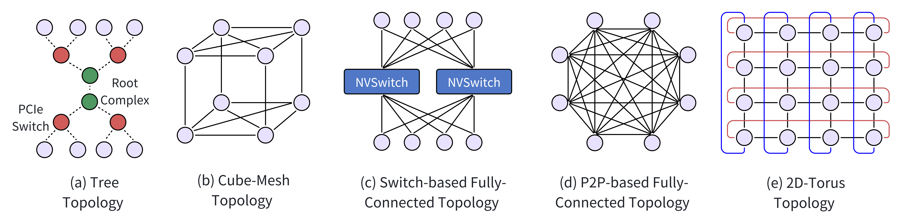
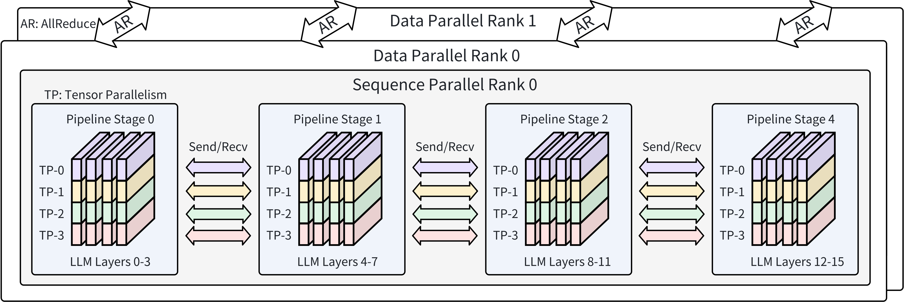

# Efficient LLM Training on Distributed Infrastructures — Survey

**Source**: Jiangfei Duan et al., 2024. 42 pages. arXiv:2407.20018. 380+ references.

## Key Points

- Comprehensive taxonomy of LLM training systems organized around **SER**: Scalability, Efficiency, Reliability
- Covers the full stack: AI accelerators, networking (chip-to-chip + node-to-node), storage, scheduling
- Detailed coverage of parallelism: DP, TP, PP, SP, CP, EP, auto-parallelism (GSPMD, Alpa, Unity), heterogeneous
- Computation: FlashAttention, kernel fusion, mixed-precision (FP16/BF16/FP8/FP4), MoE-specific ops
- Memory: recomputation (static/dynamic), redundancy reduction (ZeRO-1/2/3, FSDP, ZeRO++), defragmentation, CPU/SSD offloading
- Communication: collective tuning, priority/decomposition-based scheduling, in-network aggregation (SHARP, SwitchML, ATP)
- Fault tolerance: failure analysis, anomaly detection, checkpoint-based (synchronous, snapshot-stall, JIT, universal), checkpoint-free (live migration, module redundancy)

## Section 1-2: Background and Challenges

LLM training workloads have unique characteristics vs traditional DL:
1. **Homogeneous architecture**: Nearly all use Transformers → massive optimization opportunity for a single architecture
2. **Unprecedented scale**: Hundreds of billions of params, terabyte-scale datasets, weeks/months of training (LLaMA-3: 54 days on 16,384 H100 GPUs)
3. **Specialized software**: Megatron, DeepSpeed, Alpa — not general-purpose DL frameworks
4. **Paradigm shift**: Self-supervised pretraining → foundation model → adapt to downstream tasks

The "SER" framework:
- **Scalability**: Need to efficiently scale to tens of thousands of GPUs
- **Efficiency**: Maximize GPU utilization (MFU), minimize communication overhead, optimize memory
- **Reliability**: Training jobs span weeks; failures are inevitable at scale — need fast detection and recovery

## Section 3: Training Infrastructure

### AI Accelerators

| Vendor | Architecture | Key Features |
|--------|-------------|-------------|
| NVIDIA | H100, B200, GB200 | NVLink 5, NVSwitch, Transformer Engine |
| AMD | MI250X, MI300X | 64-192 GB HBM, Infinity Fabric |
| Intel | Gaudi 2/3 | Integrated RDMA, matrix multiplication engine |
| Google | TPU v4/v5 | 2D/3D-torus interconnect, optical circuit switches |
| Cerebras | CS-2/CS-3 | Wafer-scale, 850K cores, on-wafer memory |
| Graphcore | IPU | MIMD architecture, on-chip memory |

### Chip-to-Chip Interconnect Topologies

*Figure: Chip-to-chip topologies — cube-mesh, switch-based fully-connected, P2P fully-connected, and 2D-torus. [src](raw/efficient-llm-training-survey.pdf)*

| Topology | Examples | Bandwidth | Notes |
|----------|---------|-----------|-------|
| **Cube-Mesh** | NVLink 1.0 (DGX-1) | 160 GB/s per link | Planar mesh for 4 GPUs, cube for 8 |
| **Switch-Based Full** | NVSwitch (DGX-2, NVL72) | 300→600→900 GB/s | Every GPU connected to every switch, one-hop |
| **P2P Full** | Infinity Fabric (AMD), Ascend (Huawei) | Limited by direct link | No switch — each chip connects to every other |
| **2D/3D-Torus** | TPU v2/v3/v4 | 4 neighbors with wraparound | TPUv4 dynamically reconfigures (4×4×32 or 8×8×8) |

### Node-to-Node Networking

| Technology | Bandwidth | Latency | Use Case |
|-----------|----------|---------|----------|
| InfiniBand NDR | 400 Gbps per port | ~1-2 µs | Primary for large-scale training |
| RoCE v2 | 200-400 Gbps | ~3-5 µs | Cost-effective alternative |
| GPUDirect RDMA | Wire speed | Near-wire | GPU-to-GPU across nodes, zero CPU copy |

### Network Topologies for Training

| Topology | Key Idea |
|----------|----------|
| **Rail-Optimized** | Align NIC placement with GPU topology — reduces inter-rail traffic |
| **HPN (Alibaba)** | Dual-ToR, rail-optimized with multi-plane design |
| **HammingMesh** | Error-correcting code-inspired topology for balanced bandwidth |
| **Reconfigurable (SiP-OCS, TopoOpt, TPUv4 OCS)** | Optical switching to dynamically adapt topology to workload |

### Load Balancing & Congestion Control

LLM training traffic is characterized by **few elephant flows** with periodic bursts (gradient synchronization). Standard ECMP fails for these patterns. Solutions:
- **Packet spraying**: Distribute packets across all available paths
- **HPN**: Multi-flow with enhanced-ECMP
- **Congestion control**: DCQCN, TIMELY, Swift for RDMA; MLTCP for multi-priority traffic

### Storage Systems

| Purpose | Systems |
|---------|---------|
| Checkpoint storage | Tectonic (Meta), HDFS, Ceph |
| Training data | Lustre, GPFS, BeeGFS, Alluxio, JuiceFS |
| Data caching | Quiver (transparent GPU data caching), Fluid (Kubernetes-native) |

## Section 4: Parallelism Strategies

*Figure: Progression from data parallelism through tensor and pipeline to full 3D hybrid parallelism. [src](raw/efficient-llm-training-survey.pdf)*

### Data Parallelism
- **Sharding factor F**: Controls how many devices share parameters. F=1 (no sharding, full replication), F=W (ZeRO-3/FSDP, full sharding)
- Trade-off: larger F → less memory but more communication
- Communication: AllReduce (F=1), ReduceScatter+AllGather (F>1)

### Tensor Parallelism
- Shards weight matrices across GPUs within a layer
- Communication: AllReduce (row-wise) or AllGather (column-wise) per transformer layer
- NVLink-dependent — not suitable for cross-node scaling
- 2D/2.5D/3D TP variants: Shard across multiple mesh dimensions for higher efficiency at very large TP degrees

### Pipeline Parallelism
- Splits model layers across GPUs. Communication: P2P activations between stages
- **Key challenge: pipeline bubbles**. Solutions:
  - GPipe: Fill-drain schedule (large bubbles)
  - PipeDream-1F1B: Interleave forward+backward (reduced bubbles)
  - DAPPLE: Early backward schedule
  - Chimera: Bidirectional pipelines
  - Zero-Bubble / DualPipe: Fine-grained backward decomposition (B+W stages)
- **Memory imbalance**: Earlier stages hold more active micro-batches → uneven memory usage
- **Flexible VPP**: Allows different numbers/types of layers per virtual stage (used in Megatron-Core for DeepSeek-V3)

### Sequence & Context Parallelism
- **SP**: Splits dropout/LayerNorm along sequence dimension, tightly coupled with TP
- **CP**: Splits attention computation across GPUs. Implementations: Ring Attention (P2P ring), DeepSpeed Ulysses (All-to-All), Striped Attention
- USP (Unified Sequence Parallelism): Combines Ulysses and Ring for balanced communication

### Expert Parallelism (MoE)
- Distributes experts across GPUs. Communication: All-to-All for token dispatch/combine
- Complements DP/TP/PP — creates the dense-sparse mismatch addressed by Parallel Folding
- Key challenges: load imbalance, token dropping, communication-computation overlap

### Auto-Parallelism
| System | Approach |
|--------|----------|
| **GSPMD** (Google) | User annotations → compiler propagates sharding → inserts collectives |
| **Alpa** (Berkeley) | Two-level: inter-operator (DP+PP) + intra-operator (TP). Uses dynamic programming and ILP |
| **Unity** (Google) | Extends Alpa with algebraic cost model, supports complex parallelism combinations |
| **FlexFlow** | Automatic search over SOAP (Sample, Operator, Attribute, Parameter) space |
| **Galvatron** | Systematic search for optimal hybrid parallelism using decision tree + dynamic programming |
| **AutoDDL** | Automatically tunes distributed configuration for SPMD programs |

### Heterogeneous Parallelism
- **AMP (Automatic Mixed Parallelism)**: Different model segments use different parallelism strategies
- **Whale**: Heterogeneous GPU clusters — balance workload across different GPU types
- **HexGen**: Heterogeneous + geo-distributed resources with asymmetric bandwidth links

## Section 5: Computation Optimizations

### Operator Optimization
- **FlashAttention**: Fused attention kernel, IO-aware, O(N) HBM instead of O(N²)
- **FlashAttention-2/3**: Better parallelism, async execution, FP8
- **Kernel fusion**: Merge multiple operations into single kernel (e.g., MLP fusion, RoPE fusion)
- **JIT compilation**: PyTorch 2.0 torch.compile, OpenAI Triton

### Mixed-Precision Training

| Precision | Memory (params+grads per 1B) | Throughput | Status |
|-----------|------------------------------|------------|--------|
| FP32 | 8 GB | 1× (baseline) | Obsolete |
| FP16/BF16 | 4 GB | 2-3× | Standard |
| FP8 | 2 GB | 2× over BF16 | Maturing (DeepSeek-V3 validated) |
| FP4/INT4 | 1 GB | 2× over FP8 (theoretical) | Emerging (NVFP4 on Blackwell) |
| 1-bit (BitNet) | 0.125 GB | Research | Experimental |

**Key techniques**:
- **Loss scaling**: Prevents gradient underflow in FP16
- **Master weights in FP32**: Numerical stability for optimizer updates
- **Fine-grained quantization**: Tile/block-wise scaling (DeepSeek-V3: 1×128 activations, 128×128 weights)
- **FP8 primary weights**: Eliminate redundant FP32/BF16 weight storage

### MoE-Specific Computation
- **Grouped GEMM**: Batch expert computations into a single kernel
- **Expert-level fusion**: Fuse routing + dispatch + computation + combine
- **FP8 in MoE**: Dynamic token shapes require grouped quantization per expert

## Section 6: Memory Optimizations

Memory consumption: **Model states (16Φ bytes)** + activations + temporary buffers + fragmentation.

### Activation Recomputation
| Strategy | Type | Approach |
|----------|------|----------|
| Selective Checkpointing | Static | Discard attention activations, keep FFN. 70% memory reduction, 2.7% compute overhead (GPT-3) |
| Selective Checkpointing++ | Static | Whitelist attention module outputs + softmax statistics for long sequences |
| DistFlashAttn | Static | Place checkpoints at FlashAttention kernel output, not layer boundaries |
| Checkmate | Static | MILP solver for optimal plan — doesn't scale to LLMs |
| DTR (Dynamic Tensor Rematerialization) | Dynamic | Evict tensors based on cost-benefit at runtime |
| MegTaiChi | Dynamic | Dynamic tensor eviction with tracking of tensor access patterns |
| Coop | Dynamic | Cooperative eviction considering both memory and recomputation cost |

### Redundancy Reduction (ZeRO Family)
| Stage | What's Sharded | Communication | Memory Saved |
|-------|---------------|---------------|-------------|
| ZeRO-1 | Optimizer states | ReduceScatter + AllGather | 4× |
| ZeRO-2 | + Gradients | Same as ZeRO-1 | 8× |
| ZeRO-3 / FSDP | + Parameters | AllGather per layer (fwd+bwd) | Linear with DP degree |
| ZeRO++ | + Quantized weights + hierarchical communication | Reduced comm volume | Memory + bandwidth savings |
| MiCS | + Partial sharding | Hierarchical AllGather | Per-group sharding |
| PaRO | + Relaxed ordering | Overlapped comm | Scheduling flexibility |
| AMSP / RTP | + Multiple sharding strategies combined | Mixed | Fine-grained trade-off |

### Defragmentation
- **Tensor-based**: ROAM, ZeRO-R — reorder tensor allocations to reduce fragmentation
- **VMM-based**: GMLake, PyTorch Expandable Segments — virtual memory management to avoid physical fragmentation

### Offloading
| Type | Systems | Approach |
|------|---------|----------|
| **Static CPU** | L2L, ZeRO-Offload, Elixir | Fixed offloading schedule |
| **Dynamic CPU** | TSPLIT, PatrickStar, Mobius, Harmony, STRONGHOLD | Adaptive offloading based on memory pressure |
| **SSD** | ZeRO-Infinity, Angel-PTM, Smart-Infinity, Fuyou, MoESys | Extend memory hierarchy to NVMe |
| **Optimal schedule** | TMOF | MILP formulation for optimal offloading schedule |

## Section 7: Communication Optimizations

### Collective Communication Tuning
- **NCCL protocol selection**: Simple (large messages, bandwidth), LL (small, latency), LL128 (balanced)
- **Algorithm selection**: Ring (bandwidth-optimal) vs Tree (latency-optimal) per operation
- **Fusion**: Combine small communication operations into larger ones

### Communication Scheduling
| Strategy | Systems | Approach |
|----------|---------|----------|
| **Priority-based** | TicTac, ByteScheduler, PACE | Prioritize critical path communications |
| **Decomposition-based** | Coeus, Tessel, LYRA | Decompose into fine-grained tasks, reorder for max overlap |
| **MoE-aware** | Lina | Prioritize All-to-All over AllReduce, micro-op scheduling for overlap |

### In-Network Aggregation
- **SHARP** (NVIDIA): Offload reductions to InfiniBand switch silicon — O(log N) vs O(N) data movement
- **NVLink SHARP (NVLS)**: Same concept within NVSwitch fabric (NVL72)
- **SwitchML**: Programmable switch-based aggregation (Tofino switches)
- **ATP**: In-network aggregation supporting mixed-precision and multiple parallel strategies
- **NetReduce / NetAllReduce**: RDMA-based in-network reduction using SmartNICs

### Communication Scheduling for MoE
- **Lina**: Prioritizes All-to-All operations over AllReduce; breaks tensors into chunks for fine-grained overlap
- **Tutel**: Adaptive expert parallelism with dynamic load balancing
- **DeepEP**: Device-initiated communication for MoE dispatch/combine
- **FasterMoE**: Compression-based communication for MoE

## Section 8: Fault Tolerance

### Failure Analysis
LLaMA-3 405B training (54 days, 16K H100): 419 unexpected interruptions. Root causes:
- GPU failures: 30.1% (GPU hardware), 17.2% (HBM memory), 4.5% (SRAM)
- Software bugs: 12.9%
- Network switch/cable: 8.4%
- Silent data corruption: 1.4%

### Anomaly Detection
- **SuperBench**: Proactive validation to detect hardware issues before training
- **MegaScale**: Monitors communication patterns to detect stragglers and link failures
- **DLRover**: Automatic fault detection and recovery for elastic training

### Checkpoint-Based Recovery
| Approach | Systems | Strategy |
|----------|---------|----------|
| **Synchronous** | Standard | Stall training → snapshot all GPUs → persist |
| **Snapshot-Stall** | Check-N-Run, TorchSnapshot, MegaScale, InternEvo | Stall only for snapshot (seconds), async persist |
| **JIT Checkpointing** | JIT-Checkpointing | Checkpoint only after failure, waste ≤ 1 minibatch |
| **Universal** | Universal Checkpointing | Decouple storage from parallelism → seamless strategy changes |
| **Distributed Cache** | DLRover Flash-Checkpoint | Distributed caching service for fast migration |

### Checkpoint-Free Recovery
| Approach | Systems | Strategy |
|----------|---------|----------|
| **Live Migration** | Unicron, TRANSOM, Oobleck | Migrate training state to healthy GPU after failure |
| **Module Redundancy** | Bamboo, SlipStream, SWARM | Redundant pipeline stages or data-parallel replicas absorb failed node's work |

## Connections to Existing Wiki

This survey provides taxonomy and reference for techniques detailed in:
- **[Ultra-Scale Playbook](ultra-scale-playbook.md)** — Educational foundation for parallelism
- **[Scaling Techniques Overview](scaling-techniques-overview.md)** — DP, ZeRO, TP, SP, CP, PP, EP
- **[Megatron-Core MoE](megatron-core-moe.md)** — Production training stack
- **[DeepSeek-V3](deepseek-v3.md)** — FP8 training, DualPipe, auxiliary-loss-free MoE
- **[Memory Wall](megatron-core-moe.md)** — Activation recomputation, offloading, FSDP
- **[Communication Wall](megatron-core-moe.md)** — EP, SHARP, DeepEP
- **[GPU Hardware Architecture](gpu-hardware-architecture.md)** — Accelerator interconnect details
- **[NCCL Demystifying](nccl-demystifying.md)** — Collective protocols
- **[GSPMD](gspmd.md) / [PartIR](partir.md) / [TOAST](toast.md)** — Auto-parallelism systems
- **[LLM Scaling Laws](llm-scaling-laws.md)** — Scaling motivation
