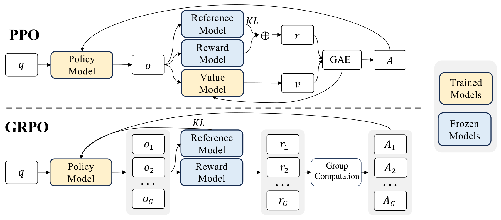

# GRPO: Group Relative Policy Optimization

**Source**: Shao, Wang, Zhu, Xu, Song, et al. (DeepSeek-AI), 2024. arXiv:2402.03300. Introduced in the DeepSeekMath paper.

## Key Points

- **Eliminates the critic model** — estimates baseline from group scores instead of a learned value function
- Same group of outputs serves both for advantage estimation AND as the comparison set
- Significantly reduces training resources vs PPO (no value model needed)
- Foundation for DeepSeek-R1, DeepSeek-V3 post-training, and most modern LLM RL

## Why GRPO Replaces PPO

### PPO's Value Model Problem

PPO requires a **value model** (critic) of comparable size to the policy model to estimate advantages:

$$
A_t = \sum_{l=0}^\infty (\gamma\lambda)^l (r_{t+l} + \gamma V(s_{t+l+1}) - V(s_{t+l}))
$$

This creates three problems:
1. **Memory**: The value model doubles the memory requirement
2. **Training complexity**: The value function must be accurate at every token, but in LLM RL, rewards are typically only given at the last token
3. **Reward hacking**: The value model itself can be exploited

### GRPO's Solution

Instead of learning a value function, GRPO uses the **average reward of multiple sampled outputs for the same question** as the baseline:

For each question $q$, sample a group of $G$ outputs $\{o_1, \dots, o_G\}$ from the old policy $\pi_{\theta_{\text{old}}}$, then optimize:

$$
\mathcal{J}_{\text{GRPO}}(\theta) = \mathbb{E}\left[ \frac{1}{G} \sum_{i=1}^G \frac{1}{\lvert o_i \rvert} \sum_{t=1}^{\lvert o_i \rvert} \min\left( \frac{\pi_\theta(o_{i,t} \mid q, o_{i,1:t-1})}{\pi_{\theta_{\text{old}}}(o_{i,t} \mid q, o_{i,1:t-1})} \hat{A}_{i,t}, \; \text{clip}\left( \frac{\pi_\theta}{\pi_{\theta_{\text{old}}}}, 1-\varepsilon, 1+\varepsilon \right) \hat{A}_{i,t} \right) \right]
$$

Where the advantage is computed from group statistics:

$$
\hat{A}_{i,t} = \frac{r_i - \text{mean}(\{r_1, \dots, r_G\})}{\text{std}(\{r_1, \dots, r_G\})}
$$

And the reward with KL penalty from a reference model:

$$
r_t = r_\varphi(q, o_{\leq t}) - \beta \log \frac{\pi_\theta(o_t \mid q, o_{1:t-1})}{\pi_{\text{ref}}(o_t \mid q, o_{1:t-1})}
$$

### Key Difference from PPO

| Component | PPO | GRPO |
|-----------|-----|------|
| **Advantage estimation** | Learned value function $V_\psi$ | Group statistics (mean/std of rewards) |
| **Baseline** | GAE with critic | Group average |
| **Value model** | Required (comparable size to policy) | **None** |
| **Memory** | 2× (policy + value) | 1× (policy only) |
| **Per-token accuracy** | Value function must be accurate at every token | Group reward is sequence-level, applies uniformly |

*Figure 4 from the paper: PPO (left) requires a value model trained alongside the policy. GRPO (right) eliminates the value model entirely by using group-based advantage estimation. [src](raw/deepseek-math-grpo.pdf)*

### Why Group-Based Baseline Works

The group of $G$ outputs for the same question provides a **natural baseline**: outputs that are better than average get positive advantage, worse than average get negative. This is a form of **relative comparison** within a group, hence the name.

Key properties:
- Group size $G$ controls the quality of the baseline estimate (larger = better)
- The reference model KL penalty prevents the policy from diverging too far
- PPO-style clipping ($\varepsilon$) prevents destructively large updates

## GRPO in Practice

**DeepSeekMath**: GRPO was first introduced to improve mathematical reasoning after instruction tuning.

**DeepSeek-V3**: Used GRPO for post-training RL with rule-based rewards (math accuracy) and model-based rewards (helpfulness).

**DeepSeek-R1 / R1-Zero**: The canonical GRPO application — 16 outputs per question, 10,400 training steps, emergent reasoning behaviors ("aha moment").

**ScaleRL (Meta)**: Studied GRPO scaling behavior; found GRPO/DAPO loss functions are highly sensitive to clipping ratio — the clip ratio changes the asymptote, not just convergence speed.

## Connections

- [DeepSeek-R1](deepseek-r1.md) — GRPO with rule-based rewards → emergent reasoning
- [PPO](ppo.md) — The algorithm GRPO improves upon
- [ScaleRL](scalerl.md) — Systematic study of GRPO variants and scaling
- [Stabilizing RL with LLMs](stabilizing-rl-llms.md) — Token-level RL as first-order approximation (applies to GRPO)
- [DeepSeek-V3](deepseek-v3.md) — Used GRPO for post-training
