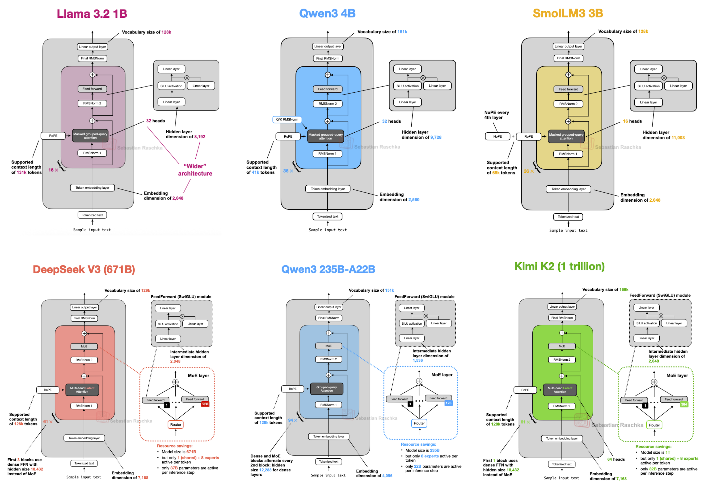
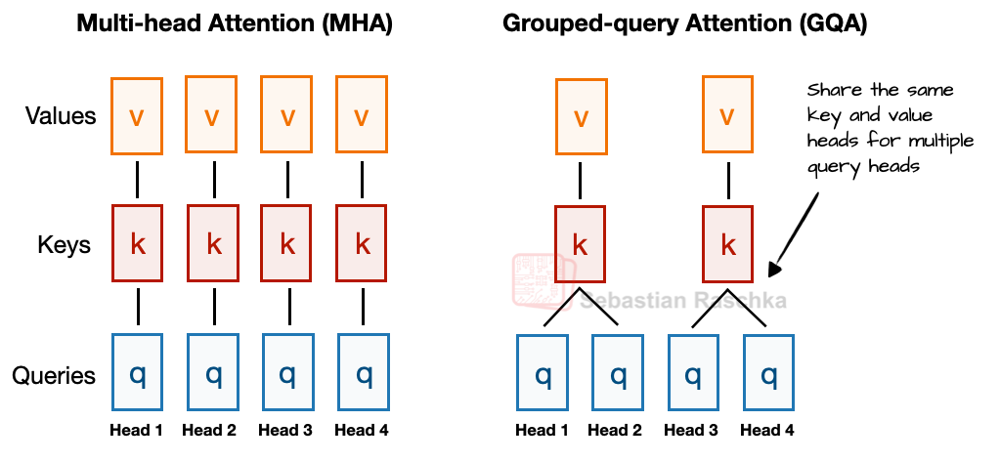
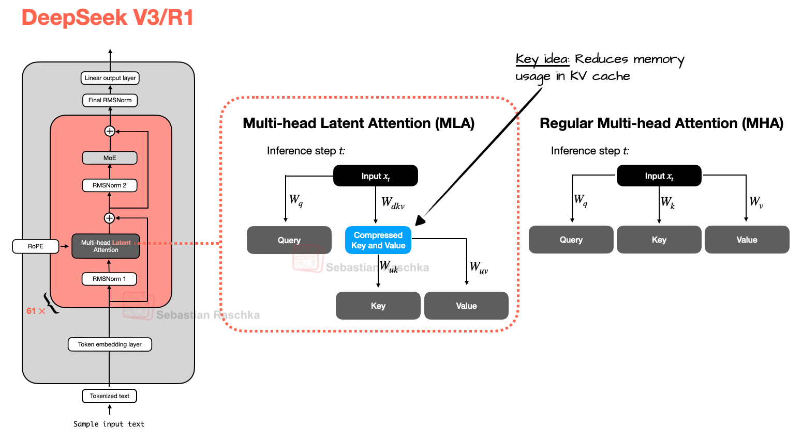
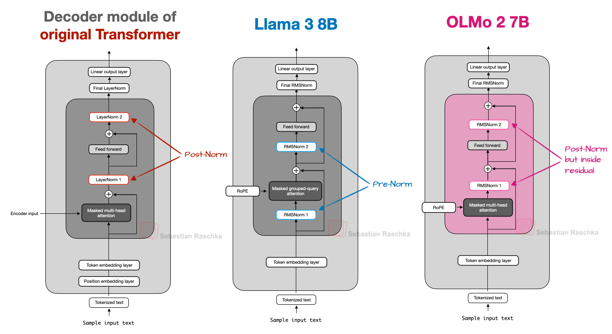
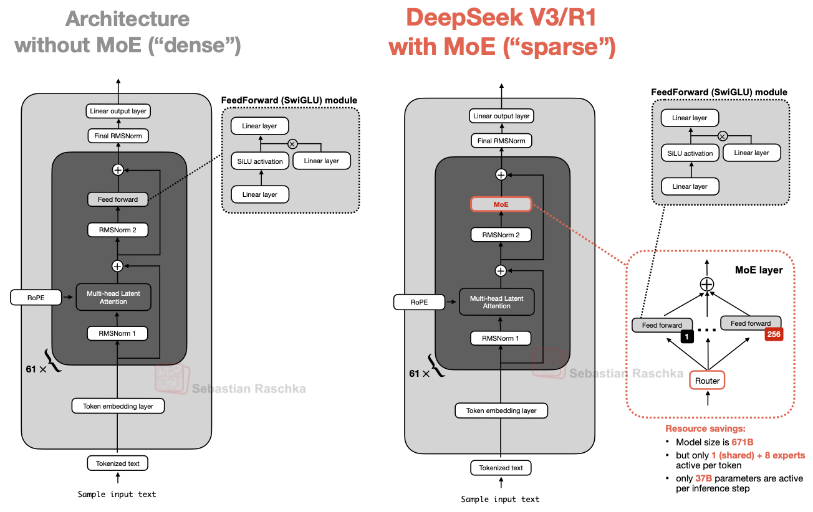
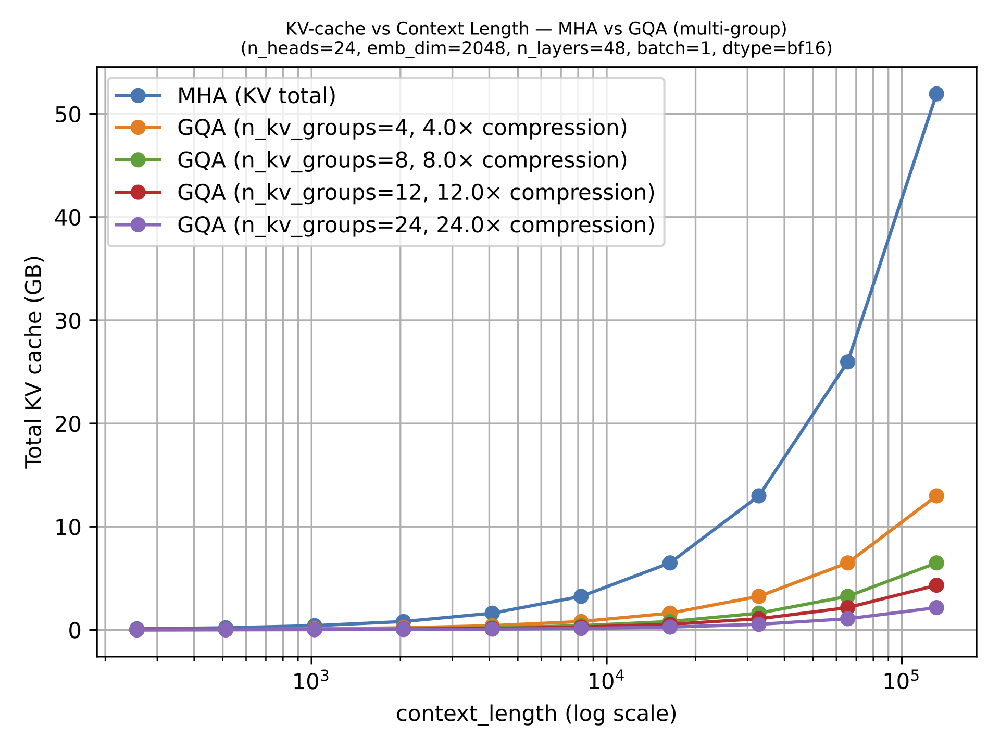

# LLM Architecture Comparison & Attention Variants

**Source**: Sebastian Raschka, PhD — "Ahead of AI" Substack. Two comprehensive reference articles (July 2025 / March 2026).

## Part 1: Architecture Comparison (23 Models)

A systematic comparison of architectural design choices across modern open-weight LLMs.

*Figure 1: Overview of 23 architectures compared in this article. [src](https://magazine.sebastianraschka.com/p/the-big-llm-architecture-comparison)*

### Attention Mechanisms

*Figure 2: MHA (all K/V independent) vs GQA (K/V shared across groups). GQA reduces parameter count and KV cache without noticeable quality loss. [src](https://magazine.sebastianraschka.com/p/the-big-llm-architecture-comparison)*

*Figure 3: MLA compresses K/V to a lower-dimensional latent, caches the compressed representation, and up-projects on-the-fly. More complex than GQA but better modeling quality. [src](https://magazine.sebastianraschka.com/p/the-big-llm-architecture-comparison)*

| Mechanism | How It Works | Models Using It | Trade-off |
|-----------|-------------|----------------|-----------|
| **MHA** (Multi-Head Attention) | Every query head has its own K/V | GPT-2, OLMo 2, OLMo 3 | Best modeling quality, highest memory |
| **GQA** (Grouped-Query Attention) | K/V heads shared across groups of query heads | Llama 3/4, Qwen3, Gemma 3, Mistral Small 3.1 | Standard replacement for MHA — small quality loss, large memory savings |
| **MLA** (Multi-Head Latent Attention) | K/V compressed to latent space, expanded on-the-fly | DeepSeek V2/V3/R1, Kimi K2, GLM-5, Mistral Large 3, Sarvam 105B | Better quality than GQA at scale, complex implementation |
| **SWA** (Sliding Window Attention) | Each token attends only to a fixed local window | Gemma 2/3, OLMo 3, Xiaomi MiMo, Arcee Trinity, Tiny Aya | Large KV cache savings, minimal perplexity impact |
| **DSA** (DeepSeek Sparse Attention) | Learned sparse pattern via indexer + selector | DeepSeek V3.2, GLM-5 | More flexible than SWA, complex to implement |

### Key Architecture Decisions by Model

**DeepSeek V3/R1** (671B total, 37B active):
- MLA instead of GQA — DeepSeek-V2 ablations showed MLA outperforms GQA on modeling quality at similar KV cache savings
- 256 experts with top-8 routing + 1 shared expert per MoE layer
- MoE in all but first 3 transformer blocks
- Auxiliary-loss-free load balancing

**OLMo 2** (7B):
- Uses traditional MHA (not GQA or MLA) — prioritizes simplicity
- Post-Norm: RMSNorm after attention and FFN (unlike standard Pre-Norm)
- QK-Norm: Additional RMSNorm on queries and keys before RoPE
- Both Post-Norm + QK-Norm stabilize training loss

**Gemma 3** (1B-27B):
- 5:1 ratio of sliding window (local) to global attention layers
- Window size reduced from 4096 (Gemma 2) to 1024 (Gemma 3)
- Ablation shows minimal perplexity impact from aggressive SWA
- Both Pre-Norm and Post-Norm around attention module
- Uses GQA with sliding window

**Llama 4 Maverick** (400B total, 17B active):
- GQA (like Llama 3), not MLA
- MoE: 2 active experts with 8192 hidden size each (fewer, larger experts than DeepSeek)
- Alternates MoE and dense layers (not all MoE like DeepSeek V3)
- Native multimodal support

**Qwen3** (dense 0.6B-32B, MoE 30B-A3B/235B-A22B):
- Dense models: Standard GQA + SwiGLU, compact sizes
- MoE models: DeepSeek-style with shared experts
- 0.6B model is practical for local training/experimentation
- Supports thinking mode (like DeepSeek-R1)

**Mistral Small 3.1** (24B):
- Abandoned sliding window attention (default: `"sliding_window": null`)
- Uses regular GQA with FlashAttention — prioritizes inference speed over memory
- Outperforms Gemma 3 27B on most benchmarks except math

**Gemma 3n** (on-device optimized):
- PLE (Per-Layer Embedding): Keeps only active layer in GPU memory, streams others from CPU/SSD
- MatFormer: Single architecture sliceable into smaller independent models

### Normalization Placement Comparison

*Figure 8: Normalization placement comparison — Post-Norm (original Transformer), Pre-Norm (GPT-2, Llama), and OLMo 2's Post-Norm-inside-residual. [src](https://magazine.sebastianraschka.com/p/the-big-llm-architecture-comparison)*

| Strategy | Example | Placement |
|----------|---------|-----------|
| **Pre-Norm** | GPT-2, Llama 3, most LLMs | RMSNorm *before* attention and FFN |
| **Post-Norm** | Original Transformer | LayerNorm *after* attention and FFN, outside residual |
| **OLMo Post-Norm** | OLMo 2/3 | RMSNorm *after* attention and FFN, inside residual |
| **Dual Norm** | Gemma 2/3 | RMSNorm both before and after attention |

Pre-Norm provides better gradient behavior at initialization and works without learning rate warmup. OLMo 2 adopted Post-Norm (with QK-Norm) to improve training stability.

### MoE Trends in 2025

The year's defining trend: Mixture-of-Experts went from niche to mainstream:

*Figure 5: MoE replaces single FeedForward with multiple experts. Only a subset activates per token — total parameters grow but inference cost stays low. [src](https://magazine.sebastianraschka.com/p/the-big-llm-architecture-comparison)*

| Model | Total Params | Active Params | Experts | Top-K | Shared Expert |
|-------|-------------|---------------|---------|-------|---------------|
| DeepSeek V3 | 671B | 37B | 256 | 8 | ✓ |
| Llama 4 Maverick | 400B | 17B | 128 | 1 | — |
| Qwen3 MoE | 235B | 22B | 128 | 8 | ✓ |
| Mixtral 8×7B | 46.7B | 12.9B | 8 | 2 | — |

## Part 2: Attention Variants Deep Dive

### MHA → GQA → MLA: The Evolution

**MHA**: Each query head has its own K/V projections. $h$ query heads = $h$ K/V heads. Maximum modeling flexibility, maximum KV cache.

**GQA**: $g$ groups of query heads share K/V projections. $g = 1$ = Multi-Query Attention (cheapest but quality loss). $g = h$ = MHA. Sweet spot: $g \approx h/4$ to $h/8$.

**MLA**: K/V projected to low-rank latent $c_{KV} \ll d$, cached compressed, up-projected on-the-fly. DeepSeek-V2 ablations: GQA < MHA < MLA in modeling quality at same KV cache budget. For smaller models (<100B), GQA often works better or is easier to tune.

### KV Cache Size Comparison

*Figure 11: KV cache size vs sequence length — GQA savings become more pronounced as context grows. MQA (1 group) is cheapest, MHA is most expensive. [src](https://magazine.sebastianraschka.com/p/the-big-llm-architecture-comparison)*

MLA's advantage grows with sequence length:

| Attention | 1K tokens | 8K tokens | 128K tokens |
|-----------|----------|----------|-------------|
| MHA | 1× | 1× | 1× (baseline) |
| GQA (4 groups) | 0.25× | 0.25× | 0.25× |
| MLA | ~0.14× | ~0.14× | ~0.14× |

### Sliding Window Attention (SWA)

Each token attends only to a fixed window of $w$ recent tokens. Some layers keep global attention for information propagation.

**Key tuning knobs**:
- **Local:global ratio**: Gemma 3 (5:1), OLMo 3 (3:1)
- **Window size**: Gemma 3 (1024), Xiaomi MiMo (128), Gemma 2 (4096)
- Smaller window + higher ratio = more aggressive savings

Gemma 3 ablation: "Aggressive SWA has little to no impact on perplexity."

### DeepSeek Sparse Attention (DSA)

Different from SWA: selection is **learned**, not fixed-locality.

1. **Lightning Indexer**: Scores prior tokens for relevance using MLA's compressed representations
2. **Token Selector**: Keeps top-k highest-scoring tokens, masks out the rest

DSA + MLA combo: MLA compresses what's stored, DSA reduces what's attended to. Independent optimizations that compound.

### Gated Attention

Hybrid stacks keep occasional full-attention layers for exact content retrieval, adding stability modifications (GQA with gating, QK-Norm) on top.

### Architectures Using Each Variant

| Variant | Density | Example Architectures |
|---------|---------|----------------------|
| MHA | Full attention, all heads independent | GPT-2, OLMo 2/3, BLOOM |
| GQA | K/V shared across query head groups | Llama 3/4, Qwen3, Gemma 3, Mistral Small 3.1 |
| MLA | K/V compressed to latent space | DeepSeek V2/V3/R1, Kimi K2, GLM-5, Sarvam 105B |
| SWA + GQA | Local window + shared K/V | Gemma 3, OLMo 3, Xiaomi MiMo, Tiny Aya |
| DSA + MLA | Learned sparse + compressed K/V | DeepSeek V3.2, GLM-5 |

## Connections to Existing Wiki

- **[Multi-Head Latent Attention](multi-head-latent-attention.md)** — MLA deep-dive with KV cache math
- **[DeepSeek-V4 Architecture](deepseek-v4.md)** — CSA/HCA evolution from DSA
- **[DeepSeek-V3](deepseek-v3.md)** — MLA + DeepSeekMoE implementation details
- **[DeepSeek-V3.2](deepseek-v3.2.md)** — DSA sparse attention training
- **[LLM Scaling Laws](llm-scaling-laws.md)** — Why bigger models need these efficiency tricks
- **[FlashAttention](flashattention.md)** — Complementary kernel-level attention optimization
