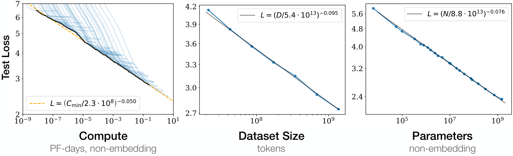
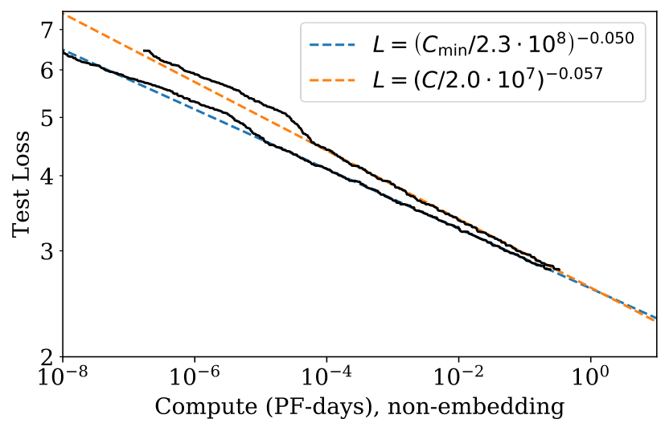

# LLM Scaling Laws

**Source**: Cameron R. Wolfe, Ph.D. — Deep (Learning) Focus Substack, January 2025. Comprehensive overview article.

## Key Points

- **Power laws are the foundation**: LLM test loss decreases as a power law with respect to compute, model size, and data size
- **Kaplan et al. (2020)**: OpenAI's original scaling laws — prioritize increasing model size over data ($D \propto N^{0.74}$)
- **Scaling is exponential decay, not exponential growth**: Each unit of improvement costs more than the last — diminishing returns
- **Data wall**: The internet is finite — web-scraped data may not suffice for continued scaling
- **RL scaling laws** are emerging but less standardized than pretraining scaling laws
- **"Plateau"**: Recent models show diminishing benefits from pure pretraining scale — shifting focus to reasoning, RL, and test-time compute

## The Mechanics of Scaling Laws

### Power Law Foundation

A scaling law is a power-law relationship between an LLM's test loss (L) and some quantity of interest (X):

$$
L(X) = a \cdot X^{-b} + L_\infty
$$

Where $a$ and $b$ are fitted constants, and $L_\infty$ is the irreducible loss.

### Kaplan et al. (2020) — The Original Scaling Laws

**Source**: OpenAI, 2020. 30 pages. arXiv:2001.08361 [src](raw/scaling-laws-kaplan.pdf). Studied Transformer LMs across 7+ orders of magnitude in scale.

**Three fundamental power laws** (when not bottlenecked by the other factors):

1. **Model size** (trained to convergence on sufficient data):
   $$L(N) = \left(\frac{N_c}{N}\right)^{\alpha_N}, \quad \alpha_N \approx 0.076, \quad N_c \approx 8.8 \times 10^{13}$$

2. **Dataset size** (large models with early stopping):
   $$L(D) = \left(\frac{D_c}{D}\right)^{\alpha_D}, \quad \alpha_D \approx 0.095, \quad D_c \approx 5.4 \times 10^{13} \text{ tokens}$$

3. **Compute budget** (optimally allocated):
   $$L(C_{\min}) = \left(\frac{C_c^{\min}}{C_{\min}}\right)^{\alpha_C^{\min}}, \quad \alpha_C^{\min} \approx 0.050, \quad C_c^{\min} \approx 3.1 \times 10^8 \text{ PF-days}$$

### The Unified Overfitting Formula (Equation 1.5)

The most important equation in the paper — combines the dependence on model size N and dataset size D into a single functional form:

$$
L(N, D) = \left[ \left(\frac{N_c}{N}\right)^{\frac{\alpha_N}{\alpha_D}} + \frac{D_c}{D} \right]^{\alpha_D}
$$

This predicts the loss when training is stopped early (before convergence). The first term dominates when the model is too small (capacity-limited). The second term dominates when data is too small (overfitting). The crossover happens when $N^{0.74}/D$ is balanced — every $8\times$ increase in model size only needs ~$5\times$ more data.

### Training Curve Prediction (Equation 1.6)

Learning curves for any model size can be parameterized by $S_{\min}$, the minimum steps needed:

$$
L(N, S) = \left(\frac{N_c}{N}\right)^{\alpha_N} + \left(\frac{S_c}{S_{\min}(S)}\right)^{\alpha_S}
$$

where $S_c \approx 2.1 \times 10^3$ and $\alpha_S \approx 0.76$. This allows **predicting final performance from early training**.

### Optimal Compute Allocation (Equations 1.7, 1.8)

For a fixed compute budget $C$, the optimal allocation proportions are:

$$N \propto C^{\alpha_C^{\min}/\alpha_N} \approx C^{0.73}$$
$$B \propto C^{\alpha_C^{\min}/\alpha_B} \approx C^{0.24}$$
$$S \propto C^{\alpha_C^{\min}/\alpha_S} \approx C^{0.03}$$

with the composite exponent:
$$\alpha_C^{\min} = \frac{1}{1/\alpha_S + 1/\alpha_B + 1/\alpha_N}$$

**For a 1000× compute increase**: model size grows ~1000×, batch size ~5×, training steps barely increase (~1.2×). Almost all additional compute should go to larger models.

### Critical Batch Size (Equation 1.4)

The batch size that optimally trades off speed and compute efficiency also follows a power law:

$$B_{\text{crit}}(L) = \frac{B_*}{L^{1/\alpha_B}}, \quad B_* \approx 2 \times 10^8 \text{ tokens}, \quad \alpha_B \approx 0.21$$

As loss decreases (model improves), the optimal batch size grows — larger models need larger batches.

