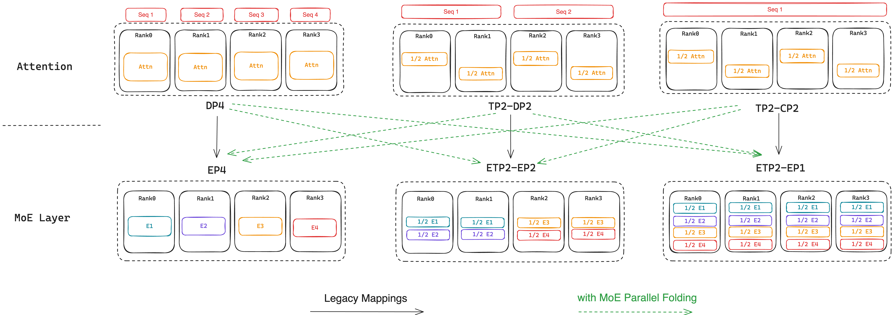
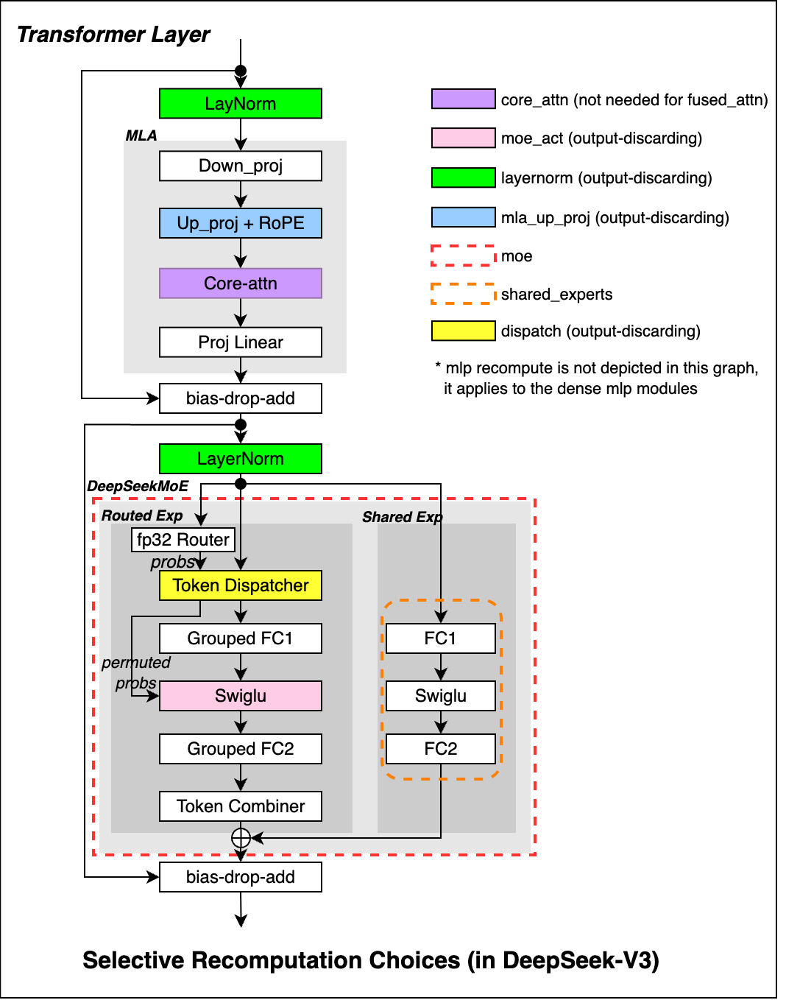
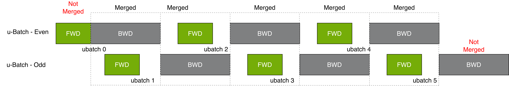
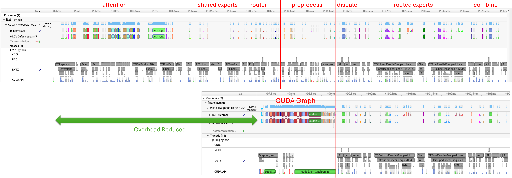

# Megatron-Core MoE: Scalable Training of Mixture-of-Experts Models

**Source**: NVIDIA Technical Report, March 2026. 88 pages, 42 figures. Open source under Megatron-Core.

**Authors**: Zijie Yan (project lead), Hongxiao Bai, Xin Yao, Dennis Liu, et al. (44 authors total). Corresponding: {zijiey, juney, jiajiey}@nvidia.com.

## Key Points

- MoE sparsity (only _K_ of _E_ experts activate per token) creates a **parameter-compute mismatch** that breaks traditional parallelism assumptions
- This mismatch manifests as three coupled constraints: the **Memory Wall**, **Communication Wall**, and **Compute Efficiency Wall**
- **Parallel Folding** decouples attention (dense) and MoE (sparse) layer parallelism, allowing each to use its optimal topology
- Achieves 1,233 TFLOPS/GPU for DeepSeek-V3-685B on GB300, 368 TFLOPS/GPU on H100 at 1,024 GPU scale
- Full open-source stack: Megatron-Core + Transformer Engine, used from billions to trillions of parameters

## Summary

This report presents Megatron-Core MoE, NVIDIA's open-source stack for training large-scale Mixture-of-Experts models. The core insight is that MoE sparsity creates fundamentally different systems challenges than dense models: because only a subset of experts activate per token, total parameters grow much faster than per-token computation, creating coupled constraints across memory, communication, and computation.

### The Three Walls Framework

The paper organizes its optimization strategies around three "walls" that emerge from MoE's sparsity:

1. **[Memory Wall](#memory-wall)**: Parameters, optimizer states, gradients, and activations must fit within GPU memory. DeepSeek-V3's full footprint is 199.5 GB/GPU — reduced to under 80 GB through fine-grained recomputation, activation offloading, FP8/FP4 precision, and FSDP.

2. **[Communication Wall](#communication-wall)**: Expert Parallelism (EP) introduces all-to-all communication that can consume 30-50% of step time. Solved via optimized dispatchers (DeepEP for NVL8, HybridEP for NVL72) and communication-computation overlap.

3. **[Compute Efficiency Wall](#compute-efficiency-wall)**: Small per-expert GEMMs underutilize Tensor Cores; dynamic token counts create host-device synchronization overhead. Solved via Grouped GEMM, kernel fusions, CUDA Graphs, and Sync-Free MoE with ECHO (Elastic Cloning for Hot Experts).

### Parallel Folding (Section 3)

The **dense-sparse mismatch**: attention layers benefit from high Tensor Parallelism (large QKV matrices), while MoE experts suffer from it (small per-expert dimensions). Traditional frameworks forced both to share one TP config. Parallel Folding decouples them, allowing attention to use TP=4 while MoE uses ETP=1 with EP=64. This breaks the EP ≤ DP constraint and reduces minimum GPU requirements.

### Reduced-Precision Training (Section 5)

Full FP8 and NVFP4 support across multiple recipes: per-tensor FP8, blockwise FP8 (Hopper), MXFP8 (Blackwell), and NVFP4 (Blackwell). Reduced precision impacts all three walls simultaneously — lower memory, less communication volume, faster computation. MoE-specific challenges include dynamic token shapes requiring grouped quantization.

### Performance (Section 8)

| Model | Hardware | GPUs | SeqLen | TFLOPS/GPU | Tokens/s/GPU |
|-------|----------|------|--------|------------|-------------|
| DeepSeek-V3-685B | GB300 | 256 | 4,096 | 1,233 | 4,730 |
| DeepSeek-V3-685B | GB200 | 256 | 4,096 | 1,048 | 4,020 |
| DeepSeek-V3-685B | H100 | 1,024 | 4,096 | 368 | 1,412 |
| Qwen3-235B | GB300 | 256 | 4,096 | 974 | 6,583 |
| Qwen3-235B (long ctx) | GB300 | 128 | 131,072 | 1,150 | 1,556 |

GB200 delivers ~3× H100 throughput at comparable or smaller GPU counts.

### Production Features (Section 7)

Load balancing strategies (aux-loss, Sinkhorn, bias-based), shared experts, Latent MoE (compressing dispatch dimension), parallelism-agnostic distributed checkpointing, flexible asymmetric VPP, dense-to-MoE upcycling, multi-token prediction, and Muon optimizer with MuonClip for attention stability.

### Best Practices (Section 9)

A systematic three-phase optimization workflow:
1. **Phase 1**: Establish memory-feasible parallelism
2. **Phase 2**: Select optimal parallelism strategy (minimize model parallelism, keep EP/TP within NVLink, prefer EP over TP for experts)
3. **Phase 3**: Profile and identify dominant bottleneck, apply targeted optimizations

Same model can require completely different strategies on different hardware (see DeepSeek-V3 case study on GB200 vs H100).

## Connections

- [Parallel Folding](#parallel-folding) — decoupling attention and MoE parallelism
- [Memory Wall](#memory-wall) — detailed breakdown of memory optimization techniques
- [Communication Wall](#communication-wall) — EP dispatchers and communication overlap
- [Compute Efficiency Wall](#compute-efficiency-wall) — Grouped GEMM, CUDA Graphs, kernel fusions
- [FP8/FP4 Training](#fp8fp4-reduced-precision-training) — reduced-precision recipes for MoE
- [Performance Best Practices](#performance-best-practices) — three-phase optimization workflow
- [DeepSeek-V3](deepseek-v3.md) — trains on Megatron-Core infrastructure
- [DeepSeek-V4](deepseek-v4.md) — successor architecture
- [NCCL Demystifying](nccl-demystifying.md) — communication protocols used by dispatchers
- [GPU Hardware Architecture](aspe-gpu-hardware-architecture.md) — NVL72, NVLink 5
- [Comet: MoE Overlap](comet-moe-overlap.md) — finer-grained EP overlap approach

# MoE Parallel Folding

**Source**: Megatron-Core MoE Technical Report, Section 3 [src](raw/scalable-training-moe-megatron-core.pdf)

## The Problem: Dense-Sparse Mismatch

### MoE's Parallelism Paradox

Dense models follow a virtuous cycle: more parameters → more GPUs needed for memory → but also more computation per token → communication takes a smaller share → MFU stays stable.

MoE breaks this cycle [src](raw/scalable-training-moe-megatron-core.pdf):

| Model | Total Params | Active Params | Ratio |
|-------|-------------|---------------|-------|
| Llama-70B (Dense) | 70B | 70B | 1:1 |
| DeepSeek-V3 (MoE) | 685B | 37B | 18:1 |

DeepSeek-V3 has 18× more parameters than its active computation suggests. This creates a compounding effect:
1. **Memory grows fast** → forces distribution across many GPUs
2. **More communication** → EP all-to-all scales with token count
3. **Compute stays low** → insufficient computation to overlap with growing communication

### Why Traditional Parallelism Fails

Within a single Transformer block, attention and MoE layers have **conflicting optimal parallelism configurations**:

| Aspect | Attention (Dense) | MoE (Sparse) |
|--------|------------------|--------------|
| Computation | Every token attends to all others | Each token routes to _K_ of _E_ experts |
| TP | Large QKV matrices benefit from high TP | Small per-expert dims make high TP counterproductive |
| CP | Long sequences benefit from high CP | No sequence dependency; CP is irrelevant |
| EP | Not applicable (no experts) | Essential for distributing many experts |

Prior frameworks (GShard, Switch Transformer) forced **one** parallelism configuration for both layer types, treating EP as a sub-dimension of DP:

```
World Size = TP × CP × PP × DP, where EP ⊆ DP
```

This creates three critical challenges:

**Challenge 1: Multiplicative GPU Requirements.** EP=8 forces DP≥8. With CP=8 for long sequences, minimum becomes 1×8×1×8 = 64 GPUs — even though attention and MoE could theoretically share 8 GPUs.

**Challenge 2: Forced Suboptimal Parallelism.** Must choose between high TP (good for attention, fragments experts) or low TP (preserves expert efficiency, underparallelizes attention). Neither works well for both.

**Challenge 3: Cross-Node Communication.** EP within DP often forces all-to-all across node boundaries (5-10× lower bandwidth than NVLink).

## The Solution: Parallel Folding

Parallel Folding **decouples** parallelism mappings for attention and MoE layers [src](raw/scalable-training-moe-megatron-core.pdf):

```
Attention layers: groups over TP × CP × DP × PP
MoE layers:       groups over ETP × EP × EDP × PP
```

The sole constraint: **Pipeline Parallelism (PP) must remain consistent** across both layouts for correct gradient flow.

### How It Works

Instead of EP being constrained within DP, EP can "fold" across arbitrary sub-groups of the attention parallelism configuration:

```
Traditional:  World = TP × CP × (DP) × PP
                          EP ≤ DP

Parallel Folding: World = TP × CP × DP × PP
                   EP can span TP × CP × DP

*Figure: Parallel Folding decouples attention (TP/CP/DP/PP) and MoE (ETP/EP/EDP/PP) configurations. The mapping switch enables each layer type to use its optimal topology independently. [src](raw/moe-parallel-folding.pdf)*
```




**Concrete example**: Attention configured with TP=4, CP=2, DP=8, PP=4 (256 GPUs)
- Traditional: EP ≤ DP = 8, so max EP = 8
- With Parallel Folding: MoE uses ETP=1, EP=64, EDP=1 (same PP=4)
- EP "folds" across the TP×CP×DP groups → 8× higher expert parallelism
- Attention layers maintain their optimal TP=4, CP=2

### Benefits

1. **Breaks the EP ≤ DP constraint**: EP can exceed DP by folding across TP and CP groups
2. **Reduces minimum GPU requirements**: CP=8, EP=8 needs only 8 GPUs with Folding (vs. 64 in traditional)
3. **Enables independent optimization**: Attention uses high TP for large matrices; MoE uses ETP=1 for full expert width and better GEMM efficiency
4. **Keeps communication in NVLink domain**: Both CP (attention) and EP (MoE) all-to-all stay within NVLink-connected GPUs, avoiding slower cross-node transfers

### The Full Parallelism Stack

With Parallel Folding, Megatron-Core orchestrates **five parallelism dimensions**:

| Dimension | Applies To | Purpose |
|-----------|-----------|---------|
| TP (Tensor) | Attention | Shard large QKV/projection matrices |
| CP (Context) | Attention | Distribute long sequences |
| DP (Data) | Attention | Process different batches |
| PP (Pipeline) | Both | Split model by layers (must be consistent) |
| EP (Expert) | MoE | Distribute experts across GPUs |
| ETP (Expert Tensor) | MoE | Shard within experts (rarely used) |
| EDP (Expert Data) | MoE | Replicate experts for throughput |

**Configuration principles**:
- Attention layers: optimize for large matrices (high TP) and long sequences (high CP)
- MoE layers: optimize for many small experts (high EP, typically ETP=1)
- PP: must remain consistent across both
- DP: used to fill remaining GPUs after TP×CP×EP×PP

### Integration with Memory Optimization

Parallel Folding integrates with Distributed Optimizer and FSDP to further reduce memory:

- **Distributed Optimizer + EP**: Only weights and gradients for local experts reside on each rank; optimizer states are sharded among replicas of the same expert (via EDP)
- **FSDP + EP**: Dual DeviceMesh architecture fully shards parameters, gradients, and optimizer states across data/expert groups, compatible with TP/EP/CP and mixed precision

# MoE Memory Wall

**Source**: Megatron-Core MoE Technical Report, Section 4.1 [src](raw/scalable-training-moe-megatron-core.pdf)

## Memory Anatomy

Training a large MoE model requires storing four categories of data per GPU [src](raw/scalable-training-moe-megatron-core.pdf):

| Component | DeepSeek-V3 (GB/GPU) | Share |
|-----------|---------------------|-------|
| Parameters | 17.9 | 9% |
| Optimizer states | 44.3 | 22% |
| Gradients | 7.7 | 4% |
| Activations | 129.6 | 65% |
| **Total** | **199.5** | 100% |

Activations dominate (65%). This is the primary target for memory optimization.

> [!note] MoE activations are larger than dense models because token dispatch creates additional intermediate tensors: routing maps, dispatch indices, and per-expert token buffers.

## 1. Memory-Efficient Permutation

**Problem**: Token dispatch and combine require permutation operations that create redundant intermediate activations — reshaping and gathering tokens into per-expert buffers essentially doubles the activation memory for a brief moment.

**Solution**: Zero-overhead permutation fuses the permutation with adjacent operations, eliminating the need to store separate input and output buffers. Instead of:
```
input → permute → buffer → compute → buffer → unpermute → output
```
The fused version directly computes on permuted indices without materializing full intermediate tensors.

**Impact**: Reduces MoE-layer activation memory with **zero compute overhead** — it's purely an implementation optimization.

## 2. FP8/FP4 Activation Storage

**Problem**: Activations stored in BF16 consume 2 bytes per element.

**Solution**: Store activations in FP8 (1 byte) or FP4 (0.5 bytes) during the forward pass, converting to higher precision only when needed for the backward pass.

- FP8: ~2× activation memory reduction
- NVFP4: ~4× activation memory reduction

**Trade-off**: Quantization introduces numerical noise. The paper addresses this with selective precision — numerically sensitive components (router, embeddings, optimizer states) stay in BF16 while bulk activations use reduced precision.

See also: [Megatron-Core MoE](#) Section 5 for FP8/FP4 training recipes.

## 3. Selective Recomputation (Activation Checkpointing)

**Problem**: Storing all activations is impossible at scale. Full recomputation (recomputing everything in backward) wastes compute.

**Solution**: Fine-grained, module-level recomputation control. Instead of a binary "recompute everything" flag, select specific modules to recompute:

| Strategy | Memory Saved | Compute Overhead | When to Use |
|----------|-------------|-----------------|-------------|
| Full (none) | Maximum | 2× forward | When memory is the only bottleneck |
| Selective | Moderate | 1.1-1.3× | When compute is also constrained |
| None | 0% | 1× | When memory is abundant |

For DeepSeek-V3 on H100, the optimal recompute set is: `mlp`, `mla_up_proj`, `layernorm`, `moe_act`. On GB200 (more memory), only `mlp` is needed.

**Key insight**: MoE layers have unique recomputation trade-offs because expert computation is localized — you can recompute individual experts rather than the full MoE block.

## 4. Fine-Grained Activation Offloading

**Problem**: Even with selective recomputation, activation memory may still exceed GPU capacity. Traditional offloading moves entire activation tensors to CPU, but the transfer latency is high.

**Solution**: Fine-grained, overlapped offloading with prefetch [src](raw/scalable-training-moe-megatron-core.pdf):

1. **Forward pass**: As each layer completes, its activations are asynchronously copied to CPU using dedicated CUDA streams. The GPU continues computing the next layer without waiting.
2. **Backward pass**: Activations are prefetched from CPU to GPU before the corresponding backward layer begins, overlapping the transfer with computation of other layers.
3. **Paged stashing**: Activations are stored in page-sized chunks, enabling efficient memory management and reducing fragmentation.

**Performance**: Overlapped offloading hides most transfer latency. The paper reports that for DeepSeek-V3, offloading reduces peak GPU memory with <5% throughput overhead compared to full recomputation.

> ⚠️ **Trade-off**: Offloading effectiveness depends on CPU-GPU bandwidth (PCIe or NVLink-C2C). GB200's C2C interconnect makes offloading highly effective; older PCIe connections may not hide enough latency.

## 5. Precision-Aware Optimizer

**Problem**: Standard Adam optimizer stores FP32 master weights + FP32 momentum + FP32 variance = 12 bytes per parameter. For a 685B model, this is ~8.2 TB.

**Solution**: Store optimizer moments (momentum, variance) in BF16 instead of FP32, while keeping master weights in FP32 for numerical stability. This cuts optimizer state from 12 bytes/param to 8 bytes/param (33% reduction).

The optimizer update still uses FP32 arithmetic internally; only storage precision is reduced.

## 6. Optimizer State Offloading

**Problem**: Even with reduced precision, optimizer states for trillion-parameter models exceed GPU memory.

**Solution**: Offload optimizer states to CPU, keeping only the currently-needed states in GPU memory. The optimizer update step:
1. Prefetch states for current parameter group to GPU
2. Compute update in FP32
3. Write updated states back to CPU
4. Proceed to next parameter group

Integrates with ZeRO-style sharding: optimizer states are already sharded across data-parallel ranks, and offloading further reduces per-rank memory.

## 7. FSDP for MoE (Megatron-FSDP)

**Problem**: Standard FSDP (Fully Sharded Data Parallelism) shards parameters across the DP group. But MoE has two distinct parameter types (dense and expert) with different communication patterns.

**Solution**: A dual DeviceMesh architecture [src](raw/scalable-training-moe-megatron-core.pdf):

- **Dense parameters**: Sharded across the DP group (standard FSDP)
- **Expert parameters**: Sharded across the EP + EDP group (Expert FSDP)

Key features:
- **Zero-copy communication**: AllGather and ReduceScatter use direct GPU-to-GPU transfers without CPU staging
- **Computation-communication overlap**: Parameter gathering is overlapped with the forward pass of previous layers
- **EP compatibility**: Works with Expert Parallelism, unlike vanilla FSDP

## Putting It All Together

The memory optimization stack transforms DeepSeek-V3 from 199.5 GB/GPU (impossible) to a feasible configuration:

```
199.5 GB  (raw)
  ↓ FP8 activations
~100 GB
  ↓ Memory-efficient permutation
 ~95 GB
  ↓ Selective recomputation
 ~75 GB
  ↓ Activation offloading
 ~60 GB
  ↓ Precision-aware optimizer
 ~55 GB
  ↓ Optimizer state offloading
 ~45 GB
  ↓ FSDP sharding
 ~35 GB  ← fits in 80 GB with room for micro-batches
```

The exact stack depends on hardware. On GB200 (192 GB), fewer techniques are needed



*Figure: Selective recomputation strategies trading compute for memory. Full recomputation saves maximum memory at 30-40% compute cost; selective hits the sweet spot. [src](raw/scalable-training-moe-megatron-core.pdf)* — typically just FP8 + selective recomputation (mlp only) + memory-efficient permutation.

# MoE Communication Wall

**Source**: Megatron-Core MoE Technical Report, Section 4.2 [src](raw/scalable-training-moe-megatron-core.pdf)



*Figure: EP communication overlap using 1F1B pipelining — Layer N+1 dispatch overlaps with Layer N expert compute. [src](raw/scalable-training-moe-megatron-core.pdf)*

## Communication Anatomy

MoE forward pass requires two all-to-all operations per MoE layer:

```
GPU 0: [T0→E1, T1→E3, T2→E0]     GPU 0: [E0 result, E1 result]
GPU 1: [T3→E2, T4→E0, T5→E1]     GPU 1: [E2 result, E3 result]
         ↓ dispatch                        ↑ combine
GPU 0: E0[T2, T4], E1[T0, T5]     ← expert compute →
GPU 1: E2[T3], E3[T1]
```

**Communication volume per layer**:

| Component | Volume per GPU |
|-----------|---------------|
| Dispatch (forward) | tokens/GPU × hidden_dim × top_K × dtype_bytes |
| Combine (forward) | Same as dispatch |
| Dispatch (backward) | gradients: tokens/GPU × hidden_dim × top_K × dtype_bytes |
| Combine (backward) | Same as dispatch |
| **Total** | **4 × (tokens/GPU × hidden_dim × top_K × dtype_bytes)** |

For DeepSeek-V3 (hidden_dim=7168, top_K=8, BF16): ~18 MB per GPU per MoE layer per iteration. With 256 GPUs and 61 MoE layers, this adds up to tens of GB per iteration.

## 1. DeepEP Dispatcher

**Target**: NVL8 systems where EP spans across nodes (cross-node all-to-all).

**Key innovations**:
- **Fused permute + all-to-all**: Combines token permutation and dispatch into a single kernel, eliminating intermediate buffers
- **NVLink-optimized routing**: Routes traffic through NVLink within a node, then through InfiniBand/RoCE between nodes, using the optimal path for each GPU pair
- **Warp-specialized kernels**: Dedicated warps for communication vs. computation within the dispatch kernel

**Performance**: DeepEP achieves near-peak NVLink + IB bandwidth utilization for MoE all-to-all patterns. Used in the DeepSeek-V3 H100 configuration (1,024 GPUs, EP=64).

## 2. HybridEP Dispatcher

**Target**: NVL72 systems (GB200/GB300) with Multi-Node NVLink — all GPUs in the EP group are connected via NVLink.

**Key innovations**:
- **NVLink-native all-to-all**: Direct GPU-to-GPU transfers over the NVLink fabric, no host memory staging
- **Multi-rail utilization**: Exploits multiple NVLink lanes simultaneously for higher aggregate bandwidth
- **Adaptive routing**: Dynamically selects routes based on link congestion and topology

**Performance**: HybridEP on NVL72 achieves 1.8 TB/s bidirectional bandwidth, making EP all-to-all essentially "free" — communication latency is hidden by the fabric's raw bandwidth. This is why GB200 configurations don't need communication overlap.

## 3. EP Communication Overlap

**Problem**: Even with optimized dispatchers, all-to-all latency can still be significant, especially across nodes.

**Solution**: Overlap EP communication with expert computation using a 1F1B (one-forward-one-backward) pipelining scheme [src](raw/scalable-training-moe-megatron-core.pdf):

**Forward pass overlap**:
```
Layer N:   [dispatch] [expert compute] [combine]
Layer N+1:            [dispatch]        [expert compute] [combine]
```
The dispatch of layer N+1 overlaps with expert compute of layer N (as long as they use different experts).

**Backward pass overlap**:
```
Layer N:   [dispatch grad] [expert grad] [combine grad]
Layer N+1:                 [dispatch grad] [expert grad] ...
```

**Requirements for overlap**:
- Each layer must use different sets of experts (natural for most MoE architectures)
- Extra memory buffers for pipelining dispatch/combine operations (~10-20% additional activation memory)
- This is why FP8 memory savings are critical — they free the memory budget for overlap buffers

**When to use**: Essential on H100/B200 (NVL8) where EP spans nodes. Not needed on GB200 (NVL72) where HybridEP provides sufficient bandwidth.

## Hardware Dependency

The communication wall's severity depends entirely on hardware topology:

| System | NVLink Domain | EP64 Spans | Dominant Strategy |
|--------|--------------|------------|-------------------|
| H100 (NVL8) | 8 GPUs | 8 nodes | DeepEP + overlap |
| GB200 (NVL72) | 72 GPUs | 1 node | HybridEP alone |
| GB300 (NVL72) | 72 GPUs | 1 node | HybridEP alone |

> ⚠️ **Key insight**: The same model (DeepSeek-V3, EP=64) has a communication wall on H100 but not on GB200. Hardware topology dictates the optimization strategy. See [Megatron-Core MoE](#) Section 9.2 for the DeepSeek-V3 case study on both platforms.

# MoE Compute Efficiency Wall

**Source**: Megatron-Core MoE Technical Report, Section 4.3 [src](raw/scalable-training-moe-megatron-core.pdf)

## Compute Anatomy: Two Sources of Inefficiency

### 1. Kernel Inefficiency

In dense models, attention and FFN matrices are large enough to saturate Tensor Cores (M, N, K ≥ 1024). In fine-grained MoE, each expert processes only a fraction of tokens, producing much smaller GEMM dimensions:

```
Dense FFN:   [batch × seq_len, hidden_dim] × [hidden_dim, 4×hidden_dim]
             e.g., [32768, 7168] × [7168, 28672]  ← saturates Tensor Cores

MoE expert:  [tokens_to_expert, hidden_dim] × [hidden_dim, intermediate_dim]
             e.g., [512, 7168] × [7168, 2048]  ← underutilization
```

With 256 experts and top-8 routing, each expert receives ~3% of tokens on average. The resulting GEMMs are too small for peak throughput.

### 2. Host Overhead

MoE's fine-grained operations (router, permutation, per-expert compute) require many small GPU kernel launches. The CPU cannot dispatch them fast enough, creating gaps in GPU execution. This becomes the dominant bottleneck once communication and memory are resolved (e.g., on GB200/NVL72).

## 1. Grouped GEMM

**Problem**: Launching separate GEMM kernels for each expert wastes GPU resources (each kernel has launch overhead, small matrices underutilize Tensor Cores).

**Solution**: Batch all expert computations into a single kernel invocation. Instead of:

```
for expert in 1..256:
    output[expert] = matmul(tokens[expert], weight[expert])
```

Grouped GEMM executes all 256 matmuls in one kernel, with each expert's computation running on a subset of SMs. This increases aggregate matrix sizes and reduces kernel launch overhead.

**Implementation**: Uses CUTLASS Grouped GEMM with expert-aware tiling — tile sizes adapt to per-expert token counts for maximum SM utilization.

**Impact**: On fine-grained MoE (256 experts, top-8), Grouped GEMM provides 2-3× throughput improvement over sequential launches.

## 2. Kernel Fusions

**Problem**: Each MoE layer requires multiple small operations (router, permutation, quantization, dispatch), each a separate kernel launch.

**Solution**: Fuse adjacent operations into single kernels:

| Fusion | Operations Combined | Benefit |
|--------|-------------------|---------|
| **Permutation fusion** | Token permute → quantize → dispatch | Reduces intermediate buffers, fewer launches |
| **Router fusion** | Router logits → softmax → top-k → aux-loss | Eliminates router activation storage |
| **Aux-loss fusion** | Load balancing loss computed inline during routing | No separate loss computation pass |

These fusions reduce kernel launch count per MoE layer from ~15-20 to ~5-8.

## 3. CUDA Graphs



*Figure: Partial CUDA Graphs capture attention, router, and MoE preprocessing into static graphs. GPU idle gaps eliminated. [src](raw/scalable-training-moe-megatron-core.pdf)*

**Problem**: Even with fusions, the CPU must still launch each kernel and manage dependencies. For MoE with hundreds of experts, this CPU overhead can dominate step time.

**Solution**: CUDA Graphs capture the entire execution graph (kernels + dependencies) and replay it with a single CPU launch [src](raw/scalable-training-moe-megatron-core.pdf):

```
Without CUDA Graphs:
CPU: launch(K1) → launch(K2) → launch(K3) → ... → launch(K100)
GPU:         [K1]     [K2]     [K3]   ...   [K100]
             ↑ gaps where GPU waits for CPU ↑

With CUDA Graphs:
CPU: launch(graph)
GPU: [K1][K2][K3]...[K100]  ← no gaps
```

**Challenge**: CUDA Graphs require static tensor shapes, but dropless MoE has dynamic per-expert token counts.

**Megatron-Core's solution**: Partial CUDA Graphs capture the static portions (attention, router, MoE preprocessing) while leaving dynamic expert computation ungraphed. On GB200, this captures ~70% of operations.

## 4. Full CUDA Graphs for Dropless MoE

For dropless MoE (where all tokens are always processed, no capacity limits), three techniques enable full CUDA Graphs coverage:

### 4a. Sync-Free Kernels (Device-Initiated)

**Problem**: Dynamic token counts require host-device synchronization to query tensor shapes before launching kernels — this breaks CUDA Graphs.

**Solution**: Device-initiated kernels read dynamic shapes directly from GPU memory (written by a previous kernel), eliminating the host-device sync. The shape metadata lives in GPU global memory and is atomically updated by producer kernels.

### 4b. ECHO: Elastic Cloning for Hot Experts

**Problem**: In dropless MoE, some experts receive more tokens than others ("hot experts"). Worst-case buffer sizing for CUDA Graphs (required for static allocation) would reserve memory for the maximum possible tokens per expert, wasting large amounts of GPU memory.

**Solution**: ECHO dynamically clones hot experts across EP ranks [src](raw/scalable-training-moe-megatron-core.pdf):

1. After routing, identify experts with above-average token counts
2. Clone (replicate) those experts' weights to idle capacity on other EP ranks
3. Split the hot expert's tokens across the original + cloned instances
4. In backward, reduce gradients from clones back to the original expert

This narrows the gap between worst-case and average load, enabling smaller static allocations for CUDA Graphs.

**Overhead**: Extra communication for cloning (forward) and gradient reduction (backward). Only a small fraction of experts are typically cloned, so overhead is modest.

### 4c. Paged Stashing

**Problem**: Each layer needs temporary buffers and activation storage, multiplying the worst-case allocation by the number of layers.

**Solution**: Paged stashing shares a single worst-case temporary buffer across all layers and uses a paged allocation scheme for activations. Memory complexity drops from O(layers × worst_case) to O(worst_case + actual_total).

### Putting It All Together

Full CUDA Graphs coverage for dropless MoE:
- Sync-free kernels → no host-device sync
- ECHO → practical worst-case buffer sizes
- Paged stashing → memory-efficient across layers

## 5. Reduced-Precision Compute

FP8 and FP4 training accelerate GEMMs through Tensor Cores with native low-precision support:
- Blockwise FP8 on Hopper (H100)
- MXFP8 on Blackwell (GB200/GB300) with native Tensor Core acceleration
- NVFP4 on Blackwell for maximum throughput

See [Megatron-Core MoE](#) Section 5 for full low-precision recipes.

## The Bottleneck Shift

A recurring theme: fixing one bottleneck exposes another.

```
Unoptimized:       [Memory Wall ████████████████]  ← can't even train
Fix memory:        [Comm Wall ██████████]          ← all-to-all dominates
Fix communication: [CPU Overhead ██████]           ← host can't keep up (GB200)
Fix CPU overhead:  [Kernel Eff ████]               ← small GEMMs remain
```

On H100, the chain typically stops at the communication wall. On GB200 (NVL72), the communication wall is resolved by hardware, exposing CPU overhead as the new bottleneck — hence the emphasis on CUDA Graphs and kernel fusions in the GB200 case study.

# MoE FP8/FP4 Reduced-Precision Training

**Source**: Megatron-Core MoE Technical Report, Section 5 [src](raw/scalable-training-moe-megatron-core.pdf)

## Why It Matters for MoE

Reduced-precision training is uniquely valuable for MoE because it attacks all three walls simultaneously [src](raw/scalable-training-moe-megatron-core.pdf):

| Wall | FP8 Benefit | FP4 Benefit |
|------|------------|------------|
| **Memory** | 2× activation reduction | 4× activation reduction |
| **Communication** | 2× less data per all-to-all | 4× less data per all-to-all |
| **Compute** | 2× Tensor Core throughput | 4× Tensor Core throughput |

This multiplicative effect makes FP8/FP4 the highest-leverage single optimization: it frees memory (enabling longer sequences or less recomputation), reduces communication volume (mitigating the EP bottleneck), and accelerates GEMMs (improving compute efficiency).

## Precision Recipes

Megatron-Core supports four quantization recipes spanning two hardware generations:

### 1. Per-Tensor FP8 (E4M3)

**Hardware**: Hopper (H100), Blackwell (GB200/GB300)

The simplest FP8 scheme: each tensor gets a single scaling factor. Used for operations where tensor-wide statistics are stable (e.g., large GEMMs).

```
x_fp8 = quantize(x_bf16, scale)
y = dequantize(x_fp8, scale)
```

**Pros**: Lowest quantization overhead, simple implementation
**Cons**: Coarse granularity can cause accuracy loss when tensor values have wide dynamic range

### 2. Blockwise FP8

**Hardware**: Hopper (H100) — primary FP8 training recipe

Each tensor is divided into blocks (typically 128×128), and each block gets its own scaling factor. This finer granularity captures local value distributions better than per-tensor scaling.

```
For each block b in tensor:
    scale_b = max(|x_b|) / FP8_MAX
    x_fp8_b = round(x_b / scale_b)
```

**Key advantage on Hopper**: Uses native FP8 Tensor Core instructions with 2× throughput vs. BF16. The blockwise scheme is the recommended FP8 recipe for H100 MoE training.

**DeepSeek-V3 on H100 results**: 368 TFLOPS/GPU with blockwise FP8 (vs. ~180 TFLOPS in BF16).

### 3. MXFP8 (Microscaling FP8)

**Hardware**: Blackwell (GB200/GB300) — native Tensor Core support

An extension of blockwise FP8 with hardware-accelerated microscaling. Each 32-element block shares an 8-bit scaling factor, stored alongside the data. Blackwell Tensor Cores natively apply the scale during computation.

```
Data layout: [e4m3_block_0][scale_0][e4m3_block_1][scale_1]...
```

**Advantage**: Zero-overhead scaling — the hardware handles it, no extra instructions needed. This is the recommended FP8 recipe for Blackwell.

**DeepSeek-V3 on GB200 results**: 1,048 TFLOPS/GPU with MXFP8.

### 4. NVFP4

**Hardware**: Blackwell (GB200/GB300) only

NVIDIA's 4-bit floating point format with native Tensor Core acceleration. Each 16-element block shares a scaling factor. Provides 4× throughput vs. BF16 on supported operations.

**Qwen3-235B on GB300**: 974 TFLOPS/GPU with MXFP8; NVFP4 is available for further acceleration.

> [!note] NVFP4 requires Blackwell Tensor Cores. Hopper GPUs (H100) do not support FP4 natively.

## FP8/FP4 Primary Weights

**Problem**: Standard mixed-precision training stores master weights in FP32 and a BF16 copy for forward/backward. This doubles weight memory.

**Solution**: Store weights directly in FP8 or FP4 as the primary format. The optimizer maintains FP32 master weights only for the update step; forward and backward use the FP8/FP4 copy directly.

| Storage Scheme | Bytes per Param | Memory (685B model) |
|---------------|----------------|---------------------|
| FP32 master + BF16 copy | 6 | 4.1 TB |
| FP32 master + FP8 primary | 5 | 3.4 TB |
| FP32 master + FP4 primary | 4.5 | 3.1 TB |

Combined with optimizer state optimizations (see [Memory Wall](#memory-wall)), this provides substantial memory savings.

## MoE-Specific Challenges

Reduced-precision training for MoE introduces unique challenges not present in dense models:

### 1. Dynamic Shape Alignment (Padding/Unpadding Fusion)

**Problem**: FP8/FP4 GEMMs require fixed input dimensions, but per-expert token counts are dynamic. Traditional padding to a fixed capacity wastes compute and memory.

**Solution**: Fuse padding and unpadding with quantization into a single kernel. Instead of:

```
pad → quantize → GEMM → dequantize → unpad
```

The fused kernel quantizes only the valid tokens, pads with zeros to the required alignment, issues the GEMM, and discards padded outputs — all in one operation with no intermediate storage of padded values.

### 2. Grouped Quantization

**Problem**: Per-expert activations have different value ranges (one expert might see outlier tokens while another sees typical ones). Per-tensor quantization uses a single scale for all experts, losing precision where ranges differ.

**Solution**: Grouped quantization computes separate scales for each expert's token batch:

```
For each expert e:
    scale_e = max(|tokens_e|) / FP8_MAX
    tokens_fp8_e = quantize(tokens_e, scale_e)
```

Grouped GEMM then applies the per-expert scales during the batched computation. The overhead is minimal — one scale per expert (256 scales for 256 experts) vs. per-tensor (1 scale).

### 3. NVFP4 Quantization Fusion

**Problem**: NVFP4 requires block-level scales (one per 16 elements). Computing scales and applying quantization for thousands of small expert token batches is expensive.

**Solution**: Fuse NVFP4 block-scale computation with the token permutation step. As tokens are permuted into per-expert buffers, block statistics are accumulated and scales computed inline. The combined kernel eliminates a separate quantization pass.

## Selective Precision

Not all operations benefit equally from reduced precision. Megatron-Core uses selective precision:

| Component | Precision | Reason |
|-----------|-----------|--------|
| GEMM (attention, expert FFN) | FP8/FP4 | Bulk computation, stable value ranges |
| Router logits + softmax | BF16 | Small computation, numerical sensitivity |
| Embeddings | BF16 | Sparse updates, wide dynamic range |
| LayerNorm/RMSNorm | BF16 | Small tensors, precision-critical |
| Loss computation | FP32 | Accumulation precision matters |
| Optimizer states | BF16/FP32 | See [Memory Wall](#memory-wall) |

This selective approach preserves accuracy while maximizing the throughput and memory benefits of reduced precision where they matter most.

## Numerical Stability

The paper reports successful FP8 training at scale (DeepSeek-V3 at 1,024 GPUs, Qwen3-235B at 256 GPUs) with no loss divergence. Key stability techniques:

- Gradient scaling maintained in FP32
- Router and auxiliary loss computed in BF16
- Embedding gradient accumulation in FP32
- Periodic (every N steps) BF16 validation to detect drift

# MoE Performance Best Practices

**Source**: Megatron-Core MoE Technical Report, Section 9 [src](raw/scalable-training-moe-megatron-core.pdf)

## The Three-Phase Workflow

Through tuning Mixtral, DeepSeek-V3, and Qwen3 across GB200 and H100, a repeatable methodology emerged:

### Phase 1: Establish Memory-Feasible Parallelism

Memory is the hard constraint. If the config does not fit in GPU memory, training cannot proceed.

**Parallelism impact on memory**:

| Strategy | Peak Activation | Weight Memory | Optimizer States | Comm Overhead |
|----------|----------------|---------------|-----------------|---------------|
| TP | 1/d | 1/d (with SP) | 1/d | High |
| EP | ~1 (load-dep.) | 1/d (MoE only) | 1/d | Medium |
| PP | 1 (>1 with VPP) | 1/d | 1/d | Medium |
| CP | 1/d | 1 | 1/d (with dist-opt) | Medium |
| DP | 1 | 1 | 1/d (with dist-opt) | Low |

**Quick testing**: Use `--fake-init-process-group` to emulate distributed training on a single GPU, or the interactive memory simulator with web GUI.

**Example**: DeepSeek-V3 BF16 activations alone exceed 130 GB/GPU, ruling out baseline configs on 80 GB devices before any parallelism.

### Phase 2: Select Optimal Parallelism Strategy

Five guidelines for minimizing communication overhead:

**Guideline 1: Minimize Model Parallelism, Maximize Data Parallelism**
- Keep TP/EP/PP/CP as small as possible while avoiding OOM
- Use distributed optimizer to shard states across DP ranks

**Guideline 2: Keep EP and TP Within NVLink Domain**
- EP x TP should fit within NVLink (8 GPUs on NVL8, 72 on NVL72)
- NVLink bandwidth (900 GB/s H100, 1.8 TB/s GB200) far exceeds cross-node
- When scaling beyond NVLink, prefer PP over expanding TP/EP across nodes

> For very large models, EP volume may exceed NVLink capacity even within a node. Enable overlap (see [Communication Wall](#communication-wall)).

**Guideline 3: Use PP for Multi-Node Scaling**
- Distribute layers across nodes while keeping EPxTP within NVLink
- Enable VPP when PP >= 2 to reduce pipeline bubbles
- Balance workloads across VPP ranks

**Guideline 4: Prefer EP over TP for Expert Layers**
- EP offers larger local matrices, less communication, easier overlap
- When EP = num_experts, local token permutation is eliminated
- Example: Mixtral-8x7B: EP8xTP1 outperforms EP4xTP2

**Guideline 5: Enable CP for Long Sequences (>= 8K tokens)**
- Avoid CP for sequences < 4K (overhead exceeds benefit)
- CP efficiency depends on communication-computation overlap

**Example**: 256-expert MoE on NVL72. Parallel Folding sets ETP=1 (Guideline 4). EP64 fits in NVLink (Guideline 2). Remaining budget determines TP/PP for attention (Guideline 1), DP fills the rest.

### Phase 3: Profile and Optimize Bottlenecks

Profile to identify the dominant wall:

| Bottleneck | Symptom | Solutions |
|-----------|---------|-----------|
| **Memory** | Forced full recompute or excessive parallelism | FP8, selective recompute, precision-aware optimizer, offloading |
| **Communication** | Significant time in collectives | Identify which communication and apply targeted fix |
| **CPU Overhead** | Gaps between GPU kernels | CUDA Graphs, disable Python GC, reduce kernel launches |
| **Computation** | Low SM utilization, no comm/CPU issues | Grouped GEMM, kernel fusions, FP8 precision |

**Iterative nature**: Memory optimizations may enable smaller parallelism (back to Phase 1). Some Phase 3 optimizations have memory costs (EP overlap buffers, CUDA Graphs), requiring revisit.

## Case Study: DeepSeek-V3 on GB200 vs H100

DeepSeek-V3 (685B, 256 experts, top-8, MTP + MLA) shows how the same model demands completely different strategies on different hardware.

### Final Configurations

| Configuration | GB200 | H100 |
|--------------|-------|------|
| Hardware | 256 x GB200 | 1024 x H100 |
| Parallelism (TP/PP/EP) | 1/4/64 | 2/8/64 |
| VPP | 4 | 4 |
| GBS / MBS / SeqLen | 8192 / 1 / 4096 | 8192 / 1 / 4096 |
| Precision | MXFP8 | FP8-Blockwise |
| Dispatcher | HybridEP | DeepEP |
| CUDA Graphs | Enabled | — |
| EP Overlap | — | Enabled |
| **TFLOPS/GPU** | **1,048** | **368** |

### Why They Differ

**Memory capacity drives parallelism**: GB200 (192 GB/GPU) allows TP1/PP4 — shallower pipeline, fewer bubbles. H100 (80 GB/GPU) requires TP2/PP8 — deeper pipeline to fit the model.

Both use EP64: each GPU holds 4 of 256 experts, eliminating local token permutation.

**Memory Wall — different stacks**:

| Technique | GB200 | H100 |
|-----------|-------|------|
| Precision | MXFP8 | Blockwise FP8 |
| Selective recompute | `mlp` only | `mlp`, `mla_up_proj`, `layernorm`, `moe_act` |
| Optimizer offloading | Yes | No |
| FP8 primary weights | Yes | Yes |
| Memory-efficient permutation | Yes | Yes |

On H100, FP8 savings are critical — they free budget for EP communication overlap buffers. GB200's extra memory eliminates that constraint.

**Communication Wall**: On H100/NVL8, EP64 spans 8 nodes — cross-node all-to-all consumes ~50% step time with standard dispatcher. DeepEP + EP overlap are essential. On GB200/NVL72, EP64 stays within NVLink — HybridEP alone suffices, no overlap needed. Hardware topology alone resolves the communication wall.

**Compute Wall — the bottleneck shift**: On GB200, NVL72 eliminates the communication bottleneck, and MXFP8 accelerates GEMMs. But faster GPU computation exposes **CPU overhead** — the host cannot launch kernels fast enough. Now CUDA Graphs, kernel fusions, and CPU/NUMA binding become critical. The bottleneck shifted from communication to CPU.

### Lessons Learned

1. **Hardware topology dictates strategy**: The same model needs different optimization stacks on different hardware
2. **Fixing one bottleneck exposes the next**: The bottleneck shifts memory -> communication -> CPU -> kernel efficiency
3. **FP8 is the highest-leverage optimization**: It attacks all three walls simultaneously
4. **Memory is always the first constraint**: You cannot optimize what you cannot fit
5. **Profile, do not guess**: Nsight Systems reveals the true bottleneck; intuition is often wrong at this scale