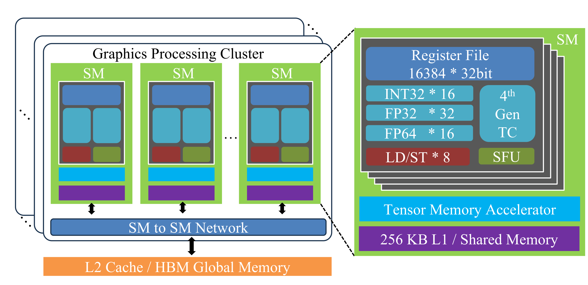
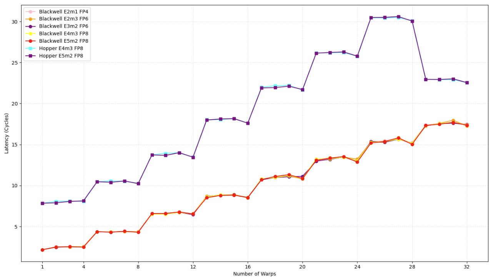
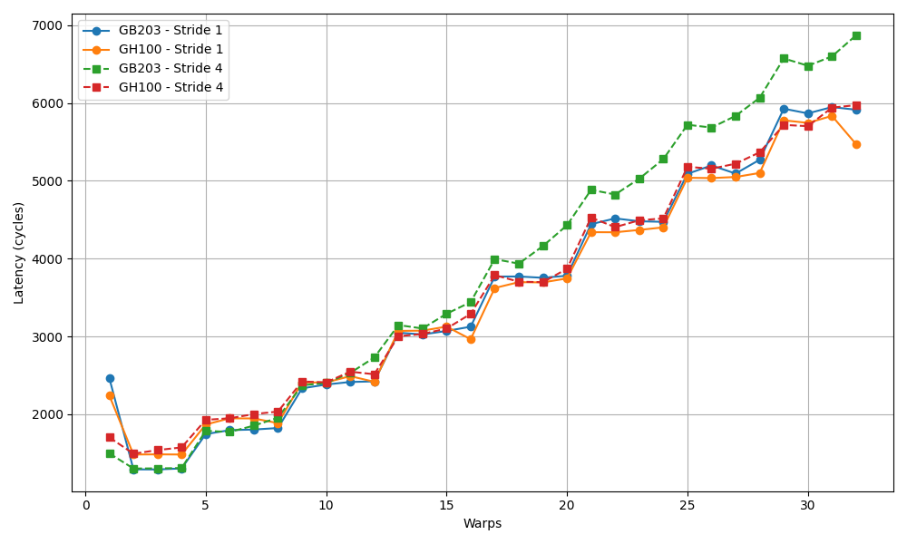
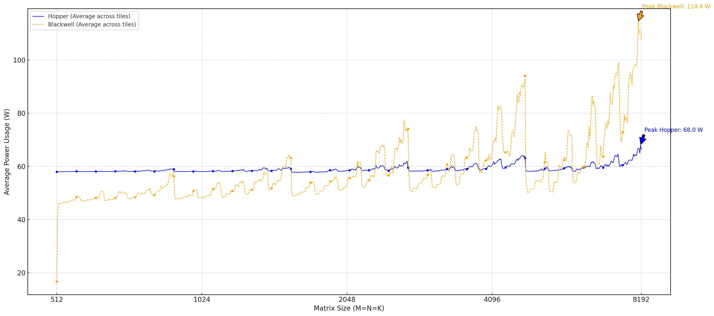
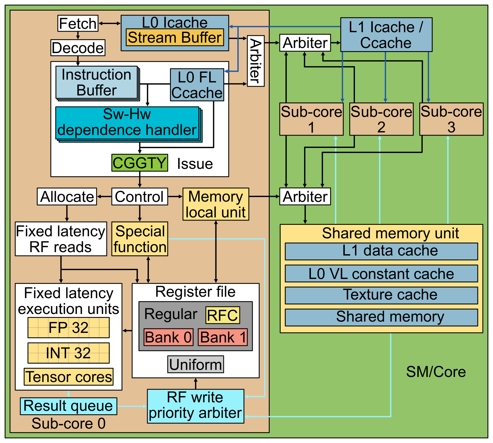

# NVIDIA GPU Architecture: Ampere → Hopper → Blackwell

Four papers tracing GPU architecture evolution through microbenchmarking and instruction-level analysis.

## Key Points

- **Ampere (A100)**: First detailed instruction latency study. WMMA tensor core analysis. Measured clock cycles for all PTX/SASS instructions and memory units.
- **Hopper (H100)**: New features — FP8 tensor cores, DPX dynamic programming, TMA async memory, distributed shared memory (DSMEM). Transformer Engine analysis.
- **Blackwell (B200/RTX 5080)**: FP4/FP6 tensor cores, unified INT32/FP32 cores, new memory hierarchy. Power efficiency comparisons.
- **General Core Analysis**: Reverse-engineers modern NVIDIA GPU core pipeline — issue scheduler policy, register file structure, instruction prefetcher.

## Paper 1: Demystifying Ampere (A100)

**Source**: Abdelkhalik et al., 2022. 8 pages. arXiv:2208.11174.

### Contributions
- Measured **clock cycle latency for every PTX and SASS instruction** across data types (FP32, FP64, INT32, etc.)
- Mapped PTX → SASS instruction correspondence and measured cycles for both
- Analyzed **WMMA (Warp Matrix Multiply-Accumulate)** tensor core instructions: clock cycle latency and throughput
- Measured **access latency of all memory units**: registers, shared memory, L1, L2, HBM

### Key Findings
- Ampere doubled FP32 throughput over Turing via additional FP32 units per SM
- WMMA tensor core instructions show significant latency variation by matrix dimensions
- SASS instruction latencies differ from PTX — the compiler translation adds overhead
- Memory hierarchy latencies increase from registers (~0 cycles) → shared (~20) → L1 (~30) → L2 (~200) → HBM (~500+)

### Architecture Context
- SM structure: 4 processing blocks (sub-cores), each with independent warp schedulers
- 3rd-gen tensor cores: support TF32, BF16, FP16, INT8, INT4, INT1
- 40-80 GB HBM2e, up to 2 TB/s bandwidth
- NVLink 3.0: 600 GB/s bidirectional per GPU

## Paper 2: Dissecting Hopper (H100)

**Source**: Luo et al., 2024. 12 pages. arXiv:2402.13499.

*Figure: Hopper SM with 4th-gen tensor cores, Tensor Memory Accelerator (TMA), and distributed shared memory. [src](raw/dissecting-hopper-gpu-architecture.pdf)*

### New Features Analyzed

| Feature | Description | Performance Impact |
|---------|-------------|-------------------|
| **4th-gen Tensor Cores** | FP8 support (E4M3, E5M2), 2× BF16 throughput over Ampere | Critical for LLM training/inference |
| **DPX Instructions** | Hardware-accelerated dynamic programming | 7× speedup on Smith-Waterman, Needleman-Wunsch |
| **TMA (Tensor Memory Accelerator)** | Async tile loads from HBM→SMEM without thread involvement | Reduced register pressure, better occupancy |
| **DSMEM (Distributed Shared Memory)** | Cross-SM-block shared memory within thread block clusters | Enables warp specialization patterns |
| **Transformer Engine** | Automatic FP8/BF16 mixed-precision in hardware | 2× training throughput for transformers |

### Comparative Benchmarks (Ampere vs Ada vs Hopper)

- **Memory bandwidth**: H100 HBM3 ~3.35 TB/s vs A100 HBM2e ~2 TB/s
- **Tensor core throughput**: FP8 on Hopper 2× BF16 throughput on Ampere
- **LLM generation**: H100 2-3× tokens/sec over A100 at same batch size
- **Dynamic programming**: DPX instructions 7× over CUDA core implementation
- **Async memory**: TMA reduces register usage by 30-50% for tiled GEMM kernels

### Key Insights
- FP8 training is viable on Hopper (validated by DeepSeek-V3 at scale)
- TMA + DSMEM together enable efficient persistent kernel patterns
- Transformer Engine library routes compatible ops to tensor cores automatically
- DPX is specialized — only benefits DP workloads, negligible impact on ML

## Paper 3: Dissecting Blackwell (B200)

**Source**: Jarmusch et al., 2025. 11 pages. arXiv:2507.10789.

### New Features Analyzed

| Feature | Description | vs Hopper |
|---------|-------------|-----------|
| **5th-gen Tensor Cores** | FP4, FP6, FP8, BF16, TF32 support | 2× FP8 throughput, FP4 = 4× BF16 (theoretical) |
| **Unified INT32/FP32 Cores** | Same units handle both integer and float | 2× INT32 throughput |
| **RTX 5080 vs H100** | Consumer vs datacenter comparison | Consumer Blackwell matches/exceeds H100 on some workloads |
| **Memory Hierarchy** | Larger L1, L2 caches; HBM3e | ~8 TB/s bandwidth, 180 GB capacity |

### Key Benchmarks

*Figure: Blackwell (RTX 5080) vs Hopper (H100) — relative throughput across memory bandwidth, latency, and compute workloads. [src](raw/dissecting-blackwell-architecture.pdf)*

*Figure: Combined L1 and shared memory latency — Blackwell shows generational improvement in cache hierarchy. [src](raw/dissecting-blackwell-architecture.pdf)*

*Figure: GEMM power usage vs matrix size — Blackwell demonstrates improved power efficiency for AI workloads. [src](raw/dissecting-blackwell-architecture.pdf)*

### Key Findings
- **L1 cache latency**: Blackwell shows 10-15% reduction vs Hopper
- **Shared memory bandwidth**: Comparable to Hopper, slight regression on some access patterns
- **Tensor core FP8 throughput**: ~2× Hopper on RTX 5080 (consumer), ~2.5-3× on B200 (datacenter)
- **FP4 throughput**: ~4× BF16 when tensor core utilization is high
- **Power efficiency**: Better perf/watt on large GEMMs (1024+) due to improved SM utilization
- **Warp scheduling**: More flexible — reduced warps-per-SM limit but better occupancy management

### RTX 5080 vs H100
- RTX 5080: consumer Blackwell, 16 GB GDDR7, ~1710 GB/s bandwidth
- H100: datacenter Hopper, 80 GB HBM3, ~3350 GB/s bandwidth
- RTX 5080 **matches or exceeds H100** on:
  - L1 cache latency
  - Small-matrix GEMM throughput (< 512×512)
  - INT32 operations
- H100 wins on: memory bandwidth, HBM capacity, FP64 throughput

## Paper 4: Analyzing Modern GPU Cores

**Source**: Huerta et al., 2025. 15 pages. arXiv:2503.20481.

*Figure: Modern GPU core pipeline — sub-cores with independent issue schedulers, register file cache, L1 instruction cache. [src](raw/analyzing-modern-nvidia-gpu-cores.pdf)*

### Reverse-Engineered Core Details

| Component | Finding |
|-----------|---------|
| **Issue Scheduler** | GTO (Greedy-Then-Oldest) policy — prioritizes oldest ready warp |
| **Register File** | Banked structure with register file cache; 2 read ports per bank |
| **Instruction Prefetcher** | Stream buffer-based prefetcher fits well with GPU access patterns |
| **Scoreboard** | RAW (Read-After-Write) and WAW (Write-After-Write) hazard tracking |
| **Sub-core Structure** | 4 sub-cores per SM, each with independent warp scheduler, INT/FP/Tensor units |
| **Operand Collection** | Dedicated unit collects operands from register file banks before issue |

### Model Accuracy
- Incorporating these details into a cycle-accurate simulator achieved **18.24% lower MAPE** (Mean Absolute Percentage Error) in execution cycles vs previous state-of-the-art simulators
- Register file cache presence: critical for accuracy — without it, error increases 5-8%
- Instruction prefetcher: stream buffer model matches hardware behavior better than no-prefetch or ideal-prefetch models

### Key Insights for Performance Engineers
- **Register file cache** is a major performance factor — spills to local memory are expensive
- **GTO scheduler** means warp priority matters: earlier warps get preferential issue
- **Sub-core independence**: different sub-cores can execute different warps from different kernels
- **Stream prefetcher**: sequential instruction access gets prefetched; branches cause misses

## Generational Comparison

| Feature | Ampere (A100) | Hopper (H100) | Blackwell (B200) |
|---------|--------------|---------------|------------------|
| Tensor Cores | 3rd gen (TF32/BF16) | 4th gen (+FP8) | 5th gen (+FP4/FP6) |
| Memory | 40-80 GB HBM2e | 80 GB HBM3 | 180 GB HBM3e |
| Bandwidth | ~2 TB/s | ~3.35 TB/s | ~8 TB/s |
| L2 Cache | 40 MB | 50 MB | 126 MB |
| NVLink | 3.0 (600 GB/s) | 4.0 (900 GB/s) | 5.0 (1.8 TB/s) |
| Special Features | WMMA, MIG | TMA, DSMEM, DPX, TE | FP4 tensor cores, unified INT/FP |
| Process | 7nm (TSMC) | 4nm (TSMC) | 4nm (TSMC, dual-die) |
| Key Paper | arXiv:2208.11174 | arXiv:2402.13499 | arXiv:2507.10789 |

## Connections

- [GPU Memory Hierarchy](gpu-memory-hierarchy.md) — Registers, SMEM, L1/L2, HBM latency details
- [CUDA Kernel Optimization](cuda-kernel-optimization.md) — Occupancy, warp efficiency, ILP
- [GPU Hardware Architecture](gpu-hardware-architecture.md) — NVL72, NVSwitch, roadmap
- [FP8/FP4 Training](megatron-core-moe.md) — Mixed-precision on tensor cores
- [GPU-Initiated Networking](nccl-device-api-gin.md) — GIN on Blackwell
