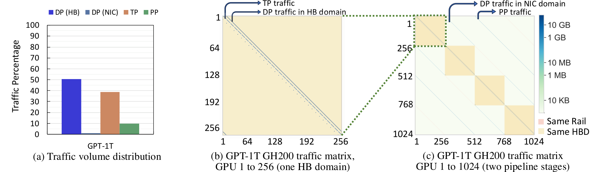

# Rail-only Network Architecture

**Source**: Wang, Ghobadi, Shakeri, Zhang, Hasani. arXiv:2307.12169. July 2023 (v5 Sep 2024). Proposes eliminating the spine layer from GPU datacenter networks by exploiting LLM training's sparse communication patterns.

## Key Points

- **Rail-only design**: eliminates spine switches in traditional spine-leaf GPU clusters, connecting leaves directly via rail links
- **Key insight**: LLM training generates **sparse communication patterns** — most traffic stays within a few GPUs, not requiring full bisection bandwidth
- **Cost reduction**: 38–77% lower network cost and 37–75% lower power vs conventional GPU datacenters
- **Same training performance**: achieves identical throughput and iteration time as spine-leaf designs
- **MoE support**: all-to-all expert routing handled via forwarding through intermediate GPUs with only 8.2–11.2% completion time overhead
- Failure robustness analysis: Rail-only degrades gracefully under switch/GPU failures



## The Insight: LLM Communication is Sparse

### Traditional Spine-Leaf Datacenter

```
[Spine Switches]  ← full bisection bandwidth, expensive
  ├── [Leaf Switch 1] → [GPU racks]
  ├── [Leaf Switch 2] → [GPU racks]
  └── [Leaf Switch N] → [GPU racks]
```

The spine layer provides any-to-any connectivity — every GPU can talk to every other GPU at full bandwidth. This is designed for general datacenter workloads.

### LLM Training Communication Patterns

In practice, large model training uses structured parallelism:
- **Data parallelism**: AllReduce within a DP group (subset of GPUs)
- **Tensor parallelism**: AllReduce within a TP group (typically 8 GPUs, intra-node)
- **Pipeline parallelism**: point-to-point between consecutive stages
- **Expert parallelism**: AllToAll for MoE dispatch/combine

None of these require **full any-to-all bisection bandwidth**. Communication is localized to specific GPU groups.

## Rail-only Architecture

### Design

Remove spine switches entirely. Connect leaf switches directly:
- Each leaf retains its GPU rack connections
- Leaf switches interconnected via **rail links** (direct leaf-to-leaf connections)
- The rail topology forms a ring or mesh between leaves

### Why It Works

1. **DP AllReduce**: Each GPU communicates only within its DP group. A ring or tree algorithm over the rail topology achieves the same bandwidth as spine-leaf for these subset communications.

2. **TP/PP**: Intra-node or between adjacent pipeline stages — typically within the same leaf switch or adjacent leaves, easily handled by the rail topology.

3. **EP (MoE)**: AllToAll communication is the hardest case. Rail-only handles it via **forwarding**: a GPU's tokens are forwarded through intermediate GPUs to reach the target expert. This adds 8.2–11.2% latency but eliminates the need for spine bandwidth.

### Cost Model

| Component | Spine-Leaf | Rail-only | Savings |
|-----------|-----------|-----------|---------|
| Network cost | Baseline | 38–77% less | — |
| Power | Baseline | 37–75% less | — |
| Training throughput | Baseline | Same | 0% loss |

## Implications

### For Cluster Designers

- Don't over-provision for worst-case communication patterns that never occur in LLM training
- Rail-only is especially attractive for **dedicated training clusters** (vs general-purpose datacenters)
- The savings can be redirected to more GPU compute

### For Scaling to Trillion-Parameter Models

As models grow, network cost becomes a larger fraction of total cluster cost. Rail-only's savings scale with cluster size, making trillion-parameter training more economically feasible.

## Connections

- [Distributed Networking Tuning](aspe-distributed-networking-tuning.md) — GPUDirect, SHARP, NIC tuning complements Rail-only's switch-level optimization
- [NCCL Demystifying](nccl-demystifying.md) — NCCL's ring/tree algorithms are the communication patterns Rail-only is designed for
- [GPU Communication Landscape](gpu-communication-landscape.md) — Rail-only as a network topology choice in the broader communication stack
- [Megatron-Core MoE](megatron-core-moe.md) — EP communication (AllToAll) is the hardest case for Rail-only; the 8–11% overhead applies
- [Scaling Techniques Overview](usp-scaling-techniques-overview.md) — the parallelism strategies whose communication patterns Rail-only exploits
- [Ultra-Scale Playbook](usp-ultra-scale-playbook.md) — cluster design considerations for large-scale training
