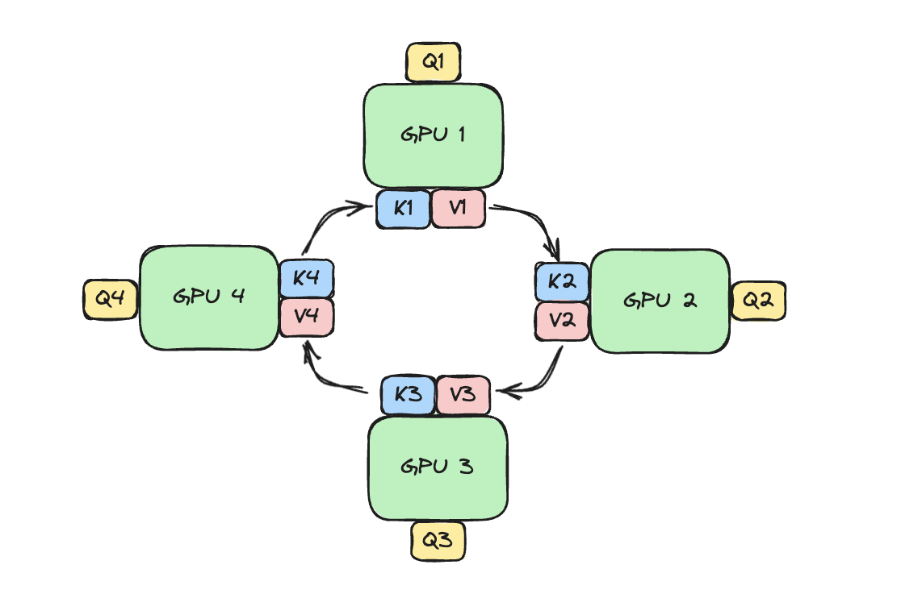
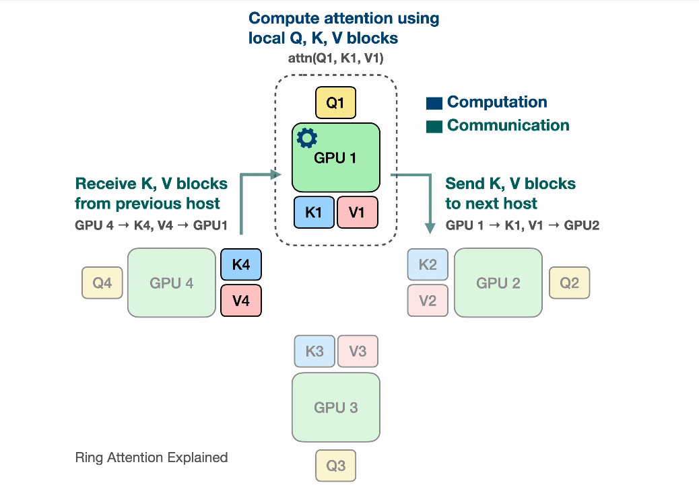

# Ring Attention

**Source**: Kilian Haefeli, Simon Zirui Guo, Bonnie Li — Coconut Mode, April 2024. Step-by-step explanation of how Ring Attention enables near-infinite context windows by distributing attention computation across GPUs.

## Key Points

- Ring Attention splits attention computation across N GPUs arranged in a **logical ring**, achieving **zero communication overhead** via overlap
- Each GPU holds one chunk of Q and iteratively receives K,V chunks from neighbors in the ring
- **Online safe softmax**: cumulative sum with running maximum enables block-wise softmax across K,V chunks
- Memory per GPU: $O(s \cdot d / N)$ instead of $O(s \cdot d)$ — scales linearly with number of devices
- Communication fully hidden when: $\frac{4 \cdot c \cdot d}{B} \leq \frac{4 \cdot d \cdot c^2}{F}$, i.e. $s/N \geq F/B$
- Orthogonal to FlashAttention — can be combined for even better memory efficiency
- Extension: **Striped Attention** handles causal masks more efficiently than basic Ring Attention

## The Problem: Attention Memory Grows with Sequence Length

Computing $O = \text{softmax}(QK^T)V$:
- Score matrix $S = QK^T$: $s \times s$ → quadratic memory in sequence length
- Attention matrix $A = \text{softmax}(QK^T)$: also $s \times s$
- Even with FlashAttention (linear memory), a single GPU still limited by VRAM

Goal: split memory cost across N GPUs so each uses $1/N$ of total, with **minimal communication overhead**.

## Building Blocks

### Splitting Q (Outer Loop)

Each output row depends only on a single query row → Q can be split into $B_Q$ chunks along rows. Each GPU gets one $Q_i$ chunk but still needs **all of K and V**.

### Splitting K and V (Inner Loop)

Score matrix $Q_i K_j^T$ is split along both rows (Q chunks) and columns (K chunks). The challenge: **softmax needs the full row** for normalization.

Solution: compute partial sums $\exp(Q_i K_j^T) \cdot V_j$ iteratively over K,V chunks, accumulating:
$$A_i^j = A_i^{j-1} + \exp(Q_i K_j^T) \cdot V_j$$

### Online Softmax

Accumulate normalization constant $l^j$ incrementally:
$$l^j = l^{j-1} + \sum_{k_t \in K_j} \exp(Q_i k_t^T)$$

At the end: normalize $A_i = A_i^{B_{KV}} / l^{B_{KV}}$

### Safe Softmax (Numerical Stability)

Keep running maximum $m^j$ and renormalize previous results:
$$m^{j+1} = \max(m^j, \max(Q_i K_{j+1}^T))$$
$$A^{j+1} = A^j \cdot e^{m^j - m^{j+1}} + e^{Q_i K_{j+1}^T - m^{j+1}} \cdot V_{j+1}$$
$$l^{j+1} = l^j \cdot e^{m^j - m^{j+1}} + e^{Q_i K_{j+1}^T - m^{j+1}}$$

## Ring Attention: Putting It Together

### Ring Topology

N GPUs arranged in a ring. GPU $i$:
- Holds $Q_i$ (one chunk of queries)
- Initially holds $K_i, V_i$
- Sends $K, V$ to GPU $i+1$, receives from GPU $i-1$
- After N iterations, every GPU has seen all K,V chunks

### Communication-Compute Overlap

While GPU $i$ computes with current $K_j, V_j$, it simultaneously:
- Sends $K_j, V_j$ to GPU $i+1$
- Receives $K_{j-1}, V_{j-1}$ from GPU $i-1$

When computation time $\geq$ transmission time, communication is **completely hidden**.

### Overlap Condition

$$4 \cdot c \cdot d / B \leq 4 \cdot d \cdot c^2 / F$$
$$\implies B \geq F / c$$
$$\implies s/N \geq F/B$$

where $c = s/N$ (chunk size), $d$ = model dimension, $B$ = bandwidth, $F$ = FLOPs.

## Complexity Analysis

| Resource | Per GPU | Total (N GPUs) |
|----------|---------|----------------|
| Memory | $12 \cdot d \cdot c$ Bytes | N× |
| Communication per step | $4 \cdot c \cdot d / B$ seconds | — |
| Computation per step | $\approx 4 \cdot d \cdot c^2 / F$ seconds | — |

Memory split: Q, K, V each split into N parts. Attention matrix split into $N^2$ parts. Works with both naive attention and FlashAttention.

## Further Optimizations

### Striped Attention

Causal masking in transformers means later GPUs compute over fewer tokens — some GPUs become idle. Striped Attention redistributes computation more evenly.

### FlashAttention Integration

Ring Attention's inner loop can use FlashAttention for the $Q_i K_j^T V_j$ computation, giving linear memory per chunk on top of the N× split from Ring Attention. Used in practice in the [RingAttention GitHub](https://github.com/lhao499/RingAttention).

## Connections

- [FlashAttention](flashattention.md) — tiling and online softmax are shared building blocks; Ring Attention wraps FlashAttention in its inner loop
- [GPU Communication Landscape](gpu-communication-landscape.md) — Ring Attention's ring topology leverages the same communication primitives
- [Scaling Techniques Overview](usp-scaling-techniques-overview.md) — sequence parallelism as an alternative to TP/PP for long contexts
- [LLM Architecture Comparison](llm-architecture-comparison.md) — long-context architectures (CSA, HCA, DSA) vs Ring Attention as a systems-level solution
- [Multi-Head Latent Attention](multi-head-latent-attention.md) — MLA reduces KV cache memory at the architecture level; Ring Attention does it at the systems level
