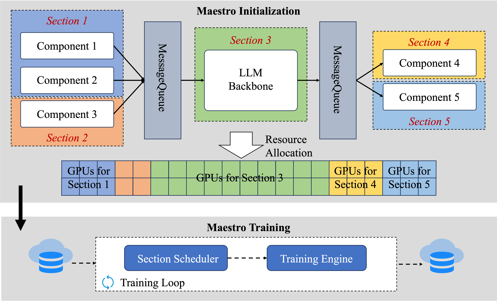
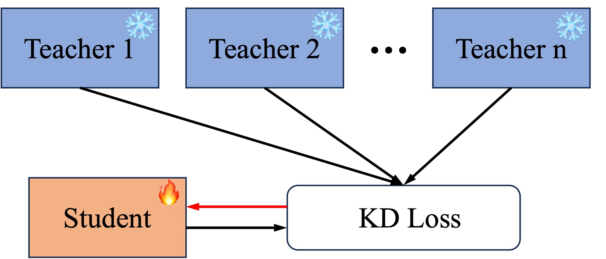

# Maestro: Compound LLM Training Framework

**Source**: Yuan, Chen, Peng, Zhou, et al. (Alibaba/Qwen Team), May 2026. arXiv:2605.10501. A section-centric training framework that handles compound LLM training workloads (knowledge distillation, MLLM training) with heterogeneous components, achieving ~40% GPU reduction in production.

## Key Points

- **Compound workloads**: training pipelines with heterogeneous components — different model sizes, execution modes (forward-only vs full forward-backward), sequence lengths
- **Dual heterogeneity**: static (across components) + dynamic (runtime, data-dependent activation in MLLM)
- **Section graph**: restructures the workload into coarse-grained sections, each with independent parallelism, micro-batch, and DP degree
- **Wavefront scheduling**: dynamically reorders input samples to maximize inter-section parallelism while preserving data dependencies
- **~40% GPU reduction** in production on knowledge distillation and MLLM training workloads
- Deployed for **millions of GPU hours** in Qwen's production training infrastructure



## The Problem: One-Size-Fits-All Training

Conventional training frameworks assume a **monolithic model** — all parameters share the same parallelism strategy, micro-batch size, and data-parallel degree. This fails for compound workloads:

### Example: Knowledge Distillation



```
Teacher model (large, forward-only) + Student model (small, forward-backward)
```

- Teacher is compute-heavy but only runs forward → wastes backward FLOPs capacity
- Student is small but runs forward+backward → different optimal parallelism
- Naive approach: run both with same config → GPU idle in teacher's backward time

### Example: MLLM Training

```
Text encoder + Image encoder + Fusion module + LLM backbone
```

- Image encoder activates only when inputs have images → dynamic, data-dependent compute
- Different components have different optimal batch sizes and parallelism
- Enforcing uniform config wastes GPU resources

## Maestro's Solution

### Section Graph

1. **Decompose** the compound workload into discrete sections (e.g., teacher forward, student forward, student backward)
2. Each section is **independently configured**: parallelism strategy (FSDP/TP/PP), micro-batch size, data-parallel degree
3. The section graph encodes dependencies (student backward depends on student forward) and parallelism constraints

### Wavefront Scheduling

To handle dynamic (runtime) heterogeneity from data-dependent activation:

1. **Reorder input samples** dynamically based on their modality composition and compute requirements
2. **Orchestrate concurrent execution** of independent sections — e.g., student backward can run while teacher processes the next batch
3. Preserve cross-section data dependencies (teacher output must reach student before student forward)
4. Maximize inter-section parallelism to minimize GPU idle time

## Production Results

| Workload | GPU Reduction |
|----------|--------------|
| Knowledge distillation | ~40% |
| MLLM training | ~40% |
| Other compound workloads | ~35-40% |

Deployed for millions of GPU hours in Qwen's training infrastructure.

## Connections

- [GPT lineage](gpt-1.md) — knowledge distillation was critical for GPT-4's training (distilling larger models into deployable sizes)
- [DeepSeek-V4](deepseek-v4.md) — V4's post-training involves compound workloads (SFT + RL + distillation)
- [Megatron-Core MoE](megatron-core-moe.md) — production training stack; Maestro addresses the scheduling layer above
- [Scaling Techniques Overview](usp-scaling-techniques-overview.md) — the parallelism strategies Maestro configures per-section
- [How To Scale Your Model](scaling-book.md) — theoretical basis for per-component parallelism decisions
