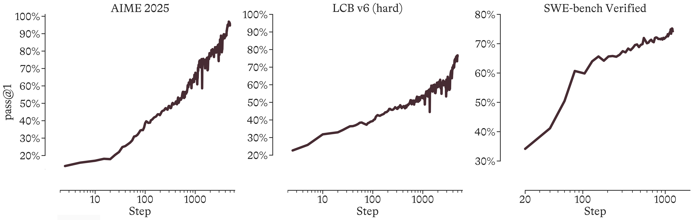
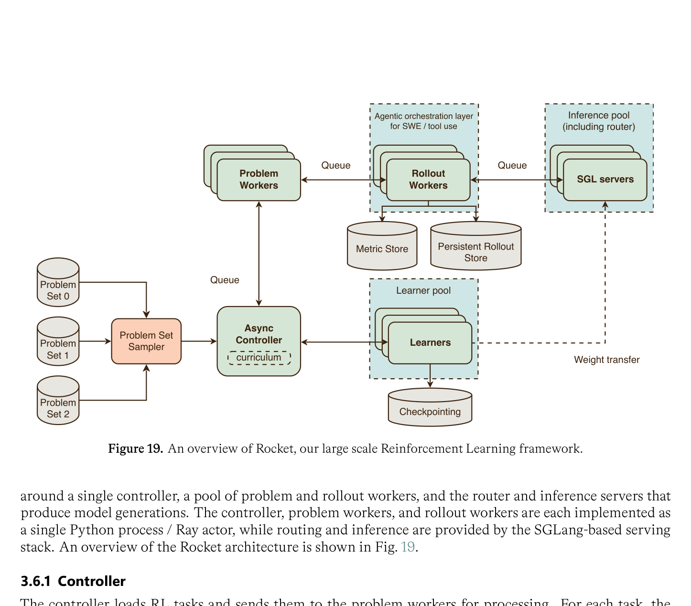
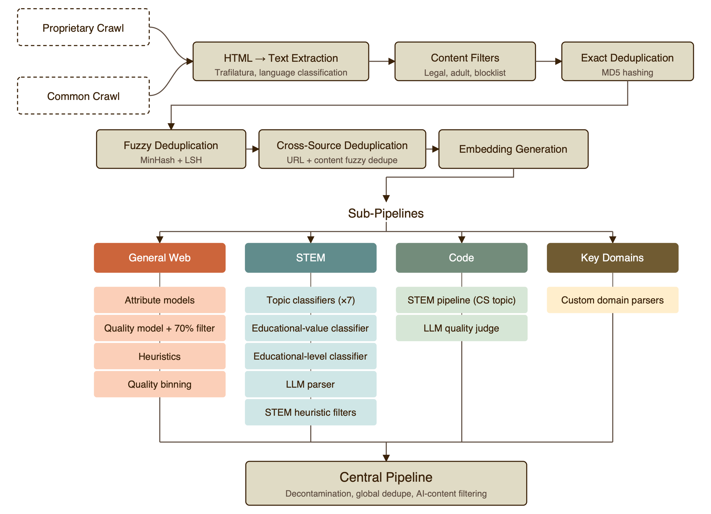

# MAI-Thinking-1: Building a Hill-Climbing Machine

**Source**: Microsoft AI Team, 2026. 109 pages. A comprehensive technical report on building the MAI model family — treating AI development as a system-level optimization process called "hill-climbing."

## Key Points

- **Hill-climbing philosophy**: every component of the training pipeline improves iteratively across generations
- **Three design principles**: (1) robustness for enduring climbs, (2) simplicity favoring scalable recipes, (3) scientific rigor — every decision testable through ladders and ablations
- **MAI-Base-1**: 34.7B-active / 962B-total sparse MoE (often rounded to "35B"), 78 layers, d_model=6656, 30T tokens on 8K GB200 GPUs
- **Three RL specialist climbs** (STEM, SWE/Agentic, Safety) → consolidated into MAI-Thinking-1 via SFT + final RL
- **Rocket** framework: async RL with persistent rollout store, SGL inference pool, agentic orchestration
- 54.6% code training data, 97-98% prefix caching hit rate, 20+ MFU optimizations



## Architecture

### MoE Design

| Parameter | Value |
|-----------|-------|
| Active params | 34.7B |
| Total params | 962B |
| Layers | 78 |
| d_model | 6656 |
| FFN dimension | 13312 |
| Experts total | 512 |
| Top-k activated | 8 |
| KV/Query heads | 8/80 |
| Attention | Periodic local + global |
| Norm | RMSNorm (pre-norm) |
| Position encoding | RoPE |
| MoE layout | Interleaved dense + MoE layers |

### Scaling Ladder

| Model | Active params | Total params | Layers | d_model | FFN | Experts |
|-------|-------------|-------------|--------|---------|-----|---------|
| L12 | 365M | 3.9B | 12 | 1024 | 2048 | 8/512 |
| L18 | 760M | 13B | 18 | 1536 | 3072 | 8/512 |
| L24 | 1.5B | 30B | 24 | 2048 | 4096 | 8/512 |
| L30 | 2.6B | 58B | 30 | 2560 | 5120 | 8/512 |
| L36 | 4.0B | 100B | 36 | 3072 | 6144 | 8/512 |
| L42 | 6.1B | 159B | 42 | 3584 | 7168 | 8/512 |
| L66 | 21.7B | 615B | 66 | 5632 | 11264 | 8/512 |
| **MAI-Base-1** | **34.7B** | **962B** | **78** | **6656** | **13312** | **8/512** |

### Architecture Decisions

- **8/512 experts** with interleaved dense+MoE layers: best efficiency balance on EGFLOPs and EGTime
- MoE-every-layer: 0.94-1.06× EGFLOPs but 0.69-0.75× EGTime — GPU utilization suffers from per-layer EP communication
- 8/1024 experts: marginally better quality but higher communication overhead

## Post-Training: RL Climbs

### Climb-and-Consolidate Strategy

Three specialist models trained via RL, then consolidated:

1. **STEM Climb**: Math and science reasoning. Verifiable rewards + AI-feedback. Self-distillation resets numerics after performance collapses. Progressive max output length increase during training.

2. **SWE/Agentic Climb**: Software engineering + tool-use in sandbox environments. 102M GitHub PRs filtered → grader combines executable tests, verifiable state, AI judges. Reward hacking prevention via LLM monitor (internet search, file system manipulation, environment escape).

3. **Helpfulness & Safety Climb**: Instruction following, safety alignment, steerability. Reward models + LLM judges.

**Consolidation**: SFT on traces from all three specialists → final RL climb → MAI-Thinking-1.

### RL Algorithm

**Adaptive entropy control**: dynamic KL penalty $k$ adjusting based on observed vs target entropy $H^*$. Decrease $k$ when entropy exceeds target; increase to prevent collapse.

**Two-level clipping**: inner soft PPO clipping + outer hard clip on all branches:
$$r^{\text{out}}_{i,t}(\theta) = \text{clip}(r_{i,t}(\theta), r_{\min}, r_{\max})$$
where $r_{\max}$ is large, $r_{\min}$ unconstrained. Discards extreme probability discrepancies while preserving standard trust-region behavior.

**Self-distillation**: traces from last N RL checkpoints (later ones weighted higher) → SFT → resume RL. Including traces from a range of strong checkpoints (not just final) provides greater diversity for exploration.

### Reward Model

- Prompt template: `<think>` reasoning `</think><answer>` answer `</answer>`
- **Cyclic calibration**: RM prompted $k$ times with response permutations to reduce positional bias
- **Coarse graders**: 0/1/2 scale outperforms granular rubrics for LLM judges

### Safety

Three data sources: harmful prompts (red-teaming, automated attacks), borderline prompts (do-not-refuse slice), capability data. Jailbreak ASR: 4.4-7.0% vs 13.9-32.3% for Sonnet/Opus/DeepSeek.

## Rocket RL Framework



```
Async Controller → Problem Workers → Rollout Workers (SGL inference)
                 → Learner Pool (weight transfer via checkpointing)
```

- Persistent rollout store + metric store
- Problem Set Sampler for curriculum control
- Agentic orchestration for SWE/tool-use
- 97-98% prefix caching hit rate on production RL runs
- 8K GB200 GPUs, 20+ MFU optimizations over 5 config versions
- **Goodput** (ideal/actual wall-clock ratio) as primary production KPI

## Benchmarks

### STEM & Coding

| Benchmark | MAI-Thinking-1 | Sonnet 4.6 | Opus 4.6 | DeepSeek V4 |
|-----------|---------------|------------|----------|-------------|
| AIME 2025 | 97.0 | 95.6 | 99.8 | — |
| AIME 2026 | 94.5 | — | — | — |
| HMMT Feb 2026 | 84.9 | — | — | 95.2 |
| GPQA Diamond | 84.2 | 89.9 | 91.3 | 90.1 |
| LCB v6 | 87.7 | — | — | 93.5 |
| Terminal-Bench 2.0 | 46.0 | 59.1 | 65.4 | 67.9 |
| SWE-bench Verified | 73.5 | 79.6 | 80.8 | 80.6 |

### Human Evaluation

vs Sonnet 4.6: overall +0.07 (statistically tied); conciseness +0.11, style +0.08 (MAI preferred). Instruction following & factuality within noise.

## Data

### Composition

| Source | Unique (T) | Train (T) | Mix % | Epochs |
|--------|-----------|----------|-------|--------|
| Code | 7.4 | 16.4 | 54.6% | 2.22× |
| STEM | 2.2 | 4.7 | 15.8% | 2.17× |
| Math | 0.3 | 1.6 | 5.4% | 5.28× |
| Books | 0.6 | 0.9 | 3.1% | 1.65× |
| PDFs | 2.7 | 1.4 | 4.7% | 0.53× |
| Web | 8.1 | 4.5 | 14.9% | 0.55× |

Knowledge cutoffs: Web (Sep 2025), PDFs (Dec 2025), Code (Jun 2025), Books (Mar 2026).

### Pipeline



HTML → extraction → heuristic filtering → exact+fuzzy dedup → cross-source semantic dedup → embedding. 183 small models trained across 61 data mixtures to find Pareto-optimal composition. Rankings from small scale don't always transfer (code-heavy mixes underperform at 5B but emerge optimal at 23B+).

## Design Principles

1. **Robustness**: improvements must be durable — scaling ladder catches non-robust choices early
2. **Simplicity**: simple scalable recipes > complex brittle optimizations; clean data and transparent infrastructure
3. **Scientific rigor**: scaling ladders, ablations, private evaluations, metrics that matter (EGFLOPs/EGTime)

## Connections

- [DeepSeek-V4](deepseek-v4.md) — full-stack optimization; both 35B+ active MoE, both use RL for reasoning
- [PPO](ppo.md) — two-level clipping extends PPO's trust region
- [GRPO / DeepSeek-R1](deepseek-r1.md) — self-distillation and reasoning climbs
- [Megatron-Core MoE](megatron-core-moe.md) — interleaved MoE/dense mirrors Parallel Folding
- [How To Scale Your Model](scaling-book.md) — scaling ladder as practical roofline-informed design
- [ScaleRL](scalerl.md) — sigmoid compute-performance curves; climb-and-consolidate extends this
- [Async RL Training Landscape](async-rl-training-landscape.md) — Rocket maps to the 7-axis survey
- [Stabilizing RL with LLMs](stabilizing-rl-llms.md) — adaptive entropy control and two-level clipping
- [The Bitter Lesson](the-bitter-lesson.md) — hill-climbing as a systematic methodology
