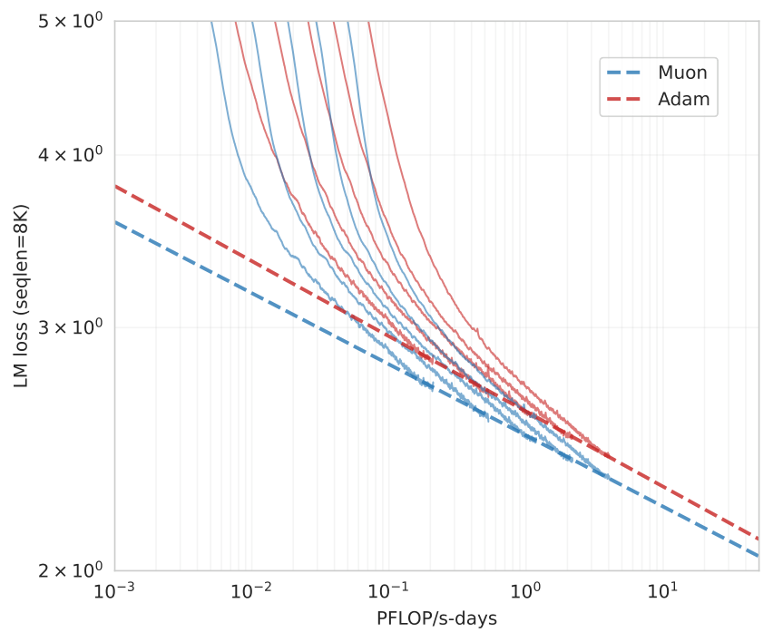

# Muon Optimizer for LLM Training

**Source**: Liu, Su, Yao, et al., Feb 2025. arXiv:2502.16982. Demonstrates that the Muon optimizer (based on matrix orthogonalization) scales to large model training, achieving ~2× computational efficiency over AdamW. Introduces the Moonlight 3B/16B MoE model.

## Key Points

- **Muon** applies Newton-Schulz iteration for matrix orthogonalization instead of AdamW's element-wise adaptive learning rates
- Two key techniques for scaling: **(1) weight decay** and **(2) per-parameter update scale adjustment**
- **~2× computational efficiency** vs AdamW in compute-optimal scaling law experiments
- **Moonlight**: a 3B/16B MoE model trained with 5.7T tokens using Muon, improving the Pareto frontier
- Open-source distributed Muon implementation: memory optimal and communication efficient
- Used in **DeepSeek-V4** training (Muon is one of the key training innovations in V4)
- Released pretrained, instruction-tuned, and intermediate checkpoints

## Why Muon?

### AdamW's Limitation

AdamW adapts learning rates **per-element** using the second moment of gradients. While effective, this:
- Ignores matrix structure (treats weight matrices as flat vectors)
- Requires storing two optimizer states (m and v) — 2× memory overhead
- Scales suboptimally with model size

### Muon's Approach

Instead of per-element adaptation, Muon operates at the **matrix level**:
1. Compute gradient $G$ for a weight matrix
2. Apply Newton-Schulz iteration to approximately orthogonalize $G$: $G' \approx G(G^T G)^{-1/2}$
3. Use the orthogonalized gradient for the update

The key insight: orthogonalizing the gradient removes the conditioning problem that makes SGD unstable, without needing per-element statistics.

### Newton-Schulz Iteration

A matrix iteration that computes $A \approx U V^T$ (the polar factor) without SVD:
- Starting from $Y_0 = A / \|A\|_F$
- $Y_{k+1} = \frac{3}{2}Y_k - \frac{1}{2}Y_k Y_k^T Y_k$
- Converges quadratically to the nearest orthogonal matrix
- Typically 5-10 iterations suffice

## Scaling Techniques

### 1. Weight Decay

Without weight decay, Muon's orthogonalization can cause unbounded weight growth. Adding weight decay stabilizes training:
$$\theta_{t+1} = \theta_t - \eta \cdot (\text{orthogonalize}(G_t) + \lambda \theta_t)$$

### 2. Per-Parameter Update Scale

Different parameter matrices (attention, FFN, embeddings) have different optimal update magnitudes. Muon adjusts the effective learning rate per parameter matrix based on its spectral properties.

## Moonlight Model

A 3B/16B Mixture-of-Experts model trained with Muon:
- 5.7T training tokens
- Improves the Pareto frontier: better performance at fewer FLOPs
- Demonstrates Muon works at production scale for MoE architectures

Results show Moonlight outperforms comparably-sized AdamW-trained models across benchmarks.

## Distributed Implementation

The open-source Muon implementation features:
- **Memory optimal**: Newton-Schulz iteration applied in-place
- **Communication efficient**: orthogonalization is local to each GPU's parameter shard — no extra communication vs AdamW
- Compatible with FSDP, TP, and ZeRO parallelism strategies

## Connections

- [DeepSeek-V4](deepseek-v4.md) — Muon is used in V4's training recipe
- [Scaling Laws](llm-scaling-laws.md) — the 2× efficiency claim is based on scaling law experiments; Muon changes the compute-optimal frontier
- [Megatron-Core MoE](megatron-core-moe.md) — Moonlight is an MoE model; Muon's training benefits apply to the MoE architectures discussed
- [Ultra-Scale Playbook](usp-ultra-scale-playbook.md) — optimizer choice as a training efficiency lever
