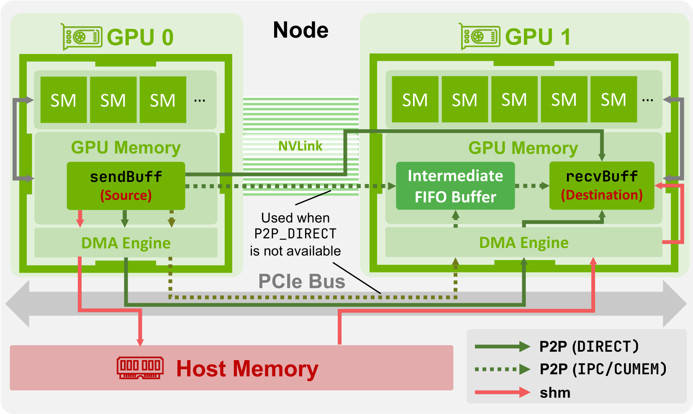
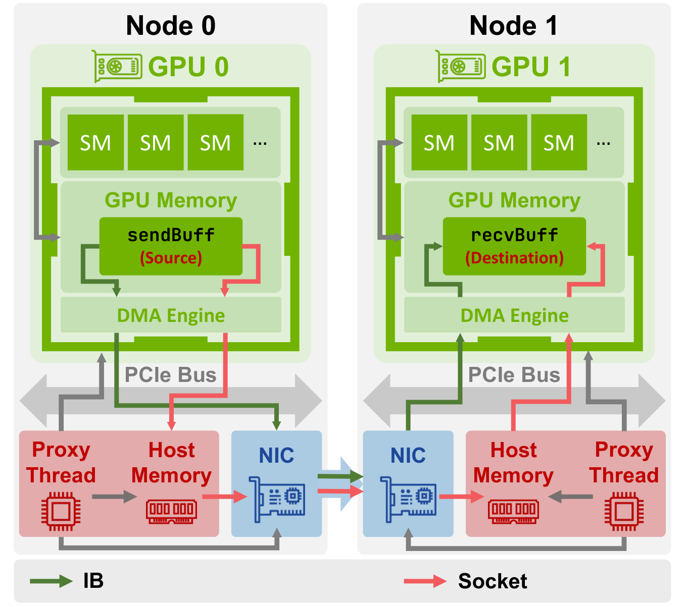
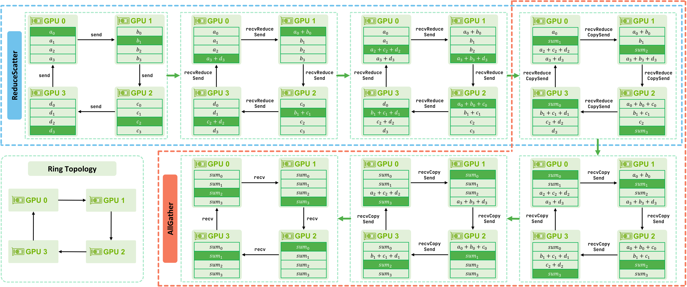
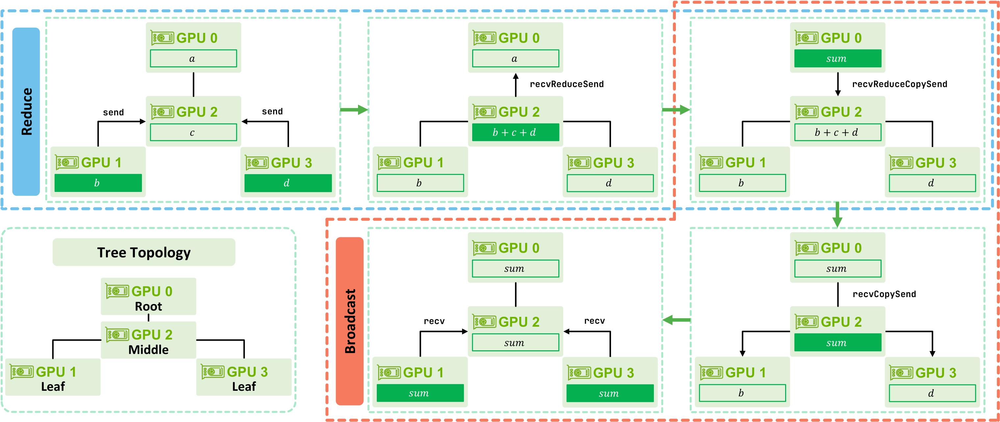
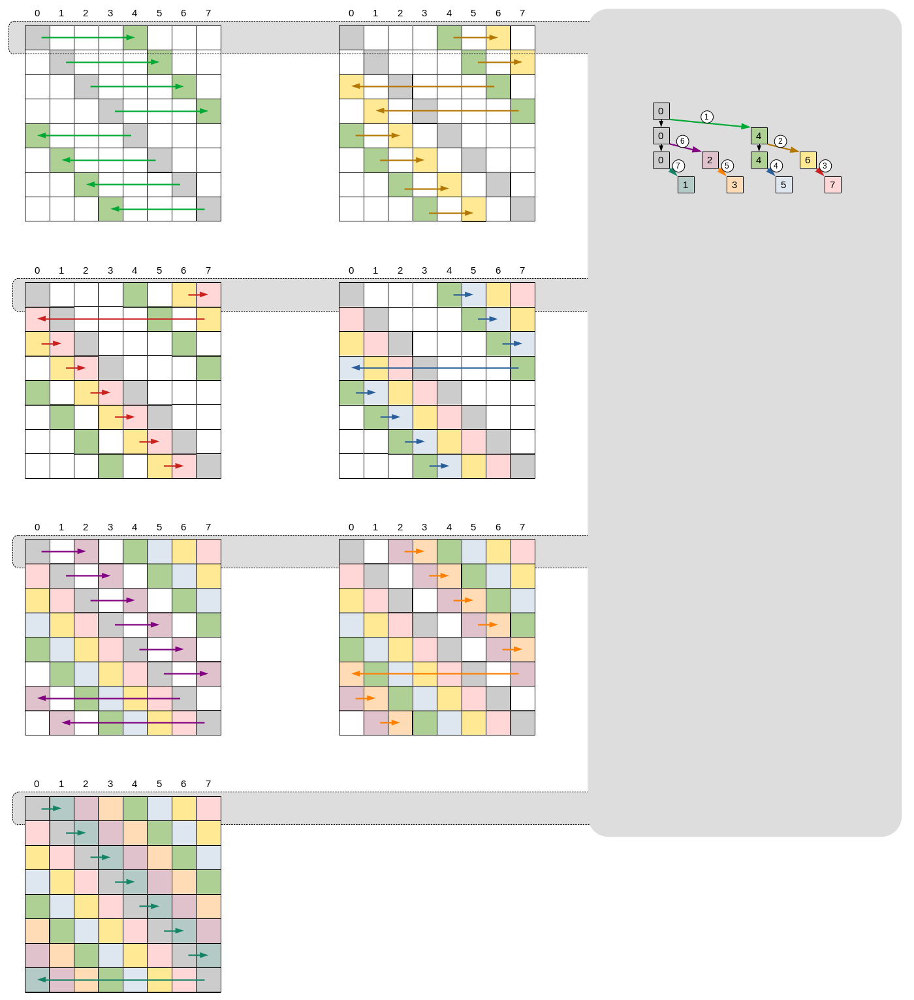
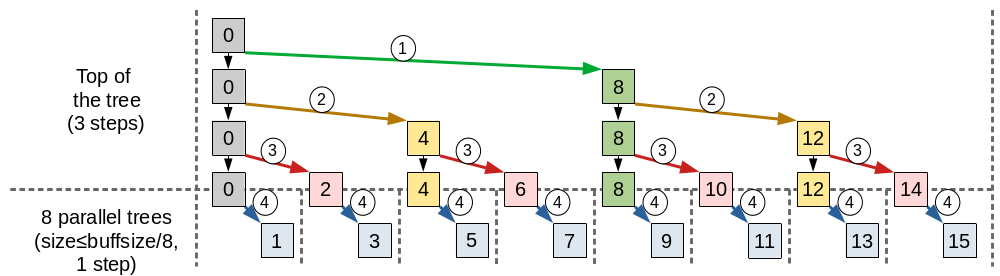
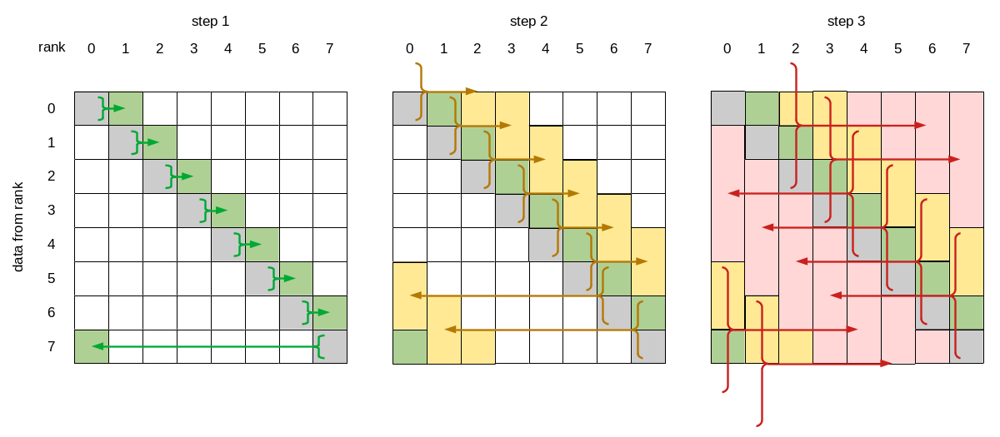

# Demystifying NCCL

**Source**: ETH Zürich / NVIDIA / Broadcom. 14 pages. Foundation for ATLAHS network simulation toolchain.

## Key Points

- NCCL is the critical software layer for GPU-to-GPU communication but its internals are poorly documented
- Three **communication protocols**: Simple (bandwidth-optimized), LL (latency-optimized), LL128 (hybrid)
- Two **topology types**: Ring (point-to-point chain) and Double Binary Tree (reduction/ broadcast)
- **Channels** provide parallelism: each channel uses one NVLink + one IB connection, enabling concurrent transfers
- ATLAHS toolchain accurately reproduces NCCL patterns for large-scale simulation

## NCCL Architecture

### Core Abstractions

**Communicator** (`ncclComm`): The fundamental object representing a group of GPUs. Each process calls `ncclCommInitRank` with a shared unique ID to join. Cleaned up via `ncclCommDestroy` (safe) or `ncclCommAbort` (emergency).

**Collective operations**:
- `ncclAllReduce`, `ncclBroadcast`, `ncclReduce`
- `ncclAllGather`, `ncclReduceScatter`
- `ncclSend` / `ncclRecv` (point-to-point)
- `ncclGroupStart` / `ncclGroupEnd` (aggregate operations)

**Launch models**:
| Model | Pros | Cons |
|-------|------|------|
| One CPU process per GPU | NUMA-local scheduling, better locality | Higher process overhead |
| One CPU thread per GPU | Efficient intra-process memory sharing | Single NUMA domain |
| Multiple GPUs per process | Simplest | Worst locality |

### Channels

NCCL organizes communication into **channels** — each channel independently manages data transfers. A channel consists of one NVLink connection (intra-node) + one IB connection (inter-node). Multiple channels enable concurrent transfers across different interconnect paths.

**Topology assignment**: Each channel gets a logical topology:
- **Ring**: Each GPU identifies predecessor/successor — unidirectional ring for data flow
- **Double Binary Tree**: Two complementary trees where no node is non-leaf in both. Tree 2 is mirrored (even nodes) or shifted (odd nodes) from Tree 1

For grouped point-to-point operations, each transfer gets its own channel when possible → task-level parallelism.

## Communication Protocols

NCCL uses three protocols with different bandwidth/latency trade-offs:

| Protocol | Goal | Sync Mechanism | Payload | Bandwidth |
|----------|------|---------------|---------|-----------|
| **Simple** | Max bandwidth | Memory fences | Large data chunks | Near peak |
| **LL** (Low Latency) | Min latency | Flag-based | 4B data + 4B flag | 25-50% peak |
| **LL128** | Low latency + high BW | Flag-based | 120B data + 8B flag | ~95% peak |

### Simple Protocol
- Designed for large message transfers
- Divides data into large chunks, dispatched across channels
- Memory fences enforce ordering — high overhead per operation
- Near-peak bandwidth but higher latency per hop (~6µs)

### LL (Low Latency) Protocol
- For small messages where latency dominates
- Uses flag-based synchronization instead of fences — much lower overhead
- 4 bytes of data + 4 bytes of flag per primitive
- ~1µs latency per hop but only 25-50% bandwidth utilization

### LL128 Protocol
- Hybrid design: flag-based sync (like LL) + larger payload (like Simple)
- 120 bytes data + 8 bytes flag per primitive
- ~95% peak bandwidth at ~2µs latency per hop
- Best general-purpose protocol for AI workloads

## Data Movement: Intra-Node vs Inter-Node

### Intra-Node (NVLink)

Direct GPU-to-GPU memory access via NVLink. NCCL uses:
- **Load/Store**: Direct memory operations over NVLink fabric
- **Copy engines**: DMA-based transfers for larger payloads
- Minimized CPU involvement

### Intra-Node (NVLink)

*Figure: Intra-node data movement — direct GPU-to-GPU memory access via NVLink with load/store and copy engines. [src](raw/demystifying-nccl.pdf)*

### Inter-Node (InfiniBand / RoCE)

*Figure: Inter-node data movement — GPUDirect RDMA enables NIC DMA directly to GPU memory across nodes. [src](raw/demystifying-nccl.pdf)*

GPU-to-GPU across nodes requires network traversal:
- **GPUDirect RDMA**: NIC DMA engine reads/writes GPU memory directly via PCIe BAR mappings
- **GDR Copy**: Intermediate copy through CPU memory when GPUDirect is unavailable
- Network operations are significantly slower than NVLink (5-10x bandwidth, higher latency)

### Protocol Selection Logic

NCCL dynamically selects protocols based on:
- Message size (thresholds for Simple/LL/LL128)
- Interconnect type (NVLink vs IB)
- Operation type (reduce vs broadcast vs all-to-all)
- Topology (ring vs tree)

## Ring vs Tree Algorithms

*Figure: Ring algorithm for all-reduce — data flows unidirectionally around a ring, each GPU receives, reduces, and forwards. Bandwidth-optimal for large messages. [src](raw/demystifying-nccl.pdf)*

*Figure: Double binary tree algorithm — two complementary trees for latency-optimal reduction. Good for small messages. [src](raw/demystifying-nccl.pdf)*

*Figure: NCCL organizes communication into channels with ring (unidirectional) or double binary tree topologies. Each channel uses one NVLink + one IB connection. [src](raw/demystifying-nccl.pdf)*

### Ring Algorithm
- Data flows around a unidirectional ring
- Each GPU receives from predecessor, computes (e.g., reduces), sends to successor
- **Good for**: Large messages, all-reduce — bandwidth-optimal
- **Steps**: 2$\times$ (N-1) per all-reduce
- **Data per step**: B/N (nearly constant — bandwidth-efficient)

### Double Binary Tree Algorithm
- Two complementary trees for latency-optimal reduction
- Tree 1: reduces data up, broadcasts results down
- Tree 2: provides redundancy, ensures no node is bottleneck
- **Construction**: Tree 2 = mirror(Tree 1) for even nodes, shift by 1 for odd nodes
- **Good for**: Small messages, broadcast — latency-optimal
- **Steps**: 2$\times$ log₂(N) per all-reduce

### Channel-Based Parallelism

NCCL organizes communication into **channels** — each channel independently manages data transfers through one NVLink connection (intra-node) + one IB connection (inter-node). Multiple channels enable concurrent transfers. For grouped point-to-point operations (`ncclGroupStart`/`ncclGroupEnd`), each transfer gets its own channel → **task-level parallelism**.

## Protocol Selection Logic

NCCL dynamically selects protocols based on:
- **Message size**: Thresholds for Simple/LL/LL128 vary by interconnect
- **Interconnect type**: NVLink vs IB — different latency/bandwidth characteristics
- **Operation type**: Reduce vs broadcast vs all-to-all
- **Topology**: Ring vs tree — ring preferred for large messages, tree for small

### Protocol Transitions

| Condition | Protocol | Reason |
|-----------|----------|--------|
| Very small messages (< few KB) | LL | Latency dominates — flag-based sync is fastest |
| Medium messages (few KB - few MB) | LL128 | Best balance — 95% bandwidth at low latency |
| Large messages (> few MB) | Simple | Bandwidth dominates — near-peak throughput |

## ATLAHS Toolchain

The insights from this analysis feed into ATLAHS — an application-trace-driven network simulation toolchain that accurately reproduces NCCL communication patterns. Used for:
- Predicting performance of new cluster configurations
- Identifying bottlenecks in training workloads
- Evaluating network topology changes before deployment
- "What-if" analysis: changing NVLink bandwidth, IB speed, topology

## Launch Models Detail

| Model | Implementation | Best For |
|-------|---------------|----------|
| One CPU process per GPU | Each GPU = separate OS process | NUMA-aware scheduling, max control |
| One CPU thread per GPU | Single process, multiple threads | Memory sharing, lower overhead |
| Multiple GPUs per process | Simplest | Small-scale, prototyping |

**NUMA implications**: With one process per GPU, each process can be bound to the CPU cores local to its GPU's NUMA domain. This avoids cross-socket memory access penalties that can significantly impact NCCL collective performance.

## PAT: Parallel Aggregated Trees (New Algorithm)

**Source**: Sylvain Jeaugey (NCCL core developer, NVIDIA), June 2025 [src](raw/pat-algorithm.pdf)

PAT is a new algorithm for AllGather and ReduceScatter in NCCL, designed to fill the gap between ring (O(P) latency, bandwidth-optimal) and simple trees (O(log P) latency, poor bandwidth).

### Why PAT?

- Ring: O(P) steps — linear latency dominates at large scale for small/medium messages
- Simple trees: O(log P) but bandwidth-inefficient, limited buffer reuse
- **PAT**: O(log P) latency, tunable bandwidth, logarithmic buffer requirement independent of operation size

### Algorithm

*Figure: PAT algorithm structure — tree-based aggregation with logarithmic depth. [src](raw/pat-algorithm.pdf)*

*Figure: PAT tree with aggregation=8 on 16 ranks. Each rank participates in O(log P) exchanges. [src](raw/pat-algorithm.pdf)*

*Figure: Brucks construction defining global connectivity for PAT tree building. [src](raw/pat-algorithm.pdf)*

- Uses **Brucks' algorithm** to construct uniform-degree tree topology
- Aggregation factor `k`: each node communicates with `k` peers per step — tunes bandwidth/latency trade-off
- Far-dimension extension optimizes for multi-dimensional topologies (2D/3D torus)

### Comparison

| Algorithm | Latency (steps) | Bandwidth | Best For |
|-----------|----------------|-----------|----------|
| **Ring** | O(P) | Near-optimal | Large messages, any scale |
| **Tree (recursive doubling)** | O(log P) | Lower than ring | Small messages, small scale |
| **PAT** | O(log P) | Tunable (aggregation) | Small-medium messages at scale |

PAT is automatically selected by NCCL based on message size and scale. Particularly effective for AllGather/ReduceScatter — heavily used in FSDP/ZeRO-3 parameter gathering.

## Connections

- [GPU Communication Landscape](gpu-communication-landscape.md) — Full survey of GPU communication stack
- [Distributed Networking Tuning](aspe-distributed-networking-tuning.md) — Magnum IO, GPUDirect RDMA, SHARP, NCCL env vars
- [NCCL Device API / GIN](nccl-device-api-gin.md) — GPU-initiated networking built on NCCL, crucial for MoE
- [NCCL EP](nccl-ep.md) — Expert Parallelism communication library using NCCL Device API
- [Communication Wall](megatron-core-moe.md) — DeepEP/HybridEP depend on NCCL protocols
- [Scaling Techniques Overview](usp-scaling-techniques-overview.md) — all-reduce, all-gather, reduce-scatter explained
