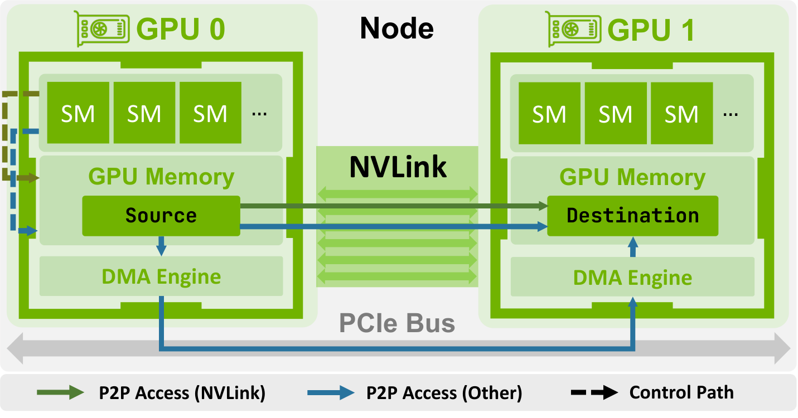
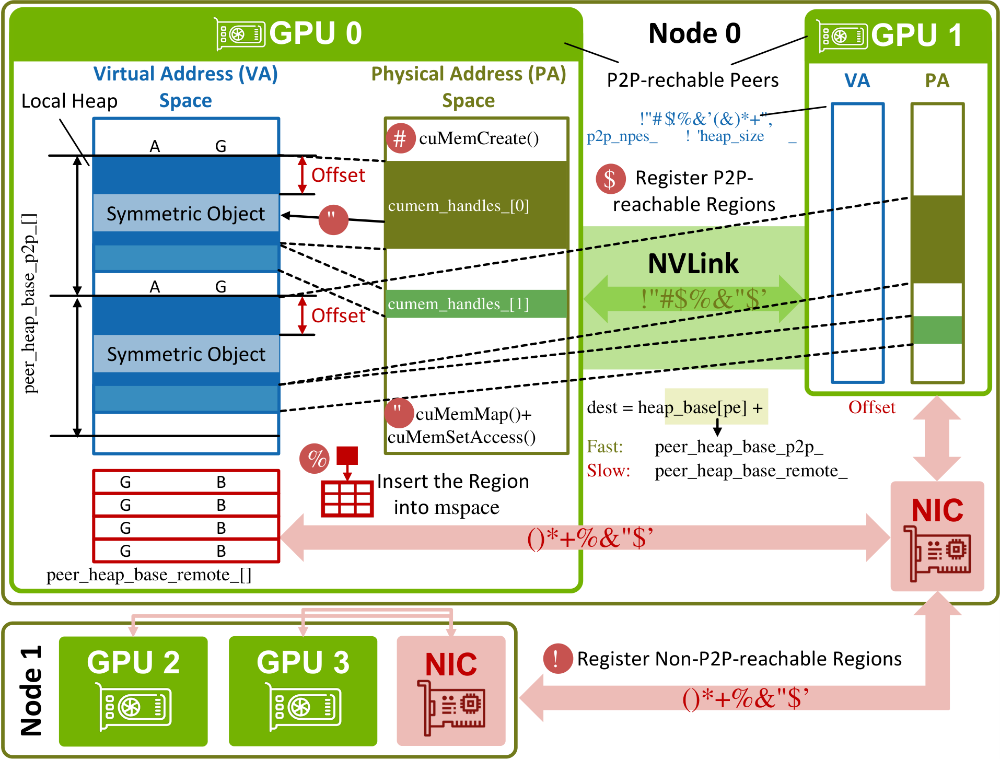

# Demystifying NVSHMEM

**Source**: Ma, Shen, Chen, Langer, Kraus, Glick, Belusar, Hammond, Hoefler (ETH Zürich & NVIDIA), Jun 2026. arXiv:2606.05951. Source-level analysis of NVSHMEM 3.3.9 — tracing its design from programming model to runtime internals and transport mechanisms.

## Key Points

- NVSHMEM is NVIDIA's **PGAS** (Partitioned Global Address Space) communication library based on OpenSHMEM, enabling **GPU-initiated, one-sided** communication through symmetric memory
- **Symmetric memory**: every GPU (PE) allocates a symmetric heap at the same virtual address — any PE can directly read/write any other PE's heap via put/get/AMO
- **Device-initiated**: GPU kernels directly issue put/get/AMO operations without CPU involvement — eliminates CPU-GPU synchronization overhead and enables fine-grained overlap
- NVSHMEM pioneered this model for GPU clusters; NCCL later incorporated related ideas through its device API (GDA-KI, IBGDA)
- **DeepEP** case study: used in performance-critical sparse expert parallelism for MoE models
- Complements NCCL: NCCL handles bulk-synchronous collectives; NVSHMEM handles fine-grained, irregular, device-initiated patterns
- Two communication paths: **fast path** (NVLink P2P for intra-node) and **slow path** (host-mediated for cross-node when GPU-initiated NIC ops unavailable)

## Background: Why NVSHMEM?

NCCL's conventional interface is **host-initiated**: communicator setup and collective launches are performed from the CPU, which schedules NCCL kernels onto CUDA streams. This model is optimized for regular collectives but places the CPU in the communication control path, introducing coordination overhead for fine-grained, irregular, or data-dependent patterns (stencil halo exchange, sparse workloads, expert parallelism).

### Key Enabling Technologies

| Technology | What It Enables |
|-----------|----------------|
| **P2P memory access** | GPU directly reads/writes another GPU's memory within NVLink/NVSwitch domain |
| **GPUDirect RDMA (GDRDMA)** | RDMA-capable NIC reads/writes GPU memory directly for scale-out |
| **GPUDirect Async Kernel-Initiated (GDA-KI)** | GPU kernels initiate/control network operations without CPU |
| **InfiniBand GPUDirect Async (IBGDA)** | IB-specific realization of GDA-KI |

## Programming Model

### Symmetric Memory

Each PE allocates a symmetric heap at the same virtual address across all devices. Any PE can: **put** (write to another PE's heap), **get** (read from another PE's heap), **AMO** (atomic memory operations on remote heaps), or launch **collectives** (barrier, broadcast, reduce, alltoall — all from GPU kernels).

### Device-Initiated Operations

```cuda
__global__ void token_dispatch(int* tokens, int* experts, int N) {
    int my_pe = nvshmem_my_pe();
    for (int i = threadIdx.x; i < N; i += blockDim.x) {
        int target_pe = experts[i];
        nvshmem_int_put(nvshmem_get_heap(target_pe), &tokens[i], 1, target_pe);
    }
}
```

This eliminates CPU-GPU synchronization (no `cudaDeviceSynchronize`), kernel launch overhead (one kernel does compute + communication), and allows fine-grained interleaving of computation and communication at the warp/thread level.

### One-Sided vs Two-Sided

| Aspect | Two-Sided (MPI/NCCL) | One-Sided (NVSHMEM) |
|--------|---------------------|---------------------|
| Initiation | Both sender and receiver participate | Only initiator participates |
| Receiver awareness | Must post receive | No action needed |
| Synchronization | Implicit in send/recv pair | Explicit via `nvshmem_barrier`, `nvshmem_quiet` |
| Best for | Bulk transfers, collectives | Irregular, fine-grained, GPU-driven |

## Communication Paths

### Fast Path (Intra-Node)

Used when both PEs are within the same NVLink/NVSwitch domain: GPU kernel issues `nvshmem_put/get` → NVSHMEM translates virtual address to physical P2P mapping → NVLink directly transfers data between GPU memories. No CPU, NIC, or host memory involved. Near-peak NVLink bandwidth with minimal latency.



### Slow Path (Cross-Node)

When PEs are on different nodes: if GDA-KI/IBGDA is available, GPU kernel initiates RDMA via NIC (GPU memory → NIC → network → remote NIC → GPU memory). If GDA-KI is **not** available, GPU signal is sent to CPU proxy thread which orchestrates transfer via NCCL or socket — introducing CPU latency.

## Memory Management

NVSHMEM's symmetric heap uses `nvshmem_malloc`: every PE allocates the same amount at the same virtual address, with a global heap state and per-PE base addresses. P2P mappings are pre-registered at initialization. Memory uses **segmented slab allocation**: each PE's heap is divided into segments with fixed-size blocks; allocation searches the free list for best-fit; deallocation returns to the free list. `nvshmem_barrier_all()` synchronizes allocation across all PEs.



## NVSHMEM vs NCCL

| Aspect | NCCL | NVSHMEM |
|--------|------|---------|
| Initiation | CPU-launched | GPU kernel-launched |
| Model | Bulk-synchronous collectives | One-sided put/get/AMO + collectives |
| Memory model | Explicit buffers | Symmetric heap (global address space) |
| Programming | Host API | CUDA kernel API |
| Best for | Regular collectives (AllReduce, AllGather) | Irregular, fine-grained, GPU-driven patterns |
| Hierarchy | Communicators (scale-up/scale-out explicit) | Teams (flat symmetric heap) |
| GPU-initiated | Via device API (GDA-KI, newer) | Native (designed from ground up) |

NCCL has incorporated NVSHMEM-like features through its device API: device-initiated operations, symmetric memory support, and explicit distinction between scale-up (NVLink) and scale-out (IB/RoCE) domains through communicators. However, NVSHMEM provides a **flat remote-memory view** while NCCL maintains explicit topology awareness. NVSHMEM's teams lack NCCL's hierarchical composition through communicators.

## DeepEP Case Study

DeepEP is a high-performance expert parallelism library for MoE models using NVSHMEM for:
1. **Token dispatch**: tokens routed to specific GPUs hosting target experts
2. **Expert combine**: partial results from expert computation return to originating GPUs
3. **Fine-grained transfer**: GPU kernels directly push/pull token data without CPU scheduling
4. **Low latency**: device-initiated operations eliminate CPU round-trips for expert routing

The MoE dispatch pattern is inherently **data-dependent** (router output determines expert assignment), making it ill-suited for host-launched collectives. NVSHMEM's GPU-native interface is a natural fit.

## Connections

- [NCCL Demystifying](nccl-demystifying.md) — NCCL's bulk-synchronous collectives; NVSHMEM provides complementary fine-grained, device-initiated model
- [NCCL Device API / GIN](nccl-device-api-gin.md) — GPU-initiated networking via NCCL GIN; NVSHMEM pioneered this approach
- [GPU Communication Landscape](gpu-communication-landscape.md) — NVSHMEM as one layer in the GPU communication stack
- [CUDA Graphs & Orchestration](aspe-cuda-graphs-and-orchestration.md) — NVSHMEM and CUDA graphs compose for persistent communication patterns
- [Megatron-Core MoE](megatron-core-moe.md) — DeepEP uses NVSHMEM for MoE expert dispatch
- [FlashMoE](flashmoe.md) — uses device-initiated RDMA; NVSHMEM provides underlying primitives
- [Every Microsecond Matters](every-microsecond-matters.md) — Thread-level low-latency API complementary to NVSHMEM; both use symmetric memory for device-initiated collectives
