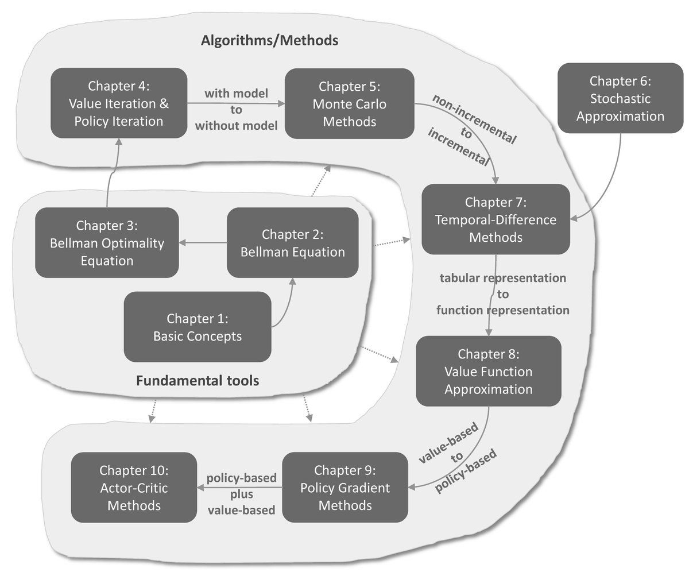

# Mathematical Foundations of RL

**Source**: Shiyu Zhao. 288 pages. Comprehensive textbook covering the mathematical foundations of reinforcement learning from MDPs through policy gradient methods.

## Key Points

- **Complete mathematical treatment**: From basic MDP concepts through advanced policy gradient methods
- Builds intuition through **grid world examples** before introducing formal mathematics
- Covers the **full RL algorithm spectrum**: value iteration → policy iteration → Monte Carlo → TD learning → Q-learning → policy gradient
- Provides rigorous convergence proofs (Robbins-Monro, Dvoretzky, contraction mapping)
- The foundational mathematics behind TRPO, PPO, GRPO, GSPO, and all modern RL algorithms

## Structure

*Figure: The RL algorithm landscape — from value-based (Bellman, TD, Q-learning) through policy-based (REINFORCE, actor-critic) to modern LLM RL (PPO, GRPO). [src](../raw/assets/rl_algorithms_overview.png)*

| Chapter | Topic | Key Concepts |
|---------|-------|-------------|
| 1 | **Basic Concepts** | State, action, policy, reward, return, MDP |
| 2 | **State Values & Bellman Equation** | $v_\pi(s)$, Bellman equation, matrix-vector form, closed-form & iterative solutions |
| 3 | **Optimal State Values & Bellman Optimality** | $v_*(s)$, optimal policies, Bellman optimality equation, contraction mapping theorem |
| 4 | **Value Iteration & Policy Iteration** | Value iteration, policy iteration, truncated policy iteration |
| 5 | **Monte Carlo Methods** | MC Basic, MC Exploring Starts, ε-greedy, exploration vs exploitation |
| 6 | **Stochastic Approximation** | Robbins-Monro algorithm, Dvoretzky theorem, SGD convergence |
| 7 | **Temporal-Difference Methods** | TD learning, Sarsa, n-step Sarsa, Q-learning, on-policy vs off-policy |
| 8-11 | **Value Function Approximation & Policy Gradient** | Function approximation, DQN, policy gradient theorem, REINFORCE, actor-critic |

## Key Mathematical Foundations

### Bellman Equation

The cornerstone of RL — relates the value of a state to the values of its successor states:

$$
v_\pi(s) = \mathbb{E}\left[ R_{t+1} + \gamma v_\pi(S_{t+1}) \mid S_t = s \right]
$$

Matrix-vector form: $v_\pi = r_\pi + \gamma P_\pi v_\pi$

Closed-form solution: $v_\pi = (I - \gamma P_\pi)^{-1} r_\pi$

### Bellman Optimality Equation

$$
v_*(s) = \max_a \mathbb{E}\left[ R_{t+1} + \gamma v_*(S_{t+1}) \mid S_t = s, A_t = a \right]
$$

Solved via contraction mapping — the Bellman operator is a $\gamma$-contraction, guaranteeing convergence of iterative methods.

#### Contraction Mapping Theorem

The Bellman optimality operator $T: \mathbb{R}^{|S|} \to \mathbb{R}^{|S|}$ defined as:

$$
(Tv)(s) = \max_a \left( r(s, a) + \gamma \sum_{s'} P(s' \mid s, a) v(s') \right)
$$

is a $\gamma$-contraction: $\|Tv_1 - Tv_2\|_\infty \leq \gamma \|v_1 - v_2\|_\infty$. By Banach's fixed-point theorem, iterating $v_{k+1} = Tv_k$ converges to the unique fixed point $v_*$ regardless of initialization. This is the mathematical guarantee behind value iteration.

### Robbins-Monro (Stochastic Approximation)

The mathematical foundation of all stochastic RL algorithms:

$$
w_{k+1} = w_k - \alpha_k g(w_k, \eta_k)
$$

Converges to the root of $\mathbb{E}[g(w, \eta)] = 0$ under decreasing learning rates $\alpha_k \to 0$, $\sum \alpha_k = \infty$, $\sum \alpha_k^2 < \infty$.

Generalized by Dvoretzky's theorem. Underlies TD learning, Q-learning, SGD, and all stochastic gradient-based RL.

#### Dvoretzky's Extension for Multi-State RL

For RL problems with multiple states, Dvoretzky's theorem extends to handle vector-valued stochastic processes:

$$
\Delta_{k+1}(s) = (1 - \beta_k(s)) \Delta_k(s) + \gamma_k(s) \eta_k(s)
$$

Converges to zero for all states $s \in \mathcal{S}$ if: (a) the learning rates decay appropriately, (b) the expected noise is bounded by the error, and (c) the noise variance is controlled. This theorem is the mathematical foundation for proving **Q-learning convergence** in tabular settings.

### TD Learning and the TD Error

The TD algorithm estimates state values using the difference between successive predictions:

$$
v_{t+1}(s_t) = v_t(s_t) - \alpha_t(s_t) \left[ v_t(s_t) - (r_{t+1} + \gamma v_t(s_{t+1})) \right]
$$

Where $\bar{v}_t = r_{t+1} + \gamma v_t(s_{t+1})$ is the **TD target** and $\delta_t = v_t(s_t) - \bar{v}_t$ is the **TD error**.

**Key insight**: The textbook proves that after each update, the new estimate is **closer to the TD target** than the old estimate:

$$
\lvert v_{t+1}(s_t) - \bar{v}_t \rvert = \lvert 1 - \alpha_t \rvert \cdot \lvert v_t(s_t) - \bar{v}_t \rvert \lt \lvert v_t(s_t) - \bar{v}_t \rvert
$$

The TD error is the **innovation** — new information from the experience sample. When $v_t = v_\pi$, the expected TD error is zero (by the Bellman equation). The fundamental idea of TD learning: **correct estimates based on newly obtained information**.

**Connection to SGD**: TD learning can be derived by applying the Robbins-Monro algorithm to solve $g(v_\pi(s_t)) = v_\pi(s_t) - \mathbb{E}[r_{t+1} + \gamma v_\pi(s_{t+1})] = 0$, which is the Bellman equation itself.

### Q-Learning and Sarsa

**Sarsa** (on-policy TD control):

$$
q_{t+1}(s_t, a_t) = q_t(s_t, a_t) - \alpha_t \left[ q_t(s_t, a_t) - (r_{t+1} + \gamma q_t(s_{t+1}, a_{t+1})) \right]
$$

Updates action values using the **actual next action** $a_{t+1}$ from the current policy. On-policy: learns the value of the policy being followed.

**Q-learning** (off-policy TD control):

$$
q_{t+1}(s_t, a_t) = q_t(s_t, a_t) - \alpha_t \left[ q_t(s_t, a_t) - (r_{t+1} + \gamma \max_{a} q_t(s_{t+1}, a)) \right]
$$

Updates using the **greedy next action** $\max_a q_t(s_{t+1}, a)$, regardless of what action the policy actually takes. Off-policy: learns the optimal policy directly while following an exploratory policy.

**The off-policy property is crucial for LLM RL**: It's the same principle that allows GRPO/GSPO to use samples from an older policy $\pi_{\theta_{\text{old}}}$ to improve the current policy $\pi_\theta$ — the importance sampling correction makes this off-policy learning possible.

### Policy Gradient — The Discounted Case ($\gamma < 1$)

The textbook derives the policy gradient for the discounted return metric $\bar{v}_\pi$:

$$
\nabla_\theta \bar{v}_\pi \approx \frac{1}{1 - \gamma} \sum_{s} d_\pi(s) \sum_{a} \nabla_\theta \pi_\theta(a \mid s) \; q_\pi(s, a)
$$

This approximation becomes **exact as $\gamma \to 1$** (when the first term involving $\nabla_\theta d_\pi$ becomes negligible compared to the $1/(1-\gamma)$ factor).

### Policy Gradient — The Undiscounted / Average-Reward Case ($\gamma = 1$)

For the undiscounted case, the textbook introduces the **Poisson equation**:

$$
v_\pi = r_\pi - \bar{r}_\pi \mathbf{1}_n + P_\pi v_\pi
$$

Where $\bar{r}_\pi$ is the long-run average reward. The state value here is the **differential reward** — the cumulative difference between actual rewards and the average reward. The policy gradient for the average reward is exact (no approximation needed):

$$
\nabla_\theta \bar{r}_\pi = \sum_{s} d_\pi(s) \sum_{a} \nabla_\theta \pi_\theta(a \mid s) \; q_\pi(s, a) = \mathbb{E}_\pi \left[ \nabla_\theta \ln \pi_\theta(A \mid S) \; q_\pi(S, A) \right]
$$

This is the fundamental policy gradient theorem — the foundation of **all** modern policy gradient methods.

### SGD and Its Connection to RL

SGD is a special case of the Robbins-Monro algorithm. The textbook shows that SGD:

$$
w_{k+1} = w_k - \alpha_k \nabla_w f(w_k, x_k)
$$

can be rewritten as $w_{k+1} = w_k - \alpha_k \mathbb{E}[\nabla_w f(w_k, X)] - \alpha_k \eta_k$, where $\eta_k = \nabla_w f(w_k, x_k) - \mathbb{E}[\nabla_w f(w_k, X)]$ has **zero mean**. This zero-mean perturbation property is why SGD converges despite using noisy gradient estimates.

**The SGD→RL chain**: SGD underlies all stochastic RL algorithms. The TD update, Q-learning update, and policy gradient update are all SGD variants applied to different objective functions. The learning rate schedule ($\sum \alpha_k = \infty, \sum \alpha_k^2 < \infty$) from Robbins-Monro determines convergence in all cases.

## Mathematical → Modern LLM RL

Each mathematical foundation directly maps to modern LLM RL algorithms:

| Mathematical Concept | Textbook Foundation | LLM RL Application |
|---------------------|-------------------|-------------------|
| **Policy gradient theorem** | $\nabla_\theta \bar{r}_\pi = \mathbb{E}[\nabla_\theta \ln \pi_\theta \cdot q_\pi]$ | All policy gradient methods (TRPO, PPO, GRPO, GSPO) |
| **Baseline invariance** | $\mathbb{E}[\nabla_\theta \ln \pi_\theta \cdot b(s)] = 0$ | GRPO's group baseline; GAE in PPO |
| **Importance sampling** | $w_t = \pi_\theta / \pi_{\theta_{\text{old}}}$ for off-policy correction | Token-level IS (GRPO), Sequence-level IS (GSPO) |
| **SGD convergence** | Robbins-Monro: $\sum \alpha_k = \infty, \sum \alpha_k^2 < \infty$ | Learning rate scheduling in all RL training |
| **Off-policy learning** | Q-learning: $\max_a$ independent of behavior policy | GRPO/GSPO: using rollout data for multiple gradient updates |
| **TD error / Innovation** | $\delta_t = v_t - (r_{t+1} + \gamma v_{t+1})$ | Advantage estimation: $A_t = r_t + \gamma V_{t+1} - V_t$ (GAE) |
| **Contraction mapping** | $\|Tv_1 - Tv_2\| \leq \gamma \|v_1 - v_2\|$ | Convergence guarantees for value-based methods |
| **Poisson equation** | $v_\pi = r_\pi - \bar{r}_\pi + P_\pi v_\pi$ | Average-reward formulation (relevant for continuing RL tasks) |

$$
\nabla_\theta J(\theta) = \mathbb{E}_\pi\left[ \nabla_\theta \log \pi_\theta(a \mid s) \; Q^\pi(s, a) \right]
$$

The foundation of REINFORCE, actor-critic, TRPO, PPO, GRPO, and GSPO — all modern policy gradient methods derive from this theorem.

#### The Role of the Baseline

A critical property: the policy gradient is **invariant to any state-dependent baseline** $b(s)$:

$$
\nabla_\theta J(\theta) = \mathbb{E}_\pi\left[ \nabla_\theta \log \pi_\theta(a \mid s) \; (Q^\pi(s, a) - b(s)) \right]
$$

The baseline doesn't change the expected gradient (because $\mathbb{E}[\nabla_\theta \log \pi_\theta] = 0$) but **dramatically reduces variance**. This is why advantage functions $A(s, a) = Q(s, a) - V(s)$ are used in practice.

The textbook proves that the **optimal baseline** (minimizing gradient variance) involves a weighted expectation — too complex for practice. However, the **state value $v_\pi(s)$ is a near-optimal suboptimal baseline**:

$$
b(s) \approx v_\pi(s) = \mathbb{E}_{a \sim \pi}[q_\pi(s, a)]
$$

This is why actor-critic methods learn a value function alongside the policy — not because it's mathematically required, but because it reduces variance by orders of magnitude.

#### Where LLM RL Deviates

Modern LLM RL (GRPO, GSPO) takes this further:

- **GRPO**: Replaces the learned value function with a **group-based baseline** — the average reward of $G$ outputs for the same prompt. This is a Monte Carlo estimate of the expected return for that prompt, eliminating the need for a separate value model.
- **GSPO**: Uses the same group baseline but at the **sequence level** — recognizing that the reward is per-sequence, not per-token.

Both are mathematically justified by the baseline invariance property of the policy gradient theorem.

## Relevance to LLM RL

This textbook provides the mathematical fundamentals for all the RL algorithms in this wiki:

| Wiki Page | Textbook Foundation |
|-----------|-------------------|
| [TRPO](trpo.md) | Policy gradient theorem + constrained optimization (Ch 8-11) |
| [PPO](ppo.md) | TRPO simplified — clipping replaces KL constraint |
| [GRPO](grpo.md) | Policy gradient + group-based baseline (replaces value function) |
| [GSPO](gspo.md) | Sequence-level IS — aligns optimization unit with reward unit |
| [ScaleRL](scalerl.md) | SGD convergence (Ch 6) applied to RL scaling |
| [Stabilizing RL](stabilizing-rl-llms.md) | Importance sampling theory — first-order Taylor approximation |

## Connections

- [TRPO](trpo.md) → [PPO](ppo.md) → [GRPO](grpo.md) → [GSPO](gspo.md) — The algorithm evolution chain
- [ScaleRL](scalerl.md) — RL compute scaling (uses these mathematical foundations)
- [Stabilizing RL with LLMs](stabilizing-rl-llms.md) — Token-level vs sequence-level RL theory
