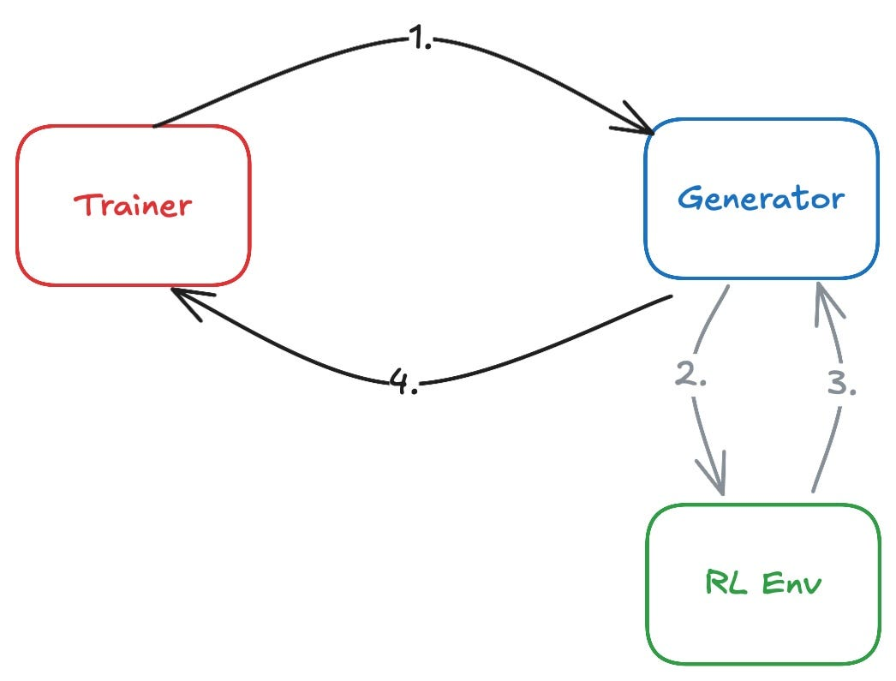
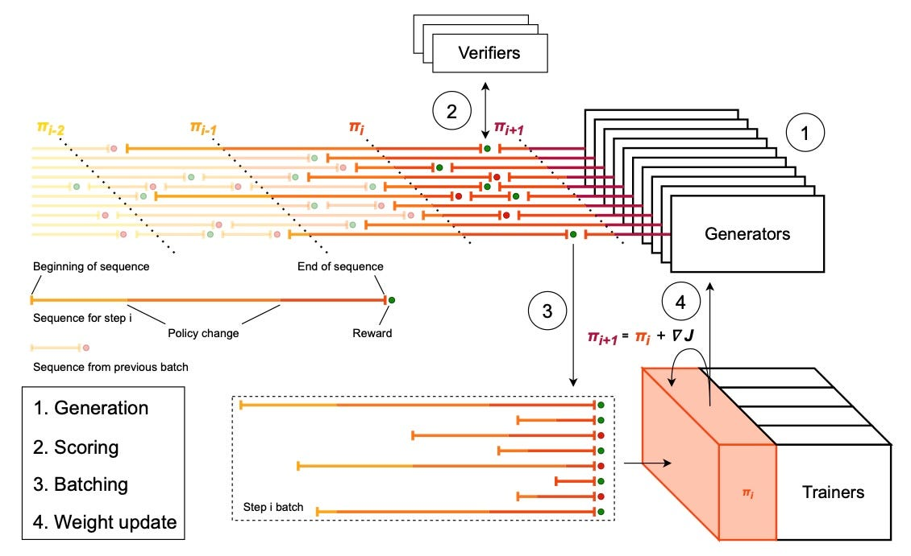

# RL Systems: Mind the Gap

**Source**: Kimbo Chen, Cheang Kang Wen, Dylan Patel (SemiAnalysis), Jun 2026. A deep dive into RL training infrastructure — matching trainer and generator throughput, with real-world case studies using Qwen3-235B, GLM-5, and GB300 hardware.

## Key Points

- **Three actors**: generator (inference), RL environment (sandbox), trainer — the system is a queue: generator produces rollouts, trainer consumes them
- **Throughput matching is the core problem**: when generator < trainer, trainer starves; when generator > trainer, samples stale
- **PipelineRL** introduced in-flight weight updates, enabling async execution with bounded policy staleness
- **GRPO** is the open-source standard: group-relative advantage from multiple completions per prompt
- **Long responses** dominate LLM inference time; **oversampling** (60% discard rate) mitigates straggler tail latency


- **Easy curricula** create zero-advantage groups (55% problems at 100% solve rate) — wasted training signal
- **Sandbox scaling** is a bottleneck: at 960 concurrent rollouts, initialization dead errors and 1-hour straggler latencies
- **Partial rollout** saves stragglers but introduces environment state-level staleness in stateful sandboxes

## The Three Actors

```
Generator (vLLM/SGLang) → RL Environment (Sandbox) → Trainer (FSDP/Megatron)
           ↑                                              |
           └──────── Weight sync (NCCL/HTTP) ─────────────┘
```

- **Generator**: performs inference on prompts, produces rollouts
- **RL Environment**: executes sandbox (code, tool-use), assigns reward scores
- **Trainer**: consumes rollouts + rewards, produces new weights via GRPO/PPO

## GRPO: Just Enough Algorithm

Group-Relative Policy Optimization:
1. Sample N completions per prompt (group size N, typically 8-64)
2. Assign reward to each rollout
3. Compute advantage: $A_i = (r_i - \text{mean}(\{r_j\})) / \text{std}(\{r_j\})$
4. Rollouts above group average → reinforced; below → suppressed

**Critical caveat**: if all rollouts in a group get the same reward (too easy or too hard), advantage = 0 and the group produces **no training signal**. Solve rate near 0% or 100% → uniform reward distribution.

## Throughput-Matching Framework



### Trainer Consumption Rate
$$\text{samples per step} / \text{training step time}$$

Constrained by: group size (N), reward distribution (advantage filtering), batch size, model architecture, parallelism configuration, MFU.

### Generator Production Rate
$$\text{concurrent rollouts} / \text{end-to-end latency}$$

Constrained by: inference throughput, sandbox latency, reward model type, reward shape (PRM vs outcome), KV cache capacity.

### Effective Rate
$$\text{effective production} = \text{acceptance rate} \times \text{production rate}$$

Acceptance rate affected by: early pruning, adaptive sampling, advantage filtering.

### Policy Staleness Budget

Bounded staleness caps the gap between producer and consumer rates. Three granularities:
- **Trajectory-level**: trainer at version t+k while rollout started at version t
- **Token-level**: in-flight weight updates mid-rollout mix policy versions
- **Environment state-level**: resumed partial rollouts face state created by old policy

## Case Studies

### Case 1: Long Responses, Early Exploration
- Qwen3-235B-A22B, 64 H200 trainer, 192 GPU generator
- Group size 16, max seq 32K, staleness budget 16
- **60% discard rate** due to tail latency skew from long responses
- **Generation-bound**: trainer waits 30%, MFU 10.5%, 3× more generator compute than trainer
- Early RL exploration pushed policy away from solvable problems before relearning

### Case 2: Frequent Tool Use, Easy Tasks
- GLM-5, 128 H200 trainer, 128 GPU generator (PD disaggregated)
- Tool calls tripled (20→51), response length grew
- 55% of problems at 100% solve rate → zero advantage → flat reward
- **Trainer waits 74%**, consumption rate 5× production rate
- PD disaggregation improved prefill TTFT under heavy prefill workload shift

### Case 3: Sandbox Scaling
- Qwen3-235B, GB300, verl + uni-agent, Modal sandbox
- 128K max seq, 5-8% samples hit max length
- At 960 concurrent rollouts: sandbox init dead errors, 1-hour straggler spin-up
- Scaled down to 96: low rollout efficiency
- Sandbox infrastructure reliability is critical bottleneck

### Case 4: Partial Rollout & Stateful Sandboxes
- Qwen3-235B, 32 H200 trainer, 64 GPU generator, slime
- GSPO algorithm, fully async + partial rollout
- Partial rollout saves stragglers to replay buffer, resumes later
- SGLang evicts KV cache for aborted rollouts → resumed rollouts are large prefill requests (ideal for PD)
- **Environment state-level staleness**: resumed rollouts continue in state created by old policy — corrupted advantage attribution

## Software Reviews

- **Prime RL**: great ergonomics (uv, .toml), orchestrator actor, Environments Hub. Rough edges with uv dependency management and sandbox error parsing
- **slime**: clean hook abstractions, friendly dev team. Sparse async mode documentation
- **Modal**: great API docs, robust at small scale. Concurrency limits and startup latency issues at scale

## History

DeepSeek R1 sparked the open-source RL framework ecosystem. OpenRLHF → slime, verl → vibrant Chinese RL communities → enabled academic RL research.

## Connections

- [Async RL Training Landscape](async-rl-training-landscape.md) — the 7-axis survey of 16 libraries; this article tests those frameworks in production
- [PipelineRL / ScaleRL](scalerl.md) — PipelineRL's in-flight weight updates are the core async mechanism
- [GRPO / DeepSeek-R1](deepseek-r1.md) — GRPO is the open-source standard analyzed here
- [MAI-Thinking-1](mai-thinking-1.md) — Microsoft's Rocket framework shares the same three-actor architecture
- [PPO](ppo.md) — PPO's clipped objective; GRPO drops the value network
- [Inside vLLM](vllm-anatomy.md) — paged attention and prefix caching enable generator throughput
- [TSP: Folding TP + SP](tsp-folding-parallelism.md) — parallelism strategies affect both trainer and generator efficiency
