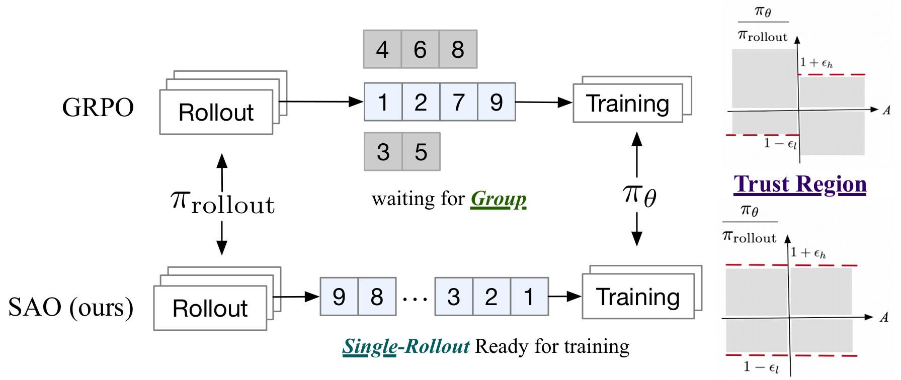

# Single-Rollout Asynchronous Optimization (SAO)

**Source**: Zhenyu Hou, Yujiang Li, Jie Tang, Yuxiao Dong (Tsinghua University; work done while interning at Z.AI), Feb 2026. arXiv:2607.07508. 14 pages. [src](../raw/single-rollout-async-agentic-rl.pdf)

## Key Points

- **SAO replaces GRPO's group-wise sampling with single-rollout sampling** (one rollout per prompt, fed to training immediately) — removes straggler-induced off-policy bias and fits online/agentic settings with single-trajectory feedback
- **Direct Importance Sampling (DIS)**: use $\pi_{\text{rollout}}$ directly as behavior proxy (log-probs from rollout engine), dropping $\pi_{\theta_{\text{old}}}$ — eliminates per-checkpoint inference cost
- **Double-sided calibration token-level masking**: tokens outside $[1-\epsilon_\ell, 1+\epsilon_h]$ are **masked entirely** (not clipped) — simpler than IcePop, stable under extreme policy divergence
- **Faster value updates (TTUR)**: K=2 critic updates per policy update
- **Frozen-Attention value training**: freeze attention layers of $V_\phi$, train only MoE projections — instability traced to Full Attention layers (large gradient norms), MoE stable
- **Skip-observation token-level GAE**: advantages computed action-to-action across observation gaps — filters environment stochasticity
- **Scaling value pretraining data**: "cold start" of value model is a major bottleneck
- **Stable for ~1000 training steps**; beats GRPO consistently during training (not just at convergence)
- **Deployed in GLM-5.2 (750B-A40B) agentic RL pipeline**; effective in simulated online learning (style-shift writing task)

## The Two Problems with Async RL

1. **Severe off-policy**: trajectories generated by multiple versions of the rollout model → unpredictable policy lag
2. **GRPO mismatch**: group-wise sampling requires waiting for the slowest rollout; environment often provides only **single trajectory feedback per prompt** in online/agentic settings

## Direct Importance Sampling (DIS)

Problem: exact IS needs $\frac{\pi_\theta}{\pi_{\theta_{\text{old}}}}$, but in async RL a trajectory spans multiple model updates — tracking exact behavior probabilities requires a history of checkpoints $\{\pi^{(1)}_{\text{old}}, \ldots, \pi^{(N)}_{\text{old}}\}$, computationally prohibitive.

Solution: use $\pi_{\text{rollout}}$ as behavior proxy directly:

$$r_t(\theta) = \exp\left(\log \pi_\theta(a_t \mid s_t) - \log \pi_{\text{rollout}}(a_t \mid s_t)\right)$$

- Uses log-probs generated during rollout (free)
- Accepts controlled off-policy bias for huge complexity reduction
- **Removes the error of using a single stale "latest" old policy**

## Double-Sided Token-Level Masking

Standard PPO clips only selected tokens ($A > 0, r_t > 1+\epsilon_h$ or $A < 0, r_t < 1-\epsilon_\ell$). SAO restricts the trust region to $[1-\epsilon_\ell, 1+\epsilon_h]$ and **masks out-of-range tokens entirely** (gradient = 0):

$$f(x; \epsilon_\ell, \epsilon_h) = \begin{cases} x, & \text{if } 1 - \epsilon_\ell < x < 1 + \epsilon_h \\ 0, & \text{otherwise} \end{cases}$$

$$L(\theta) = \hat{\mathbb{E}}_t\left[ f(r_t(\theta), \epsilon_\ell, \epsilon_h) \hat{A}_t \log \pi_\theta(a_t \mid s_t) \right]$$

Similar to IcePop but simpler (no $\pi_{\theta_{\text{old}}}$). Enables **more aggressive clipping** → effective regularization under asynchrony. (VAPO baseline without DIS: near-zero clip ratio, collapses at ~90 steps.)

## Reducing Off-Policy: Single Rollout

Group-wise sampling introduces "imbalanced generation" bias + straggler waiting. Single-rollout: sample fed to training immediately upon generation.

Single-rollout = REINFORCE-like variance → requires a **good value model**. Three value-model improvements:

### 1. Faster Value Update than Policy (TTUR)

Decouple optimization frequencies: **K=2 value updates per policy update**. Value estimates adapt to the current policy before advantage computation → lower variance.

### 2. Frozen-Attention Value Training

Pilot experiments: value-model gradient norms >> policy gradient norms; instability originates in **Full Attention layers** (MoE layers stable). Freeze attention modules of $V_\phi$, optimize only MoE projections — pre-trained attention weights already capture representation capacity; training the whole head destabilizes.

### 3. Scaling Value Pretraining

"Cold start" in value estimation is a major bottleneck; scale up value pretraining corpus for robust initialization.

## Skip-Observation Token-Level GAE

Multi-turn agent trajectories interleave environment feedback (observations not generated by the model). Standard token-level GAE propagates noise through observation tokens.

SAO: advantages computed across **action-to-action boundaries**:

$$A(a_{i,N}) = \delta + \gamma \lambda \hat{A}(a_{i+1,0})$$

$$\delta = r_t + \gamma V(a_{i+1,0}) - V(a_{i,N})$$

- Depends purely on model outputs — filters environment stochasticity
- Step-level value functions perform worse (ablated)

## Hyperparameters (agentic reasoning RL)

- Batch 128, **group size 1**, max length 128K
- Policy lr $1 \times 10^{-6}$; token clipping $\epsilon_{\text{low}} = 0.3$, $\epsilon_{\text{high}} = 5.0$
- Length-adaptive GAE: $\lambda_{\text{policy}} = 1 - \frac{1}{\alpha l}$, $\alpha = 1.5$
- Value model lr $5 \times 10^{-6}$, $\lambda_{\text{critic}} = 1$, 10-step ... value pretraining on TIR data from GPT-OSS-120B (Qwen3-30B-A3B base)

## Results

| Benchmark | Baseline (SFT) | GRPO (w/ DIS) | SAO |
|-----------|------|------|-----|
| AIME2025 | 80.4 | 84.2 | 97.3 |
| BeyondAIME | 53.3 | 54.8 | 74.8 |
| HMMT Nov 2025 | 75.2 | 76.0 | 88.3 |
| IMOAnswerBench | 53.3 | 55.8 | 74.0 |
| SWE-bench Verified | 23.0 | 27.0 | 29.8 |

- SAO consistently outperforms optimized GRPO **during** training, not just at convergence (AIME, BeyondAIME, HMMT curves)
- Stable ~1000 steps; VAPO (w/o DIS) collapses ~90 steps

### Ablations (AIME2025 / BeyondAIME)

| Value strategy | Critic freq | AIME2025 | BeyondAIME |
|----------------|-------------|----------|------------|
| Frozen attention (SAO) | 2 | 97.3 | 74.8 |
| Frozen attention | 1 | 95.0 | 69.8 |
| Full-parameter | 2 | 90.6 | 74.5 |
| Vanilla VAPO (w/o DIS) | — | 91.3 | 69.0 |
| Running mean baseline | — | 79.8 | 55.3 |

### Training Dynamics

- **Explained variance**: SAO >> single-critic-update baseline after ~400 steps (faster value convergence)
- **Critic gradient norms**: frozen-attention lower and smoother vs full-parameter
- **Clip ratio**: SAO gates divergent updates; VAPO near-zero clip ratio → collapse

## Online Learning Simulation

Simulated writing task with **non-stationary rewards** — judge (GLM-4.7) scores quality × style adherence ($r = r_{\text{quality}} \times r_{\text{style}}$), with the target stylistic archetype shifting across phases (Academic → Cute → Chuunibyou → Classical):

- GRPO structurally incompatible (needs group-relative rewards)
- SAO rapidly realigns policy after each reward shift — effective for evolving environments

## Connections

- [GRPO](grpo.md) — the algorithm SAO replaces; group-wise sampling critique
- [Async RL Training Landscape](async-rl-training-landscape.md) — async survey; SAO addresses effectiveness gap (prior work throughput-focused); AReaL/ROLL systems context
- [GLM-5](glm-5.md) — same team lineage; GLM-5's async agent RL + TITO; SAO deployed in GLM-5.2
- [Predicting Staleness in Async RL](staleness-in-async-rl.md) — staleness theory; single-rollout bounds staleness structurally
- [Stabilizing RL with LLMs](stabilizing-rl-llms.md) — token-level first-order approximation + clipping theory
- [PPO](ppo.md) — clipped surrogate + GAE lineage; SAO's masking differs from PPO clipping
- [Batch Size-Invariance](batch-size-invariance.md) — proximal/behavior decoupling; SAO's DIS drops the old-policy term entirely
- [RL Foundations](rl-foundations.md) — policy gradient, GAE, baseline invariance
- [TITO: Agentic RL](tito-agentic-rl.md) — token-level fidelity in multi-turn tool-use rollouts
- [Kimi K2](kimi-k2.md) — TTUR-style critic updates also relevant to critic-based training

## Key Figure

