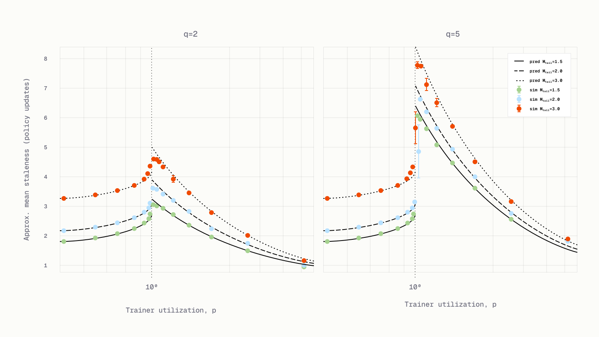

# Staleness in Fully Async RL

**Source**: Dong, Goel, Yu (Applied Compute), Jul 2026. Closed-form formulas for predicting and controlling policy staleness in fully asynchronous RL training, validated against simulations and real Qwen3-8B runs.

## Key Points

- **Staleness** = number of policy versions between when a rollout starts generating and when it's trained on
- **Closed-form formula** with two additive components: PQS (pre-queue staleness) + IQS (in-queue staleness)
- PQS depends only on C (concurrency), B (batch size), M_tail (response tailness), ρ (utilization)
- IQS depends on ρ and q (queue factor = queue capacity / batch size)
- **Staleness independent of mean response length** — only tailness matters
- **Prefer rollout-bound**: slightly under-provisioning rollouts gives better staleness-performance trade-off
- **Set q=1**: minimal queue avoids staleness accumulation with negligible throughput cost
- Formula validated within ±0.27 steps across 6 real Qwen3-8B GRPO runs

## Total Staleness Formula

$$\text{staleness}(\rho) = \begin{cases} \dfrac{CM_{\text{tail}}}{B} + \rho, & \rho < 1 \quad\text{(rollout-bound)}\\[8pt] \dfrac{CM_{\text{tail}}}{\rho B} + \dfrac{2q + \rho - 1}{2\rho}, & \rho > 1 \quad\text{(train-bound)} \end{cases}$$

Where:
- $\rho = v_R / v_T$ = utilization (rollout throughput / train throughput)
- $C$ = sampling concurrency (inference slots)
- $M_{\text{tail}} = \mathbb{E}[\max(L_1,\dots,L_S)] / \mathbb{E}[L]$ = group tailness multiplier
- $B = G \cdot S$ = batch size (groups × samples per group)
- $q = Q / B$ = queue factor

### Pre-Queue Staleness (PQS)

How many policy updates happen during a rollout's generation:

$$\text{PQS}(\rho) = \frac{CM_{\text{tail}}}{B \cdot \max(1, \rho)}$$

Key insight: $C \cdot M_{\text{tail}} / B$ — linear in concurrency and tailness, inverse in batch size. Staleness is independent of mean response length because both generation time and train period scale linearly with it.

### In-Queue Staleness (IQS)

How many train steps pass while a rollout sits in the queue:

$$\text{IQS}(\rho) = \begin{cases} \rho, & \rho < 1 \\[4pt] \dfrac{2q + \rho - 1}{2\rho}, & \rho > 1 \end{cases}$$

- Rollout-bound ($\rho < 1$): trainer drains queue every step; IQS = ρ
- Train-bound ($\rho > 1$): queue fills to capacity; oldest groups (most stale) consumed first

## queue-drop vs queue-max

| Algorithm | Mechanism | Response Length Bias |
|-----------|-----------|---------------------|
| `queue-drop` | Drop oldest groups when queue exceeds capacity | **Unbiased** (proven in steady state) |
| `queue-max` | Drop samples exceeding max staleness | **Biased** toward shorter responses (longer = higher PQS = more likely dropped) |

At tailness=90 and max staleness=1: trained mean drops from 1354→897 tokens for `queue-max`; `queue-drop` stays at ~1350.

## Practical Recommendations

### 1. Set q = 1
Minimal queue size avoids staleness accumulation. At $\rho \approx 1$, q=2→q=1 reduces measured staleness by 35% (3.09→2.01) at near-identical train period.

### 2. Prefer Rollout-Bound
For any achievable train period, the rollout-bound ($\rho < 1$) operating point achieves lower staleness than train-bound. Exception only when rollout compute < 50% of trainer compute at balance (rare).

### 3. Staleness-Performance Frontier
For fixed GPU budget, staleness and throughput form a Pareto frontier. Reducing staleness requires moving $\rho$ away from 1, sacrificing throughput:

$$t_{\text{period}}(\rho) \propto \frac{1}{\min(1,\rho)} \cdot \left(\frac{1}{c_T} + \frac{\rho}{c_R}\right)$$

### 4. Batch Size Trade-off
Doubling batch size halves PQS (1/B scaling). Noise-adjusted: $t_{\text{period}}/\sqrt{B}$ — larger batches trade speed for staleness.

### 5. Concurrency
Lower concurrency reduces staleness linearly in rollout-bound regime. Halving C reduced staleness 39% (1.92→3.15) at cost of 29% longer step time.

### 6. Monitor Tailness
$M_{\text{tail}}$ grows as response length distribution gets heavier-tailed. Tuning max response length cap is a direct lever.

## Validation

| C | B | q | ρ | M_tail | Predicted | Measured | Error |
|---|----|---|---|---------|-----------|----------|-------|
| 120 | 240 | 2 | 0.63 | 1.42 | 1.34 | 1.26 | +0.08 |
| 240 | 120 | 2 | 0.92 | 1.43 | 3.86 | 3.59 | +0.27 |
| 128 | 128 | 2 | 1.07 | 1.44 | 3.29 | 3.09 | +0.20 |
| 240 | 120 | 1 | 0.86 | 1.42 | 3.34 | 3.40 | −0.06 |
| 120 | 120 | 1 | 0.67 | 1.42 | 1.95 | 1.92 | +0.03 |
| 128 | 128 | 1 | 1.14 | 1.45 | 2.24 | 2.01 | +0.24 |

## Connections

- [RL Systems: Mind the Gap](rl-systems-mind-the-gap.md) — SemiAnalysis throughput-matching framework; this provides the mathematical formalism
- [Async RL Training Landscape](async-rl-training-landscape.md) — staleness management across 16 libraries (Axis 4)
- [GRPO / DeepSeek-R1](deepseek-r1.md) — GRPO algorithm this analysis assumes
- [ScaleRL](scalerl.md) — PipelineRL async RL; the "effective train period" matches ScaleRL's sigmoid scaling framework
- [Stabilizing RL with LLMs](stabilizing-rl-llms.md) — off-policy staleness theory; this provides system-level quantification
