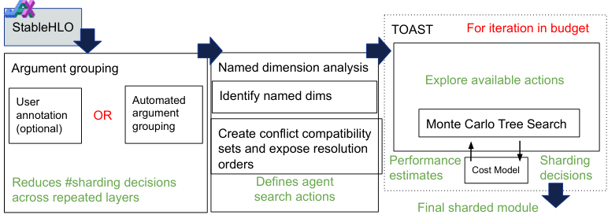

# TOAST

**Source**: Google DeepMind. 13 pages. Automatic ML model partitioning using static analysis + Monte Carlo Tree Search.

## Key Points

- **Fully automated**: No user annotations needed — finds optimal sharding strategy automatically
- **Two-phase approach**: (1) Static analysis identifies sharding equivalences and conflicts, (2) MCTS searches over conflict resolutions
- **Named dimensions**: Static analysis discovers logical dimension groups that must be sharded identically — dramatically reduces search space
- **Outperforms state-of-the-art**: Better than expert-crafted and previous auto-partitioning strategies across diverse models and hardware
- Discovers previously unknown superior solutions



## The Problem: Auto-Partitioning Search Space

Existing auto-partitioners face a fundamental trade-off:

| Approach | Problem |
|----------|---------|
| Restrict search space too much | Misses optimal solutions, often infeasible (OOM) |
| Explore full space | Exponentially large — prohibitively slow |

For a model with N tensors, each with D dimensions, shardable across M mesh axes, the naive search space is O(M^(N×D)) — impossible to explore exhaustively.

## TOAST's Solution: Static Analysis First

### Phase 1: Named Dimensions Analysis

TOAST performs a **static compiler analysis** before the partitioning search. The key insight: many tensor dimensions must be sharded identically due to dataflow constraints.

**How it works**: The analysis traces dimension relationships through the computation graph using rules for each operation:

```
Parallel dimensions:   batch → matmul → batch (propagates unchanged)
Contracting dimensions: hidden → matmul → next hidden (must be sharded together)
```

These form **named dimension groups** — logical groups that must share a single sharding decision. Using colors as dimension names:

```
x[batch: 256, hidden: 32] → matmul(w1[hidden: 32, model: 64])
  → ReLU → matmul(w2[model: 64, out: 16])

Groups: {batch_group}, {hidden_group}, {model_group}, {out_group}
Each group → one sharding decision across the device mesh
```

**Impact**: From O(M^(N×D)) to O(M^G) where G is the number of named dimension groups (typically 10-50 for large models, vs thousands of individual tensor dimensions). This makes search tractable.

### Phase 2: Sharding Conflict Identification

When an operation's sharding is **ambiguous**, TOAST identifies a **sharding conflict** — a decision point that defines the search space:

```
Example: matmul(A[sharded on batch, hidden], B[sharded on hidden, model])
  → Output has dimensions [sharded on batch, model]
  → But batch and model are on DIFFERENT mesh axes
  → Conflict: which sharding does the output carry forward?
```

Conflicts are the **only points where resharding decisions matter**. A model with T tensors might have only C conflicts (C << T), and MCTS only needs to explore those.

### Phase 3: MCTS Search

A Monte Carlo Tree Search agent explores conflict resolutions:

1. **State**: Current sharding assignments for all named dimension groups
2. **Actions**: At each conflict, choose which sharding to propagate forward (introducing an AllReduce/AllGather if needed)
3. **Reward**: Estimated throughput and peak memory from compiler cost model
4. **Selection**: UCT (Upper Confidence bounds for Trees) balances exploration/exploitation
5. **Rollout**: Propagate chosen decisions, identify new conflicts, continue until fully resolved
6. **Backpropagation**: Update node statistics with rollout reward

**The named dimension analysis is critical**: without it, MCTS would have to explore sharding decisions for every individual tensor dimension. With it, the action space is limited to conflict resolution on named groups.

### Search Example

```
Step 1: Named analysis → 8 groups, 3 conflicts identified
Step 2: MCTS root → conflict 1: split batch vs model
  ├── Propagate batch → conflict 2 arises → ...
  └── Propagate model → AllReduce needed → conflict 3 → ...
Step 3: After exploring ~100 rollouts → optimal strategy found
  (vs billions of possibilities without named dimension pruning)
```

## Results

TOAST consistently outperforms:
- **Expert-crafted strategies**: Human-engineered sharding for known architectures — TOAST finds solutions with **better throughput AND lower memory**
- **GSPMD-style propagation**: Annotation-based systems limited by manual placement
- **Alpa-style heuristics**: Cost-model-guided but limited search space

**Key finding**: TOAST discovers **previously unknown superior solutions** — partitioning strategies that expert engineers hadn't considered. On a Transformer model, TOAST found a hybrid sharding where some layers use Megatron-style TP while others use a different pattern — a strategy no human had proposed for that architecture.

## Results

TOAST consistently outperforms:
- **Expert-crafted strategies**: Human-engineered sharding for known architectures
- **Previous auto-partitioners**: GSPMD-style propagation, Alpa-style heuristics
- Across diverse models (Transformers, CNNs, MoE) and hardware platforms (TPU, GPU)

**Key finding**: TOAST discovers **previously unknown superior solutions** — partitioning strategies that expert engineers hadn't considered, with better throughput and lower memory.

## How It Compares

| System | User Input Required | How It Finds the Strategy |
|--------|-------------------|--------------------------|
| **GSPMD** | Manual annotations on key tensors | Compiler propagation from annotations |
| **[PartIR](partir.md)** | Composable tactics (schedule) | Ordered tactic application + propagation |
| **TOAST** | **None** | Static analysis + MCTS search |

TOAST represents the fully automated extreme: zero user input, discovers optimal strategies automatically. PartIR represents the structured middle: user expresses intent through tactics. GSPMD represents the manual approach: user places annotations.

## Connections

- [GSPMD](gspmd.md) — The foundational annotation-based system TOAST automates
- [PartIR](partir.md) — TOAST can generate PartIR schedules as output
- [Scaling Techniques Overview](usp-scaling-techniques-overview.md) — The parallelism strategies TOAST searches over
- [Parallel Folding](megatron-core-moe.md) — Megatron-Core's manual approach (TOAST could automate this)
- [Auto-Parallelism Survey](auto-parallelism-survey.md) — TOAST in context: where MCTS-based auto-partitioning fits in the broader landscape
