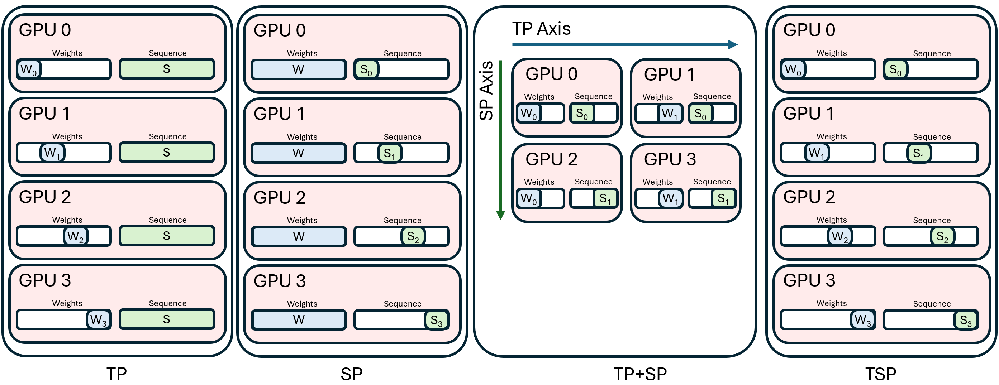
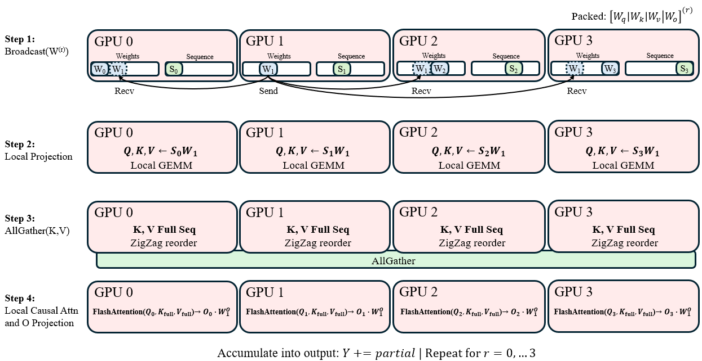
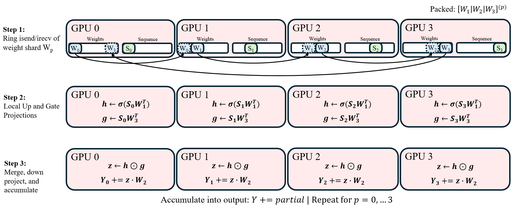

# TSP: Folding Tensor and Sequence Parallelism

**Source**: Shyam, Golubeva, Anthony, Apr 2026. arXiv:2604.26294. A parallel execution strategy that folds tensor parallelism (TP) and sequence parallelism (SP) onto a single device axis, trading additional communication for reduced memory.

## Key Points

- **TSP** assigns each rank **both a weight shard and a sequence shard** — unlike conventional multi-dimensional layouts where TP and SP use separate mesh axes
- Reduces both **parameter and activation memory** along the same device axis
- **Attention**: ranks iterate over broadcast parameter shards and reconstruct full context through a sequence-wise key/value exchange
- **Gated MLPs**: weight shards circulate in a ring while partial outputs accumulate locally
- Trades **additional communication volume** for reduced memory overhead — a hardware-aware alternative for long-context and memory-constrained training
- Composes with pipeline and expert parallelism for dense and MoE models

## The Problem: Multi-Dimensional Parallelism Layouts

Conventional parallelism uses separate mesh axes for different strategies:
- **Tensor parallelism (TP)**: shard model weights across one axis — reduces per-device parameter memory
- **Sequence parallelism (SP)**: shard tokens across another axis — reduces per-device activation memory

This requires enough mesh dimensions to accommodate both, and each dimension incurs its own communication overhead from separate AllGather/ReduceScatter operations.

## TSP: Single-Axis Folding

Instead of TP on axis X and SP on axis Y, TSP folds both onto a single axis:

| Conventional | TSP |
|-------------|-----|
| TP on mesh X, SP on mesh Y | Both on same mesh axis |
| AllGather weights over X, AllGather tokens over Y | Ring-based weight circulation + KV exchange |
| Requires 2 mesh dimensions | Works with 1 mesh dimension |
| Lower comms, higher memory | Higher comms, lower memory |

Each device holds: `1/N` of the model weights AND `1/N` of the tokens.

### Attention Block

1. Each rank holds its weight shard (Q, K, V projections for a subset of heads)
2. Ranks **iterate** over all weight shards via broadcast from the current holder
3. Each rank computes attention with its local token shard using the current weight shard
4. For full context reconstruction, ranks perform a **sequence-wise KV exchange** — each rank receives K/V from other ranks to build the complete attention context

### Gated MLP Block

1. Each rank holds shards of $W_{\text{in1}}$, $W_{\text{in2}}$, $W_{\text{out}}$
2. Weight shards circulate in a **ring** around the device axis
3. As each weight shard arrives, the rank computes the local contribution and **accumulates** the partial output
4. After one full rotation, each rank has its complete MLP output

This is analogous to a ring-based AllGather of weights combined with computation — communication and compute overlap naturally.

## Communication Analysis

TSP increases total communication volume compared to separate TP+SP axes (since both weight and sequence data travel over the same links), but:

- Eliminates the need for separate mesh dimensions — useful when mesh axes are a scarce resource (e.g., 3D torus with PP already using one axis)
- Communication is **ring-based** and naturally overlaps with computation
- For long-context workloads where SP dominates memory, the trade-off is favorable
- Composes with FSDP (batch sharding) and PP (layer sharding) on separate axes

## Connections

- [How To Scale Your Model](scaling-book.md) — the parallelism framework (DP, FSDP, TP, SP, PP) that TSP extends
- [Megatron-Core MoE](megatron-core-moe.md) — production training stack; TSP offers an alternative memory/compute tradeoff for parallelism
- [Communication Overlap via Decomposition](communication-overlap-decomposition.md) — Google ASPLOS 2023; TSP's ring-based weight circulation similarly overlaps comms with compute
- [Ring Attention](ring-attention.md) — the sequence-wise KV exchange in TSP's attention block is a variant of ring attention
- [Scaling Techniques Overview](usp-scaling-techniques-overview.md) — TP and SP as separate strategies; TSP folds them together
- [Parallel Folding](megatron-core-moe.md) — different "folding": Megatron decouples parallelism per-layer, TSP coalesces mesh axes per-layer; compose orthogonally
