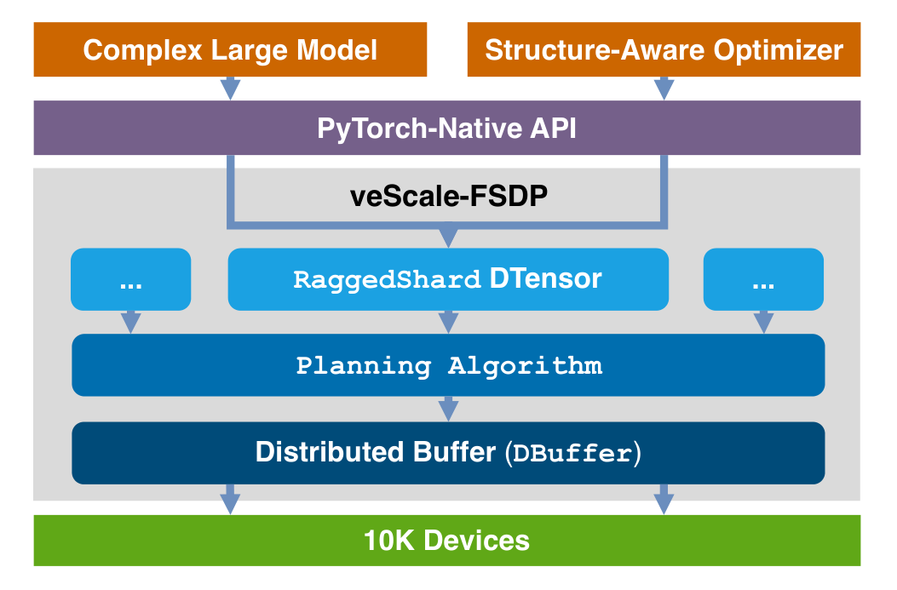
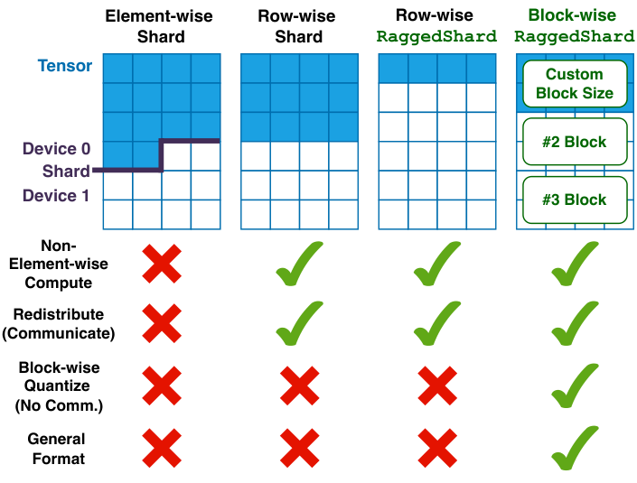
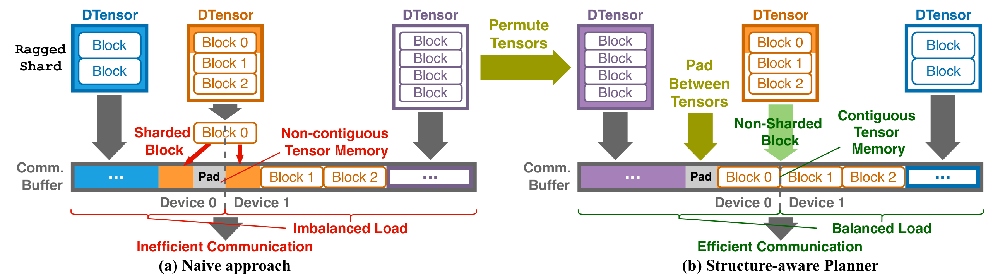

# veScale-FSDP

**Source**: Wang, Li, Lin, Yang, Xie, et al., Feb 2026. arXiv:2602.22437. A novel FSDP system that combines a flexible RaggedShard sharding format with structure-aware planning, enabling zero-copy communication and native support for block-wise quantization and non-element-wise optimizers.

## Key Points

- Existing FSDP systems use **fixed element-wise or row-wise sharding** that conflicts with block-structured computations
- **RaggedShard**: a flexible sharding format that preserves tensor block structure across device boundaries
- **Structure-aware planning algorithm**: automatically determines optimal sharding layout based on model structure and training configuration
- **Zero-copy FSDP communication**: eliminates intermediate copies during AllGather/ReduceScatter by directly operating on RaggedShards
- Native support for **block-wise quantization** and **non-element-wise optimizers** (Shampoo, Muon) — impossible with standard FSDP's fixed sharding
- **5-66% higher throughput** and **16-30% lower memory** vs existing FSDP systems
- Scales efficiently to tens of thousands of GPUs



## The Problem: Fixed Sharding vs Block Structure

Standard FSDP (ZeRO-3) shards parameters element-wise or row-wise:

```
Standard FSDP: weight[D, F] → sharded as weight[D/X, F]  (row-wise)
```

This works for element-wise optimizers (Adam) but breaks when:
- Parameters need to be accessed in **blocks** (e.g., block-wise quantization groups)
- Optimizers use **matrix-level operations** (Shampoo requires eigenvalue decomposition on parameter matrices, Muon uses matrix orthogonalization)
- **Block-sparse** or structured sparsity patterns exist

### RaggedShard



veScale-FSDP introduces RaggedShard: instead of sharding parameters uniformly, each shard preserves the **block structure** of the original tensor:

```
Standard FSDP shard:    uniform slice, block boundaries violated
RaggedShard:            block-aligned slice, each shard contains complete blocks
```

This means each device's shard is self-contained for block-level operations — no cross-device communication needed for block-wise quantization or matrix-level optimizer steps.

## Structure-Aware Planning

The planning algorithm analyzes the model's parameter layout and training configuration:

1. **Block decomposition**: identify parameter blocks (e.g., attention head blocks, FFN matrix tiles)
2. **Cost modeling**: estimate communication and memory costs for different sharding layouts
3. **Optimization**: select the RaggedShard layout that minimizes total cost while preserving block structure
4. **Automatic**: no manual tuning required; the planner adapts to model architecture

## Zero-Copy Communication



Standard FSDP requires intermediate copies during collective operations because shards don't align with communication buffers. veScale-FSDP's RaggedShard format aligns directly with NCCL buffer requirements, enabling:

- **AllGather without intermediate copies**: RaggedShards map directly to send/receive buffers
- **ReduceScatter without copies**: gradient reduction operates in-place on RaggedShards
- Communication-compute overlap is preserved

## Performance

| Metric | vs FSDP Baseline |
|--------|-----------------|
| Throughput | +5% to +66% |
| Memory usage | -16% to -30% |
| Block-wise FP8 quant support | ✓ (native) |
| Shampoo optimizer | ✓ (native) |
| Muon optimizer | ✓ (native) |
| Scale | 10K+ GPUs |

## Connections

- [How To Scale Your Model](scaling-book.md) — FSDP theory and cost analysis; veScale-FSDP is a production implementation
- [Muon Optimizer](muon-optimizer.md) — one of the optimizers veScale-FSDP natively supports
- [Megatron-Core MoE](megatron-core-moe.md) — complementary training stack; veScale-FSDP covers data-parallel sharding
- [Scaling Techniques Overview](usp-scaling-techniques-overview.md) — FSDP/ZeRO in the broader parallelism landscape
